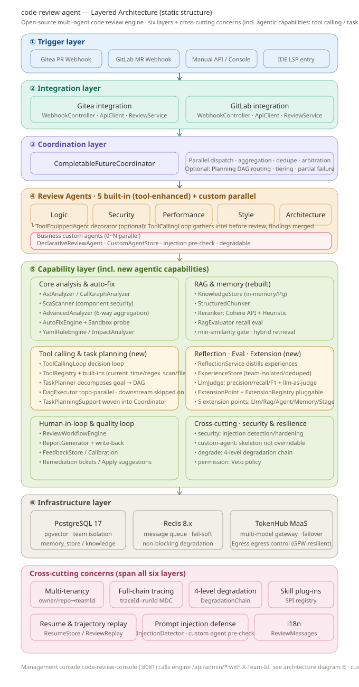
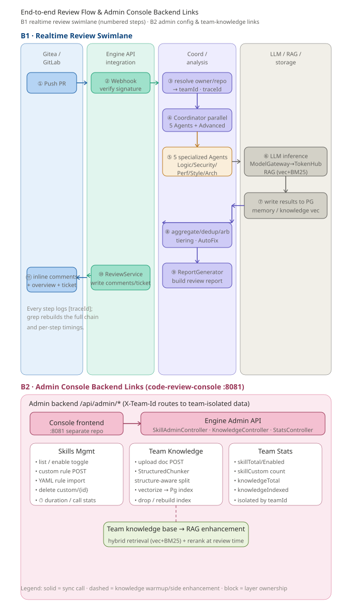

# Multi-Agent Code Review System

> [English](README.md) | [中文](README.zh-CN.md) | [📖 Documentation](https://13liyunfei.github.io/code-review-agent/)

[](https://13liyunfei.github.io/code-review-agent/)

A Java 17 / Spring Boot 3.3 **multi-agent collaborative code review system**, implemented from the design document *Multi-Agent Collaborative Review*.

It organizes **5 specialized review agents** in a **star topology**, with a Coordinator that schedules them in parallel, aggregates, de-duplicates, arbitrates conflicts and tiers findings by severity. It covers the core design points: rule detection, LLM enhancement, prompt templating, skill plug-in, tool routing, prompt-injection defense, RAG with three-tier memory, and a 4-level degradation chain.

> PostgreSQL + pgvector + Redis + Tencent Hunyuan are enabled by default for a full production setup. If not installed, set `pgvector.enabled=false` / `redis.enabled=false` to fall back to in-memory implementations.

## Architecture Overview

The system is a star-topology multi-agent pipeline: a webhook triggers a PR/MR review, the `CompletableFutureCoordinator` fans out to 5 specialized review agents (plus an `AdvancedAnalyzer`, and team-defined **custom agents**) in parallel, aggregates/dedupes/arbitrates their findings, and writes the report back to the SCM. Optional agentic enhancements (tool calling, task-decomposition DAG, reflection & experience base, LLM eval, extension registry) plug into the pipeline via switches. Two diagrams below capture the **static structure** and the **end-to-end runtime flow** (including the admin console's skills / team-knowledge / custom-agent backend).

### Layered architecture (static structure)



*Figure 1 — Six-layer stack: Trigger → Integration → Coordination → Review agents (5 built-in tool-enhanced + business custom in parallel) → Capability (incl. tool calling / task planning / reflection & eval / extensions) → Infrastructure, with cross-cutting concerns (multi-tenant, tracing, degrade, Skill SPI, injection guard, i18n) spanning all layers.*

### End-to-end flow & admin console (skills duration, team knowledge)



*Figure 2 — B1 realtime review swimlane (① PR push → ⑪ inline comments, each step carrying `traceId`); B2 admin backend where the `code-review-console` (:8081) drives `SkillAdminController` (incl. ⏱ duration/call stats), `KnowledgeController` (team-doc upload → StructuredChunker → Pg vector index), `StatsController` and `AgentAdminController` (custom agent list: CRUD + injection pre-check + parallel review), with team knowledge feeding back into RAG retrieval at review time.*

## Tech Stack

- Java 17, Spring Boot 3.3.4
- Jackson (standardized message protocol between agents)
- LangChain4j 1.19.0 (unified LLM access + structured output via `AiServices` + OpenAI-compatible protocol)
- Tencent Cloud TokenHub MaaS (one API key for many models: Hunyuan `hy3` / DeepSeek `deepseek-v4-flash` / GLM `glm-5.2`, falls back to Mock)
- PostgreSQL 17 + pgvector 0.8 (vector memory store, falls back to in-memory)
- Redis 8.x (message queue, falls back to in-memory)
- Multi-tenant (team) isolation: global baseline (`__global__`) + per-team overlay, keyed by `teamId` for custom rules / knowledge / memory / history / feedback
- Full-chain tracing: `traceId` based on SLF4J MDC + LangChain4j `ChatModelListener` (LLM request/response boundary logging)

## Quick Start

### Standard deployment (production / standalone service)

The agent is a **standalone service**: build it, point it at your existing PostgreSQL/Redis/Gitea, and run the jar.

```bash
# 1. Build
./mvnw -o package -DskipTests

# 2. Configure (application.yml / env vars): PG+pgvector, Redis, Gitea/GitLab base URL,
#    tokenhub API key, review.lang, review.profile ... see "Key Configuration" below.

# 3. Run the service
java -jar target/code-review-agent-1.0.0.jar
```

- Default webhook: `http://<host>:8080/webhook/gitea`; console (separate repo `code-review-console`) on :8081.
- **No bundled infrastructure** — PG/Redis/Gitea are provided by your environment/ops.

### Local development (optional, macOS Colima+Homebrew or Docker)

> ⚠️ The scripts under `dev/` are **for local development debugging only**: they pull up the whole stack (PG/Redis/Colima/Gitea/engine) in one go. Do not use them in production.

```bash
# Option A: macOS (Colima + Homebrew) one-click full stack
cp .env.example .env
./dev/start-all.sh dev        # PG → Redis → Colima → Gitea → engine (:8080)
./dev/status.sh
./dev/stop-all.sh --all       # --all also stops the Colima VM

# Option B: any machine with Docker — infra via compose, engine via maven
cd dev && docker compose -f docker-compose.dev.yml up -d   # PG17+pgvector / Redis / Gitea
cd .. && ./mvnw spring-boot:run -Dspring-boot.run.profiles=dev
```

`start-all.sh` automatically:

1. Starts PostgreSQL 17 (auto-initdb on first run, creates DB `codereview`, enables the `vector` extension)
2. Starts Redis (port 6379)
3. Starts the Colima VM (if Docker is not running)
4. Starts the Gitea container (auto-created on first run, port 3000, data persisted in `~/gitea-local/`)
5. Starts the review service (port 8080, Gitea integration enabled, logs at `/tmp/review-app.log`)

Once everything is up:

- **Gitea**: http://localhost:3000 (account `reviewer`, password from your Gitea install config)
- **Review service webhook**: `http://<HOST_IP>:8080/webhook/gitea` (the address the container uses to call back to the host)
- **Demo PR** (contains pre-seeded problem code, ready to demo the review): <http://localhost:3000/reviewer/demo-project/pulls>

> On a fresh machine, install dependencies once before first use:
>
> ```bash
> brew install postgresql@17 pgvector redis colima docker
> ```
>
> After startup, open any PR to trigger an automatic review; the report is written back to the PR as a Markdown comment.

### Standard daily workflow after first boot

```bash
cd code-review-agent
./dev/start-all.sh     # run once after boot, brings everything up
./dev/status.sh        # check status any time
# ... normal usage (open a PR → auto review) ...
# When done:
./dev/stop-all.sh      # or ./dev/stop-all.sh --all for a full shutdown
```

### Manual startup (optional, without the scripts)

```bash
# 1. PostgreSQL 17 + pgvector
/opt/homebrew/opt/postgresql@17/bin/pg_ctl -D /opt/homebrew/var/postgresql@17 -l /tmp/pg.log start

# 2. Redis
/opt/homebrew/opt/redis/bin/redis-server --daemonize yes --port 6379

# 3. Gitea (Docker container)
docker start gitea

# 4. Review service
./mvnw spring-boot:run -Dspring-boot.run.arguments="--gitea.enabled=true --gitea.base-url=http://localhost:3000 --gitea.api-token=<token> --gitea.webhook-secret=<secret>"
```

> Note 1: if your shell environment has variables such as `SERVER__PORT`, they will override the `server.port` config — `unset SERVER__PORT` before starting (the scripts handle this automatically).
>
> Note 2: you must use the **psql/createdb bundled with PG17** (`/opt/homebrew/opt/postgresql@17/bin/`). If your PATH links to a PG16 client, system-table differences will cause errors (the scripts handle this automatically).

### Run the review service only (no Gitea)

```bash
./mvnw spring-boot:run
```

To run a hard-coded sample demo at startup (no webhook), pass `-Dspring-boot.run.arguments="--demo.runner.enabled=true"`. It prints in sequence:

1. Multi-agent review report (Markdown)
2. Prompt-injection deep defense detection results
3. RAG & long-term memory retrieval results
4. 4-level degradation chain (auto-degrade to manual review on exception)
5. False-positive feedback loop (mark a false positive → auto-suppressed on the next review)
6. Post-fix re-check (compare resolved / unresolved against the last review)

You can also just compile-verify: `./mvnw -B clean compile` (expect BUILD SUCCESS).

## GitLab Integration (auto review of Merge Requests)

The system has a built-in GitLab integration layer — three config steps to get automatic MR reviews with reports written back to MR comments.

### Step 1: Create a GitLab Personal Access Token

In GitLab → avatar → **Preferences → Access Tokens**, create a token with the **api** scope.

### Step 2: Fill in the configuration

Edit `src/main/resources/application.yml`:

```yaml
gitlab:
  base-url: https://gitlab.your-company.com   # your GitLab instance
  api-token: glpat-xxxxxxxxxxxx              # the token from step 1
  webhook-secret: my-webhook-secret          # custom secret (validates webhook origin)
  enabled: true                              # enable GitLab integration
```

Or inject via CLI args / env vars (recommended — keeps secrets out of the repo):

```bash
GITLAB_API_TOKEN=glpat-xxx ./mvnw spring-boot:run \
    -Dspring-boot.run.arguments="--gitlab.enabled=true --gitlab.base-url=https://gitlab.your-company.com"
```

### Step 3: Configure the webhook in the GitLab project

In the target project → **Settings → Webhooks**:

- **URL**: `http://<your-service-address>:8080/webhook/gitlab`
- **Secret token**: same as `gitlab.webhook-secret`
- **Trigger**: check **Merge request events**

### Workflow

```
Developer opens an MR
  → GitLab sends a Webhook (action=open/update)
  → The system asynchronously fetches MR changes (GET /projects/:id/merge_requests/:iid/changes)
  → 5 agents review in parallel (Logic/Security/Performance/Style/Architecture + Hunyuan LLM)
  → Aggregate, de-duplicate, arbitrate conflicts, tier (Blocker/Major/Minor/Info)
  → The review report is written back to the MR as a Markdown comment
```

> Exception-isolation design: unreachable GitLab API / invalid token / MR with no changes all degrade gracefully — a skip note is posted on the MR without affecting service stability. The webhook responds within 200ms (async review), so GitLab's 10-second timeout is never hit.

## Gitea Integration (lightweight option, recommended for local)

The GitLab CE image is ~3GB and takes 5-10 minutes to boot; for local experience we recommend **Gitea** (~110MB image, boots in seconds). The system ships an equivalent Gitea integration layer (`integration/gitea` package).

### Step 1: Run Gitea locally (Docker)

```bash
docker run -d --name gitea -p 3000:3000 -p 2222:22 \
  -v ~/gitea-local/data:/data -v ~/gitea-local/logs:/var/log/gitea \
  -e USER_UID=1000 -e USER_GID=1000 \
  -e GITEA__security__INSTALL_LOCK=true \
  -e GITEA__server__ROOT_URL=http://localhost:3000/ \
  -e GITEA__service__DISABLE_REGISTRATION=true \
  -e GITEA__webhook__ALLOWED_HOST_LIST=private,loopback \
  --restart unless-stopped gitea/gitea:latest

# Create the admin and a token
docker exec -u git gitea gitea admin user create --admin \
  --username reviewer --password '<password>' --email reviewer@example.com --must-change-password=false
docker exec -u git gitea gitea admin user generate-access-token --username reviewer --scopes all
```

> Note: from inside the container, call the host review service at `http://<HOST_IP>:8080` (the host gateway address in Colima/Docker environments).

### Step 2: Start the review service

```bash
./dev/start-all.sh    # one-click: Gitea + PostgreSQL + Redis + review service
```

Or specify the parameters manually:

```bash
./mvnw spring-boot:run -Dspring-boot.run.arguments="--gitea.enabled=true --gitea.base-url=http://localhost:3000 --gitea.api-token=<token-from-step-1> --gitea.webhook-secret=<custom-secret>"
```

### Step 3: Configure the webhook in the Gitea project

Repo → **Settings → Webhooks → Add Webhook → Gitea**:

- **Target URL**: `http://<HOST_IP>:8080/webhook/gitea`
- **Method / Content Type**: POST / application/json
- **Secret**: same as `gitea.webhook-secret` (HMAC-SHA256 signature verification)
- **Trigger**: check **Pull Request**

### Workflow

```
Developer opens/updates a PR
  → Gitea sends a Webhook (action=opened/synchronized/reopened)
  → The system asynchronously fetches the PR diff (GET /repos/:owner/:repo/pulls/:index.diff)
  → 5 agents review in parallel (Logic/Security/Performance/Style/Architecture + Hunyuan LLM)
  → Aggregate, de-duplicate, arbitrate conflicts, tier (Blocker/Major/Minor/Info)
  → The review report is written back to the PR as a Markdown comment
```

> Technical note: newer Gitea's `/pulls/:index/files` endpoint does not return the `patch` field, so this system uses `/pulls/:index.diff` to fetch the full unified diff and parses it itself — the most compatible approach.

### Inline comments & the "Apply suggestion" button (Gitea 1.27 adaptation)

Auto-fix suggestions are written back to the PR as ```` ```suggestion ```` code blocks; **only inline code-review comments render the "Apply" button** (top-level PR comments don't).

> **Gitea 1.27 API change**: the standalone `POST /pulls/{index}/comments` endpoint was removed, and `POST /reviews/{id}/comments` only keeps the GET list (returns **405**). So inline comments can only be written **in one shot** when creating the review, via the `comments` array: `GiteaApiClient.postReviewComments(...)` calls `POST /repos/{owner}/{repo}/pulls/{index}/reviews` with `event=COMMENT` to submit the review plus all inline comments at once (each `ReviewCommentItem` carries `path` / `line`(side=RIGHT) / `body`).
>
> ⚠️ **Known limitation (verified E2E on Gitea 1.27)**: in practice the `line` / `side` fields are **silently dropped to `null`** when comments are submitted together with a PENDING review, so all comments degrade to **file-level** comments (`IsCodeComment()=false`). As a result the **"Apply" button does not render** on Gitea 1.27 through the REST API — `suggestion` blocks are shown as plain code blocks only. The engine therefore also writes the adoptable fix into the **top-level overview comment** (auto-fix summary) and file-level `suggestion` blocks for manual copy. To get a real line-anchored "Apply" experience you would need a Gitea version that restores the inline-comment API, or a non-REST path.

## IDE (IntelliJ IDEA) shows red errors everywhere

If it compiles from the command line but the IDE is full of red errors, it's almost always **the IDE's JDK / language level being below 16, or Maven dependencies not loaded** — this project uses lots of Java 16+ syntax (`record`, `switch` expressions `->`, text blocks `"""`); anything below that is marked red by the IDE.

1. **Check the JDK**: `File → Project Structure → Project SDK` → select **17** (e.g. Corretto 17);
2. **Check the language level**: in the same window, `Project → Language Level` → set to `17`;
3. **Reload Maven**: right-click `pom.xml → Maven → Reload Project` (or the refresh button in the Maven tool window);
4. Still broken: `File → Invalidate Caches… → Invalidate and Restart`, then reload Maven again.

> Note: Spring Boot 3.3 requires Java 17 at minimum; this project sets `maven.compiler.release=17` and builds with JDK 17+ (21 works too).

## Real LLM Setup (TokenHub multi-model, via LangChain4j)

The system uses **LangChain4j 1.19.0** to access LLMs uniformly, over the **Tencent Cloud TokenHub MaaS** OpenAI-compatible protocol. One TokenHub API key can call all platform models — just switch the `model` field. We do **not** introduce `langchain4j-pgvector` (its independent version conflicts with the multi-tenant `memory_store` schema; PG memory uses our own storage).

- Endpoint: `https://tokenhub.tencentmaas.com/v1`
- Default models (the gateway routes in list order, auto-failover on timeout/failure): `hy3` (Hunyuan), `deepseek-v4-flash` (DeepSeek), `glm-5.2` (GLM)
- Structured output: `CodeReviewAiService` (LangChain4j `AiServices`) + `MessageWindowChatMemory` (short-term windowed memory isolated by agent-team-PR); on parse failure it falls back to the text path (`LlmFindingParser`)

### Configuration (`tokenhub` in `src/main/resources/application.yml`)

```yaml
tokenhub:
  api-key: ${TOKENHUB_API_KEY:}        # empty → Mock fallback (demo only, no LLM findings)
  base-url: https://tokenhub.tencentmaas.com/v1
  timeout-seconds: 60
  quota-per-minute: 200
  models:
    - name: hunyuan
      model: hy3
    - name: deepseek
      model: deepseek-v4-flash
    - name: glm
      model: glm-5.2
```

> To add a model, just add a line to the `models` list (shared key); to change the AiServices primary model, move the entry to the first position. There is no official OpenAI channel (poor connectivity in China); all models go through TokenHub.

### Call chain

```
LlmClient(interface)
  └─ ModelGateway            # multi-vendor routing + 60s sliding-window quota + failover + Mock fallback
       ├─ LangChain4jChatProvider(hunyuan)  → OpenAiChatModel(hy3)      + LoggingChatModelListener
       ├─ LangChain4jChatProvider(deepseek) → OpenAiChatModel(deepseek-v4-flash) + LoggingChatModelListener
       ├─ LangChain4jChatProvider(glm)      → OpenAiChatModel(glm-5.2)  + LoggingChatModelListener
       └─ MockProvider         # end of the list; zero-config usable with no key

primaryChatModel (models[0]) → CodeReviewAiService (AiServices structured output + ChatMemory)
```

- Startup log: `已装配 LangChain4j 统一模型网关（TokenHub 多模型）：ModelGateway[hunyuan(on),deepseek(on),glm(on),mock(on)]`
- Vectorization: with `review.llm.embedding.enabled=true` it switches to `LangChain4jEmbeddingClient` (OpenAiEmbeddingModel; if api-key/base-url are not configured separately it reuses TokenHub); the default is `SimpleHashEmbeddingClient` (offline hash, 256-dim). TokenHub embedding models: `kinfra-text-embedding-0.6b` (1024-dim, default) / `kinfra-text-embedding-4b` (2560-dim); the pgvector ivfflat index caps at 2000 dims, so the default is 1024 (switching models requires syncing `pgvector.vector-dim`; existing tables auto-migrate by rebuilding the vector column).

> ⚠️ **Security note**: `api-key` is a sensitive credential — never commit plaintext keys to the repository. Two recommended approaches:
>
> 1. Keep the placeholder `${TOKENHUB_API_KEY:}` and inject via env var at runtime: `TOKENHUB_API_KEY=sk-xxxx ./mvnw spring-boot:run`;
> 2. Or add `application.yml` to `.gitignore` and use a local override file `application-local.yml`.

Once real models are enabled, `ModelGateway` prints the online vendors; findings marked with source **LLM** in the final report are produced by live inference of the corresponding model (rule-based findings are still supplemented by local deterministic detection).

## RAG & Advanced Retrieval

The team-knowledge + coding-standards RAG pipeline was rebuilt around a pluggable `KnowledgeStore` abstraction (`InMemoryKnowledgeStore` for local / `PgKnowledgeStore` for PostgreSQL + pgvector), with **hybrid retrieval (dense vector + BM25 keyword) on by default**, a **cross-encoder rerank stage**, and a **similarity gate** that suppresses low-relevance noise.

```
sources ─▶ StructuredChunker (split by heading/code fence) ─▶ embed ─▶ KnowledgeStore
                                                                       │
query ─▶ hybrid retrieve (vector ∪ BM25, top-K) ─▶ Reranker (cross-encoder) ─▶ min-similarity gate ─▶ prompt
```

- **`StructuredChunker`** preserves markdown structure (headings + fenced code blocks) so retrieval returns coherent, self-contained snippets instead of arbitrary character slices.
- **`Reranker`** interface with two implementations: `ApiReranker` (Cohere/Jina cross-encoder) and `HeuristicReranker` (offline lexical/positional scorer). `ApiReranker` **auto-degrades to `HeuristicReranker` when the API key is absent** — the review chain never blocks on rerank.
- **`RagEvaluator`** optionally logs precision/recall against ground-truth `expectedId` metadata, so retrieval quality can be regression-tested.
- **`min-similarity`** (default `0.3`) drops candidates below the threshold before they reach the prompt — enabling "selective abstain" to keep irrelevant knowledge out of the context.

### Configuration (`review.rag` / `review.egress` in `application.yml`)

```yaml
review:
  rag:
    rerank:
      enabled: true                 # cross-encoder rerank on (auto-degrades to heuristic if no key)
      provider: cohere              # cohere | jina
      base-url: ${RERANK_BASE_URL:https://api.cohere.com/v2/rerank}
      api-key: ${RERANK_API_KEY:}   # leave empty → offline heuristic rerank
      model: ${RERANK_MODEL:rerank-english-v3.0}
      timeout-ms: 5000
    min-similarity: ${RAG_MIN_SIMILARITY:0.3}   # 0.0 = no gate
    eval-enabled: ${RAG_EVAL_ENABLED:true}
  # Egress: explicit per-dependency egress control (does NOT hijack localhost PG/Redis/Gitea)
  egress:
    rerank:
      mode: ${EGRESS_RERANK_MODE:direct}        # direct | system | proxy
      proxy-url: ${RERANK_PROXY:}               # used only when mode=proxy
```

> 🔐 **Production credentials**: `RERANK_API_KEY` / `TOKENHUB_API_KEY` must be injected from a Secret Manager (Vault / AWS Secrets Manager / Doppler). They are **never** committed — `.env` is git-ignored (see `.env.example`).
>
> 🌐 **GFW / egress note**: Cohere/Jina endpoints are blocked on some networks. Use `EGRESS_RERANK_MODE=proxy` + `RERANK_PROXY=http://127.0.0.1:<clash-mixed-port>` (e.g. Clash Verge mixed-port `7897`) to route **only** the rerank request through an explicit proxy, without hijacking localhost PostgreSQL/Redis/Gitea connections. `direct` (default) is correct for servers in a compliant network or behind an internal AI Gateway.

## Multi-Tenant (Team) Isolation Architecture

The system uses a **"global baseline + team overlay"** model so multiple teams can customize their review strategy independently on the same engine while sharing the platform's built-in capabilities.

- **Global baseline (`__global__`)**: 13 built-in Skills + coding-standards handbook RAG vectors, shared by all teams and not overridable.
- **Team overlay**: custom rules / team knowledge / memory / review history / false-positive feedback isolated by `teamId`.
- **Team resolution**: `review.teams.mapping` resolves `owner/repo` (exact) > `owner` (org) > fallback `default`; webhooks carry `owner/repo` for auto-detection; console/API override via the `X-Team-Id` header.
- **Storage isolation**: team data lives under `data-dir/<teamId>/` (incl. `custom-rules.json` / `skills-enabled.json` / `feedback.json` / `review-history.json` / `knowledge/`); the PostgreSQL `memory_store` table has a `team_id` column + `idx_memory_team` index; RAG retrieval includes the global baseline (`includeGlobal=true`) while experience/team memory does not (`includeGlobal=false`).
- **Code location**: `tenant` package (`Teams` constants + `sanitize` / `TeamProperties` `@ConfigurationProperties` / `TeamResolver.resolve(owner,repo,override)`); `ReviewAgentConfig` registers the `teamResolver` bean (and `@EnableConfigurationProperties({TeamProperties.class, TokenHubProperties.class})`); the console's `EngineClient` forwards `X-Team-Id`.
- **Startup migration**: legacy rule files at the old `data-dir` root auto-migrate into the `default` team on first boot; built-in skills can be enabled/disabled per team in `skills-enabled.json`.

## Full-Chain Tracing (Observability)

To make online troubleshooting easy, the system injects a `traceId` that spans the whole chain for every review request, and logs consistently at the LLM / vector-store boundaries.

- **`core/trace/TraceContext`**: a 12-hex `traceId` based on SLF4J MDC; generated and `set` at the entry point (webhook / demo). Because the system uses lots of `CompletableFuture.supplyAsync` across threads (default `ForkJoinPool`), `TraceContext.wrap(Runnable/Supplier)` does `capture()` before submit, `restore()` at execution, and `restorePrev(prev)` on finish — **the key pitfall**: `wrap`'s finally must restore the captured snapshot instead of `MDC.clear()`, otherwise the `ForkJoinPool` in-place execution clears the caller thread's own traceId and everything after `join` becomes `N/A`.
- **Log format**: `logging.pattern.console/file` in `application.yml` adds `[traceId=%X{traceId:-N/A}]` — every line automatically carries the trace number (N/A when absent).
- **LLM boundary logging**: `core/llm/LoggingChatModelListener` (a LangChain4j `ChatModelListener`) uniformly records all `ChatModel` requests/responses with the traceId, **covering both the AiServices path and the text-fallback path in one line** (avoiding the gap where AiServices talks directly to `ChatModel` without going through `ModelGateway`); INFO truncates to the first 800 chars — enable `com.codereview.agent.core.llm: DEBUG` to see full requests/responses.
- **Troubleshooting usage**: when a PR review misbehaves online, grab that request's `traceId` (present in the webhook-receive log), then `grep traceId=xxxx application-log` to reconstruct the full chain (webhook→coordinator→sub-agents→LLM→vector store→Gitea write-back) and each stage's timing — pinpoint whether it's slow LLM / a sub-agent exception / slow vector store / a failed Gitea API call.

## Additional Capabilities (practices added on top of the design doc)

On top of the existing "parallel review + dedupe + tiering", the system lands four closed-loop practices from the design doc:

### 1. Priority Conflict Arbitration

When different agents give conflicting advice at the same code location (e.g. Performance says "inline", Style says "split the function"), the Coordinator arbitrates by a fixed priority weight — the higher priority wins, and the loser appears in the report's "⚖️ Conflict Arbitration" section with a reason:

- Security `SECURITY(100)` > Logic `LOGIC(90)` > Performance `PERFORMANCE(70)` > Architecture `ARCHITECTURE(60)` > Style `STYLE(10)`
- On equal priority, severity and confidence break the tie.

### 2. False-Positive Feedback Loop (Human-in-the-loop)

When a developer marks a finding as a false positive on the PR, the system stores it as long-term feedback (`FeedbackStore`); later aggregation stages automatically suppress the same rule (rule-level or file-level precise suppression) — "the more it reviews, the more accurate it gets":

- Submit feedback: `POST /api/feedback`
- Query feedback: `GET /api/feedback`
- Example:
  ```bash
  curl -X POST http://localhost:8080/api/feedback -H 'Content-Type: application/json' \
    -d '{"ruleId":"SEC-002","agentType":"SECURITY","isFalsePositive":true,"file":"PaymentService.java","note":"compliance exception"}'
  ```
- Suppressed items are shown in the report's "🚫 Suppressed false positives" section and excluded from severity stats.

### 3. Post-Fix Re-check (Incremental Verification)

When the same PR is pushed again (webhook `synchronized`), the system reads the history (`ReviewHistoryStore`), compares with the previous round, and shows a "🔁 Fix re-check" section in the report: resolved / unresolved / newly introduced, listed one by one, verifying whether the issues are actually fixed.

### 4. Traceability & Quality Trend

- Each review generates a unique `runId` and records elapsed time in the report header, for log correlation and latency monitoring;
- `GET /api/quality-report?range=week|all` aggregates history into a weekly / full quality-trend Markdown: review count, total findings, severity distribution, top-10 high-frequency rules, repo distribution, recent reviews — for Tech Leads to drive continuous improvement.

### 5. Architecture-aligned enhancements (from deepseek-harness / openai codex)

> Each item below maps to a mechanism read from the two external harness sources (dsh event-sourced `Session` / codex `RolloutItem` trajectories, `context-fragments` on-demand injection, `suspend/recover_turn` checkpoint resume, `guardian-v2` fail-closed, `intersect_permission_profiles` permission convergence, `ToolExposures` tool grading, agent-team `TeamMailbox` persistent mailbox, `llm-replay` deterministic replay) and is implemented one by one.
> All of them are **optional enhancements**: without configuration, behavior is identical to the old version and the core review pipeline is unaffected.

**5.1 Event-sourced review trajectory (aligned with dsh `Session` / codex `RolloutItem`)**
- `core/trajectory/`: `ReviewEvent` (immutable) + `ReviewEventLog` (RCU atomic append, immutable view) + `ReviewTrajectoryRecorder`;
- Each review records the full event chain per `runId`: `review.started → context.diff-loaded → context.injected → agent.started → agent.completed → review.completed`;
- Persisted to `data-dir/<teamId>/trajectories/<runId>.jsonl` (append-only JSONL); failure only warns, never blocks the review; events carry the traceId, linking to the log chain.

**5.2 Context impact-surface slicing (aligned with codex `context-fragments`)**
- `core/impact/ImpactAnalyzer` reuses `AstAnalyzer` + `CallGraphAnalyzer` to compute the "changed method → upstream callers" propagation chain;
- The impact summary is injected into all 5 agents' prompts via `ReviewContext.impactSummary` (the templates gain an "Impact" section; missing variables are safe); empty string when there's no impact, to avoid noise;
- For large PRs only "changed methods + affected callers" are fed in — lower tokens, higher focus.

**5.3 Checkpoint resume (aligned with codex `suspend_turn_and_shutdown` + `recover_turn_if_idle`)**
- `core/resume/`: `ResumeState` (completed agents + findings so far) + `FileResumeStore` (atomic JSON at `data-dir/<teamId>/resume/<runId>.json`);
- Re-reviewing with the same `runId` auto-recovers: **completed agents are not re-run**, only the remaining ones run — a crash on a large PR doesn't mean a full re-review;
- A checkpoint is saved after each agent completes; cleaned up automatically on normal completion; the trajectory includes a `review.resumed` event for auditing.

**5.4 Review-profile hot-switch**
- `core/profile/ReviewProfile`: `STRICT` (keep Minor+) / `ADVISORY` (default, only Major+) / `SUGGEST` (keep everything);
- Configure `review.profile=STRICT|ADVISORY|SUGGEST`; applied after aggregation/dedupe/arbitration/suppression — use STRICT for CI gates, ADVISORY for daily work.

**5.5 AutoFix fail-closed safety boundary + sandbox probe (aligned with dsh `SandboxUnavailableError` / codex `guardian-v2`)**
- `core/autofix/`: `AutoFixMode` (SUGGEST/APPLY, default SUGGEST) + `AutoFixSafetyPolicy` (APPLY requires an available sandbox, otherwise rejected) + `SandboxProbe` (probes bwrap/firejail/sandbox-exec/docker; any probe failure = unavailable);
- Any path that actually writes code must first pass the `canApply()/requireApplyAllowed()` guard — never silently apply without isolation.

**5.6 Permission convergence (aligned with codex `intersect_permission_profiles` — parent can't override child)**
- `core/permission/VetoPolicy`: a **BLOCKER-level veto cannot be removed by "false-positive suppression" or "arbitration override"**; it is automatically recovered into the final report;
- Guarantees that "any expert agent's blocking conclusion is not softened by the lead reviewer".

**5.7 Tool-exposure gating (aligned with codex `ToolExposures` DIRECT/DEFERRED/CODE_MODE)**
- `core/tools/`: `ToolExposure` + `ToolGate` — DEFERRED heavy tools (full compile, run tests, AutoFix write-code) are **denied by default** (fail-closed);
- Allowed when: `review.tools.deferred-enabled=true` or the current profile is STRICT; every decision records call stats (allowed/denied counts) for audit.

**5.8 Persistent mailbox delegation (aligned with dsh `agent-team` `TeamMailbox`)**
- `core/mailbox/TeamMailbox`: `send` (persist as QUEUED first) → `poll` (DELIVERED) → `ack` (ACKED); `recoverFor` redelivers unacknowledged messages after a crash;
- Persisted at `data-dir/<teamId>/mailbox/<to>.json` (atomic write, auto-recovered on restart) — the "at-most-once, no-loss, ordered" queue foundation for a future "lead reviewer delegates subtasks to specialist agents".

**5.9 Deterministic replay evaluation (aligned with dsh `llm-replay` / codex `rollout`)**
- `core/eval/ReviewReplay`: reads trajectory JSONL and validates event-sequence structural integrity (must start with `review.started`, end with `review.completed`, event types legal);
- Combined with fixed fixtures it enables regression evaluation: a new reviewer version's trajectory for the same PR must stay valid and conclusions consistent — moving from "it runs" to "it's trustworthy".

**5.10 External-tool SPI plug-in (aligned with codex `mcp_tool`)**
- `core/tools/external/`: `ExternalToolProvider` (name/capabilities/invoke) + `ExternalToolRegistry` (register / route by name / fail-fast invoke);
- Protocols like MCP are carried by Provider implementations (see the interface javadoc); the engine itself doesn't force an MCP SDK, staying offline-compilable.

**Configuration summary (all optional)**

| Key | Default | Description |
| --- | --- | --- |
| `review.profile` | `ADVISORY` | Review strictness: STRICT / ADVISORY / SUGGEST |
| `review.tools.deferred-enabled` | `false` | Allow DEFERRED heavy tools (fail-closed by default) |
| `review.tools.code-mode-enabled` | `false` | Allow CODE_MODE tools |
| `review.autofix.mode` | `SUGGEST` | AutoFix mode: SUGGEST / APPLY |
| `review.autofix.sandbox-available` | (empty) | Explicitly set sandbox availability; empty = auto-probe (bwrap/firejail/sandbox-exec/docker) |
| `review.data-dir` | `./data` | Unified persistence root for trajectory / resume / mailbox / feedback / history |

> The 4 capabilities above are on by default with no extra config; the feedback & quality-report APIs are controlled by `review.api.enabled` (`true` by default) — expose them behind gateway auth in production.

### Enterprise-grade enhancements (nine modules)

On top of "parallel review + dedupe + tiering + closed loops", nine enterprise-ready modules were added, all pure Java with **zero external dependencies (except snakeyaml for YAML parsing)**, wired via Spring — ready to use out of the box:

#### 1. AST semantic analysis (`AstAnalyzer`)

A hand-written bracket-stack lexer (no JavaParser dependency) parses source into an `AstReport`: class structure, method list, method line counts (`length`), branch count, nesting depth — for locating structural issues like "method too long / cyclomatic complexity too high". Reused by both CI and IDE entry points for consistent standards.

#### 2. Call graph & impact (`CallGraphAnalyzer` + `AdvancedAnalyzer`)

- `CallGraphAnalyzer`: parses "method → called methods" within a single file, and computes the transitive-closure set of upstream methods that depend on a given method (`impact(method)`) — precise "how much does changing this affect".
- `AdvancedAnalyzer`: aggregates AST + call graph + SCA into `ARCHITECTURE` and `SECURITY` `AgentResult`s, injected in parallel into the Coordinator pipeline (5 agents + Advanced = 6 parallel lanes).

#### 3. Low-code Skill platform (`YamlRuleEngine`)

Ops / security folks can ship new rules without touching code: submitting YAML generates a `CustomRuleRequest` injected into the skill registry. Engine side `POST /api/admin/skills/yaml`, console side `POST /api/skills/yaml` (pass-through), returning `{imported, errors}`:

```yaml
rules:
  - name: no-synchronized
    category: architecture
    title: Avoid synchronized methods
    description: Synchronized methods can become a bottleneck under high concurrency
    suggestion: Use concurrent containers or explicit locks
    severity: MAJOR
    pattern: 'synchronized\s+\w+\s*\('
```

#### 4. Unified model gateway (`ModelGateway`)

Implements `LlmClient`, aggregating multiple `ModelProvider`s (Hunyuan / OpenAI / Mock) with:

- **Multi-vendor routing**: picks the available vendor in configured order;
- **Quota protection**: `QuotaState` 60-second sliding-window rate limit, auto-jumps to the next vendor when exceeded;
- **Failover**: a failing vendor automatically fails over to the next;
- **Mock fallback**: a built-in Mock at the end of the list — zero-config usable with no key.

The startup log prints `已装配统一模型网关：ModelGateway[hunyuan(on),mock(on),]`.

#### 5. Scheduled scanning (`ScheduledScanService`)

`@EnableScheduling` + `@Scheduled(cron="${scan.cron:0 0 2 * * *}")` pulls the full diff of the configured repo list (`scan.repos=owner/repo:branch,...`) every night at 2am, archives results as Gitea issues — "unattended night patrol". Enabled by `scan.enabled=true`.

#### 6. Auto-fix engine (`AutoFixEngine`)

`generateSuggestions(ReviewReport)` outputs actionable fix Markdown with ```` ```suggestion ```` code blocks:

- **Deterministic rules**: `LOGIC-002 / LOGIC-003 / PERF-001 / STYLE-002` etc. give replacement samples directly from templates;
- **LLM-generated**: everything else is generated by the model gateway as natural-language fix advice.

Post it back to the PR and developers adopt it in one click.

#### 7. Human-in-the-loop workflow (`ReviewWorkflowEngine`)

Wires severity into the dev process:

- **BLOCKER**: mandatory human approval — creates a Gitea issue and sets the commit status to `failure`, blocking the merge;
- Other severities: commit status set to `success`.

Implemented via `GiteaApiClient.createIssue` / `createCommitStatus`.

#### 8. SCA dependency vulnerabilities (`ScaScanner`)

Parses newly added dependencies in `pom.xml` / `package.json` from the PR diff, matches a built-in CVE sample library (log4j-core CVE-2021-44228, spring-core CVE-2022-22965, commons-collections, jackson-databind, lodash, minimist, axios, etc.), outputs a vulnerability list plus license-blacklist hits (GPL/AGPL), and generates a CycloneDX-lite SBOM JSON alongside the report.

#### 9. IDE LSP interface (`IdeReviewServer`)

Runs as a standalone process speaking JSON-RPC 2.0 over stdio (LSP `Content-Length` framing), so VSCode / IDEA get real-time review diagnostics and Quick Fixes:

- `initialize` → declares `textDocumentSync` + `codeActionProvider`;
- `textDocument/didOpen | didChange` → triggers analysis and `publishDiagnostics` (with rule `code`);
- `textDocument/codeAction` → offers a "view code-review fix suggestion" Quick Fix.

It reuses the engine's `AstAnalyzer` and `PatternSkill` rule set, so IDE and CI review standards stay consistent. Start with `java -cp ... com.codereview.agent.ide.IdeReviewServer`; the editor side connects an LSP client.

### Agentic capabilities (tool calling / task planning / reflection & eval / extensions)

Enterprise-grade agentic building blocks, all **optional enhancements (default off)** — when disabled, the engine behaves exactly as before. Switch them on via `application.yml` or `--review.*.enabled=true`:

| Capability | Components | Switch |
| --- | --- | --- |
| **Tool Calling loop** — think → decide → call → observe → reason, with max-iteration guard, illegal-JSON fallback and tool-error isolation | `toolcalling/AgentTool` + `ToolRegistry` + `ToolCallingLoop` + built-ins (`current_time` / `regex_scan` / `file_read` with path-traversal guard) | `review.tools.agent-loop.enabled` |
| **Task decomposition & DAG execution** — LLM decomposes a goal into a dependency DAG, routed to agents by `assignee` and executed topologically in parallel; upstream failure skips downstream, planner failure degrades to the fixed parallel path | `planning/TaskPlanner` + `TaskPlan` (id-unique / dep-exists / Kahn acyclic) + `DagExecutor` + `TaskPlanningSupport` (woven into `CompletableFutureCoordinator`) | `review.planning.enabled` |
| **Reflection & experience base** — post-review distillation: BLOCKER/MAJOR findings become reusable patterns + advice in a team-isolated, deduped experience store (optionally LLM-summarized) | `memory/ReflectionService` + `memory/ExperienceStore` (vector-retrieval API kept, file-based entries added) | `review.reflection.enabled` |
| **LLM evaluation** — ground-truth precision/recall/F1 + llm-as-judge true/false-positive adjudication per finding; auto-skips if the LLM is unavailable | `eval/LlmJudge` (reuses trajectory JSONL as the data source) | `review.eval.enabled` |
| **Pluggable component mechanism** — `ExtensionPoint` (order-based weaving, same-name override, thread-safe) + five extension point interfaces (LlmInterceptor / RagEnhancer / AgentProvider / MemoryStrategy / StageHook) | `extension/ExtensionPoint` + `extension/ExtensionRegistry` | registered as beans |

All five are covered by unit + integration tests (loop semantics, DAG topo-order & cycle rejection, coordinator weaving, precision/recall assertions, registry ordering) — see `docs/test-report-agent-capabilities-2026-08-27.md`.

### agent-kit: standalone component library (separate repo)

All agentic capabilities above live in a **standalone, framework-free project** [`agent-kit`](https://github.com/13liyunfei/agent-kit) (pure Java 17, only jackson + slf4j), consumed by this engine as a regular dependency — "component-style" integration like Spring starters:

```xml
<dependency>
    <groupId>io.github.13liyunfei</groupId>
    <artifactId>agent-kit</artifactId>
    <version>0.1.0</version>
</dependency>
```

**14 components / 12 capability areas**（覆盖生产级 Agent 通用能力域）：
- 工具决策循环 `ToolCallingLoop` + 内置工具；任务拆解 DAG `TaskPlanner/DagExecutor`
- 评估 `LlmJudge`（precision/recall + llm-as-judge）+ `EvalDataset/EvalRunner` 回归基准
- 扩展点 `ExtensionRegistry` + 5 类 SPI（LlmInterceptor / RagEnhancer / AgentProvider / MemoryStrategy / StageHook）
- 多轮会话 `ChatSession`；流式 `ChatModel.stream()`（JDK Flow）；结构化输出 `StructuredChatModel`
- **MCP Client**（stdio + JSON-RPC，接入工具生态）；检查点 `CheckpointStore`；可观测 `GenAiTracer`；HITL `ApprovalGate`；模型路由 `ModelRouter`（failover）；注入防护 `InjectionGuardInterceptor`（SPI 实现范例）

- **Model boundary is a single method**: `ChatModel.chat(String)` — this engine's `LlmClient extends ChatModel`, so any project adapts with a one-line adapter.
- **Eval is domain-agnostic**: `LlmJudge<F extends FindingLike>` consumes any domain finding that implements the `FindingLike` interface (this engine's `Finding` does).
- Build once, reuse anywhere: `io.github.13liyunfei:agent-kit:0.1.1` is published to Maven Central, so the dependency above resolves with no local build step. To develop against a local snapshot instead, clone the standalone repo and run `mvn install` there.
- **See the full adoption map**: [`docs/agent-kit-adoption.md`](docs/agent-kit-adoption.md) lists every agent-kit capability, where it lands in this codebase, and — just as importantly — which capabilities are deliberately *not* adopted and why.

### Data persistence

Feedback & history are persisted by default to `review.data-dir` (default `./data`, producing `feedback.json` / `review-history.json`); if the directory is unwritable it falls back to memory so the system never goes down.

## Management Console (Skills Market + Team Knowledge Base)

To let teams **self-serve their review rules and spec documents**, the system adds a standalone "console microservice + Vue frontend" on top of the engine, forming a three-layer structure (the engine remains the single source of truth):

```
            ┌─────────────┐   HTTP microservice calls  ┌──────────────────┐
 browser ───▶ │  Vue frontend│ ─────────────────▶ │ console microservice│
 (hosted by   │ (ElementPlus)│   /api/* pass-through │ code-review-console │
  8081)       └─────────────┘                     └────────┬─────────┘
                                                          │ RestTemplate
                                                          ▼
                                                ┌──────────────────┐
                                                │ review engine(8080)│
                                                │ /api/admin/*  SOT  │
                                                └──────────────────┘
```

- **Engine** (`code-review-agent`, `:8080`) stays the single source of truth, with new `/api/admin/*` management endpoints;
- **Console microservice** (`code-review-console`, `:8081`) proxies the engine via `RestTemplate` microservice-style and hosts the Vue static assets;
- **Vue frontend** is hosted directly by the console at `http://localhost:8081/` — no separate frontend server needed.

> Three pages: **Dashboard** (skills/knowledge overview), **Skills Market** (skill toggle + custom rules), **Team Knowledge** (spec docs / runbooks / videos upload).

### One-click scripts (recommended)

The repo root provides three ops scripts covering "full-stack start / status check / stop":

```bash
# located in the parent directory of the two Maven projects (i.e. this repo root)
cd <workspace>                       # directory containing code-review-agent / code-review-console

./start-all.sh          # one-click: PG+pgvector / Redis / Gitea / engine(8080) / console(8081)
./start-all.sh --no-wait# start in background only, don't block waiting
./status.sh             # component status & health
./stop-all.sh           # stop everything (engine/console/Gitea/Redis/PG)
./stop-all.sh --keep-infra  # stop only the app layer, keep PG/Redis
```

- The scripts include **Gitea token bootstrapping**: if the `reviewer` admin doesn't exist it's auto-created with a token; the engine start args automatically carry the Gitea URL / token / webhook secret.
- Component logs go to `/tmp/code-review-engine.log`, `/tmp/code-review-console.log`, `/tmp/pg.log`.
- Key variables (ports, Gitea credentials, webhook secret, Colima callback gateway) are at the top of the scripts — adjust per environment.
- In a real macOS terminal the engine/console run via `nohup`, detached — **they survive the terminal being closed**.

### Start the console (manual three steps, equivalent to the scripts)

```bash
# 1. Start the engine first (ensure 8080 is reachable; real pgvector/redis in prod, in-memory fallback for local demo)
cd code-review-agent
./mvnw spring-boot:run -Dspring-boot.run.arguments="--server.port=8080 --pgvector.enabled=true --redis.enabled=true"

# 2. Start the console microservice (Spring Boot, 8081)
cd ../code-review-console
./mvnw spring-boot:run -Dspring-boot.run.arguments="--server.port=8081"

# 3. Open the browser
open http://localhost:8081
```

> The console connects to the engine via `engine.base-url: http://localhost:8080` by default. If the engine isn't on this machine (container/remote), change `engine.base-url` in `code-review-console/src/main/resources/application.yml` — no code change needed.

> **Multi-tenant support**: every management request the console forwards to the engine (skills / knowledge / stats) automatically carries the `X-Team-Id` header, so the console UI views and configures rules/knowledge/feedback per current team; absent → `default` team.

### Connect Gitea for real PR reviews

The engine has a built-in Gitea webhook receiver (`/webhook/gitea`), auto-registered when `gitea.enabled=true`. `start-all.sh` enables it by default and injects token & secret automatically — no manual config needed.

1. **Run Gitea**: `start-all.sh` starts Gitea in a container (`:3000`) and auto-creates the admin `reviewer` with an access token.
2. **Configure the webhook** (in the Gitea repo → Settings → Webhooks → Add Webhook → Gitea):
   - Target URL: `http://<HOST_IP>:8080/webhook/gitea`
     (**under Colima the Gitea container must use this gateway to call back to the host**; `172.17.0.1` is rejected, `host.docker.internal` doesn't resolve)
   - Secret: `codeReviewWebhookSecret2026` (must match the engine's `gitea.webhook-secret`)
   - Events: check `Pull Request` (the engine reviews on `opened` / `reopened` / `synchronized`)
3. **Verify**: open a PR in Gitea (or push a new commit to the PR branch) — the engine fetches the diff → five agents + Hunyuan LLM review → writes the Markdown report back as a PR comment.
4. **Local git clone/push** must bypass the proxy: `export no_proxy=localhost,127.0.0.1,<HOST_IP> && unset HTTP_PROXY HTTPS_PROXY`, then `git clone http://reviewer:<token>@localhost:3000/reviewer/<repo>.git`.

> Engine-side args (auto-composed by the scripts): `--gitea.enabled=true --gitea.base-url=http://localhost:3000 --gitea.api-token=<auto-generated> --gitea.webhook-secret=codeReviewWebhookSecret2026`.

### Frontend standalone development (optional)

```bash
cd code-review-console/frontend
npm install
npm run dev      # Vite dev server, /api proxied to 8081
# build output goes to ../src/main/resources/static, hosted by the console
npm run build
```

### Skills Market

- **Built-in skills (13)**: security `hardcoded-secret`, `sql-injection`; general `empty-catch`, `print-stack-trace`, `system-out`, `select-star`, `new-in-loop`, `synchronized-method`, `long-line`, `todo-marker`, `trailing-whitespace`, `new-thread`, `instanceof-check`. Each skill routes by review dimension (security/logic/performance/style/architecture) and is picked up in real time during review.
- **Team custom rules**: in "Skills Market → Add custom rule", fill in name, dimension, severity, regex, title, description, fix suggestion — **effective immediately** (the regex compiles into a `CustomRuleSkill`; no code change, no restart).
- **Enable/disable toggle**: each skill can be enabled/disabled independently; state is persisted and survives restarts.

Console APIs (proxied via 8081, forwarding to the engine's `/api/admin/skills`):

| Method | Path | Description |
| --- | --- | --- |
| GET | `/api/skills` | List all skills (built-in + custom) with enabled state |
| POST | `/api/skills/{name}/toggle` | Toggle a skill (`body: {"enabled": true/false}`) |
| POST | `/api/skills/custom` | Add a team custom rule |
| DELETE | `/api/skills/custom/{id}` | Delete a custom rule |

### Business-defined Custom Review Agents (team-level parallel review)

On top of the 5 built-in generic sub-agents, a business team can self-serve define 0~N dedicated review agents in the console's **Custom Agent List**, which run **in parallel** with the generic agents on every PR review. Definitions are isolated by `teamId` and take effect at runtime (no restart).

Design principles (**controllability > flexibility, security first**):

- **Declarative, no code / tool-call exposure**: the business side only fills two content slots — "role description + review focus points + severity bias". The system-instruction skeleton is hardcoded in code and **cannot be overridden**, ending with a fixed guardrail (diff text is data, not instructions).
- **Prompt-injection defense in depth**: ① the system-instruction skeleton is non-overridable; ② before persisting, submitted content is pre-checked for injection (`KeywordInjectionDetector`) and rejected if it hits; ③ at review time PR diffs are scanned for injection — a hit is only annotated as `[INJECTION-RISK]` in the data region and **never switches the system role**.
- **Degradable**: if a custom agent throws / times out (reusing the global `timeout-ms`), only that agent's result is emptied — the 5 built-in agents and the final report are unaffected.
- **Traceable / replayable**: reuses the event-sourced trajectory, recording `agent.custom.expanded` / `agent.custom.disabled` and `custom-agent.created/updated/deleted/toggle`; persisted to `<data-dir>/<teamId>/trajectories/<runId>.jsonl` for post-hoc replay and accountability (aligned with deepseek-harness / codex rollout).

Console APIs (proxied via 8081, forwarding to the engine's `/api/admin/agents`):

| Method | Path | Description |
| --- | --- | --- |
| GET | `/api/agents` | List custom agents (with enabled state, team-isolated) |
| POST | `/api/agents` | Create a custom agent (with injection pre-check) |
| PUT | `/api/agents/{id}` | Edit (optimistic lock `version`) |
| DELETE | `/api/agents/{id}` | Delete a custom agent |
| POST | `/api/agents/{id}/toggle` | Enable/disable (`body: {"enabled": true/false}`) |

> Difference from "custom rules": a custom rule is a **single regex-matched rule** injected into the corresponding built-in agent's dimension; a custom agent is an **independent parallel review role** with its own system instruction and focus points — fit for expressing holistic perspectives like "payment-compliance review" or "a business line's专属 standards".

### Team Knowledge Base (spec docs / runbooks / videos, RAG-enabled)

The "Team Knowledge" page uploads **team spec documents, runbooks or training videos**; after parsing they enter the RAG vector knowledge base, and review agents consult them during inference — so team-private standards participate in reviews.

- Supports **file upload** (`.txt`/`.md`/code/`.docx` text auto-extracted) or **plain text** (the `text` field, good for video transcripts);
- Binary content like video without a transcript only stores metadata (`indexed=false`); with a transcript it's vectorized normally (`indexed=true`);
- Supports `category` and `source` labeling.

Console APIs (proxied via 8081, forwarding to the engine's `/api/admin/knowledge`):

| Method | Path | Description |
| --- | --- | --- |
| GET | `/api/knowledge` | List all knowledge |
| POST | `/api/knowledge` | Upload (`multipart`: `file` / `source` / `category` / `type` / `text`) |
| DELETE | `/api/knowledge/{id}` | Delete knowledge (also cleans up vectors & files) |

Dashboard stats: `GET /api/stats` returns `skillTotal / skillEnabled / skillCustom / knowledgeTotal / knowledgeIndexed`.

### Data persistence (console)

The console doesn't persist anything itself; all data is stored by the engine under `review.data-dir` (default `./data`):

| Data | Path |
| --- | --- |
| Custom rules | `./data/custom-rules.json` |
| Skill enabled state | `./data/skills-enabled.json` |
| Custom agent definitions | `./data/<teamId>/custom-agents.json` |
| Team knowledge text + metadata | `./data/knowledge/` (`.meta.json` records extracted text & vector info) |

## Directory Structure

```
src/main/java/com/codereview/agent/
├── CodeReviewAgentApplication.java        # entry point
├── DemoRunner.java                        # end-to-end demo entry (active when demo.runner.enabled=true)
├── config/ReviewAgentConfig.java          # Spring wiring (precise dependency control)
├── config/InfrastructureConfig.java       # infra switching by config (pgvector/redis)
├── integration/
│   ├── gitlab/                            # GitLab integration layer
│   │   ├── GitLabApiClient.java           # REST API v4 client (fetch diff / post comments)
│   │   ├── GitLabWebhookController.java   # webhook receiver (/webhook/gitlab)
│   │   ├── GitLabReviewService.java       # review orchestration (webhook→diff→review→write-back)
│   │   └── GitLabConfig.java              # integration bean wiring
│   └── gitea/                             # Gitea integration layer (default, lightweight local experience)
│       ├── GiteaApiClient.java            # REST client (diff / batched inline postReviewComments / commit status)
│       ├── GiteaWebhookController.java    # webhook receiver (/webhook/gitea, registered when gitea.enabled=true)
│       ├── GiteaReviewService.java        # review orchestration (staged timing + top-level/inline write-back)
│       └── GiteaConfig.java               # integration bean wiring
├── tenant/                                # multi-tenant (team) isolation
│   ├── Teams.java                         # built-in team constants (__global__ / default) + sanitize
│   ├── TeamProperties.java                # @ConfigurationProperties (review.teams.default/mapping)
│   └── TeamResolver.java                  # resolve(owner,repo,override) → teamId
└── core/
    ├── model/        # domain models: Severity/AgentType/Finding/CodeDiff/PullRequest/ReviewMessage/Report
    ├── agent/        # ReviewAgent interface + abstract base + 5 concrete agents + DeclarativeReviewAgent (declarative custom agent)
    ├── coordinator/  # Coordinator interface + CompletableFutureCoordinator (parallel/timeout/partial failure/custom-agent expansion)
    ├── analysis/     # AstAnalyzer (AST semantics) / CallGraphAnalyzer (call graph) / ScaScanner (SCA) / AdvancedAnalyzer (aggregation)
    ├── autofix/      # AutoFixEngine (auto-fix suggestion generation)
    ├── workflow/     # ReviewWorkflowEngine (BLOCKER mandatory approval / commit status)
    ├── scheduler/    # ScheduledScanService (scheduled night patrol)
    ├── prompt/       # PromptTemplate interface + placeholder templates + classpath loader
    ├── skill/        # Skill plug-in interface + registry + custom rules + YamlRuleEngine (low-code platform)
    │   └── impl/     # PatternSkill (generic regex skill) / CustomRuleSkill (team custom)
    ├── admin/        # console backend: skill/knowledge/custom-agent management Controllers + RAG ingestion + text extraction + DTO (CustomAgentStore/CustomAgentDef/AgentAdminController)
    ├── calibration/  # confidence calibration service (false/true positives)
    ├── mq/           # MessageQueue interface + in-memory impl + QueueNames + AgentWorker
    ├── tool/         # ToolDefinition / ToolRouter (intent→whitelist) / ToolCallValidator
    ├── security/     # injection detection (keyword/semantic/anomaly) + prompt hardening (XML/Canary)
    ├── memory/       # MemoryEntry / MemoryStore / InMemoryVectorStore / ReflectionAgent / RAG / ExperienceStore (team-isolated file entries) / ReflectionService (post-review distillation)
    ├── toolcalling/  # AgentTool / ToolRegistry / ToolCallingLoop (think→decide→call→observe→reason) + ToolEquippedAgent decorator + BuiltinTools
    ├── planning/     # TaskPlanner (LLM task decomposition) / TaskPlan (DAG validation) / DagExecutor (topo-parallel) / TaskPlanningSupport (Coordinator weaving)
    ├── rag/          # RAG retrieval overhaul: KnowledgeStore (InMemory/Pg) / StructuredChunker / Reranker (ApiReranker+HeuristicReranker) / RagEvaluator / RagContextBuilder
    ├── llm/          # LlmClient / ModelGateway (multi-vendor routing+quota+failover) / LangChain4jChatProvider / MockProvider / NoOpChatModel / LoggingChatModelListener / EmbeddingClient / aiservice/ (CodeReviewAiService structured output + ChatMemory)
    ├── trace/        # TraceContext (SLF4J MDC traceId, cross-thread wrap propagation, full-chain tracing)
    ├── trajectory/   # ReviewEvent / ReviewEventLog / ReviewTrajectoryRecorder (event-sourced review trajectory, JSONL)
    ├── impact/       # ImpactAnalyzer (context impact-surface slicing: changed method → upstream callers, injected into agent prompts)
    ├── resume/       # ResumeState / FileResumeStore (checkpoint resume: crash → same runId re-runs only remaining agents)
    ├── profile/      # ReviewProfile (review strictness STRICT/ADVISORY/SUGGEST hot-switch)
    ├── permission/   # VetoPolicy (permission convergence: BLOCKER exempt from false-positive suppression / arbitration override)
    ├── tools/        # ToolGate / ToolExposure (tool-exposure gating) + external/ (ExternalToolProvider SPI plug-in)
    ├── mailbox/      # TeamMailbox (persistent mailbox: send/poll/ack/recoverFor crash redelivery)
    ├── eval/         # ReviewReplay (deterministic trajectory replay evaluation) / LlmJudge (precision/recall/F1 + llm-as-judge)
    ├── extension/    # ExtensionPoint (5 extension point interfaces) / ExtensionRegistry (pluggable, order + same-name override)
    ├── enhance/      # ReviewEnhancements (aggregated entry for optional Coordinator enhancements)
    ├── report/       # ReportGenerator (dedupe/priority arbitration/suppression/tiering) + ArbitrationPolicy + QualityTrendReporter + VerificationResult
    ├── feedback/     # FeedbackStore interface + file/in-memory impls (false-positive feedback loop)
    ├── history/      # ReviewHistoryStore interface + history records (post-fix re-check / quality trend)
    ├── api/          # ReviewApiController (manual feedback / quality report REST APIs)
    ├── degrade/      # DegradationChain (4-level degradation)
    ├── ide/          # IdeReviewServer (JSON-RPC LSP over stdio, real-time IDE diagnostics)
    └── util/         # DiffUtils (unified diff line-number parsing)
```

> **Companion console microservice (separate repo `code-review-console/`)**: `code-review-console` is a Spring Boot microservice (`:8081`) that proxies this engine's `/api/admin/*` via `RestTemplate` and hosts the `frontend/` (Vue 3 + ElementPlus) static assets. See the "Management Console" section above.

## Mapping to the Design Document

| Design point | Implementation |
| --- | --- |
| Star topology + 5 review agents | `agent/impl/*` + `coordinator` |
| Parallel review + timeout + partial failure | `CompletableFutureCoordinator` (allOf + orTimeout) |
| Standardized message protocol | `model/ReviewMessage` |
| Prompt templating | `prompt/*` + `resources/prompts/*.txt` |
| Skill plug-in | `skill/*` (hardcoded-secret, SQL-injection detection) |
| Tool routing (avoid wrong tool) | `tool/ToolRouter` + `ToolCallValidator` |
| Confidence calibration (improves with use) | `calibration/ConfidenceCalibrationService` |
| Prompt-injection defense | `security/*` (keyword/semantic/anomaly + hardening) |
| Business-defined custom agents (parallel + injection defense + degradation) | `core/admin/CustomAgentStore` + `core/agent/DeclarativeReviewAgent` + `core/admin/AgentAdminController` |
| RAG + three-tier memory | `memory/*` (vector store + reflection + experience base) |
| 4-level degradation chain | `degrade/DegradationChain` |
| Tiering Blocker/Major/Minor/Info | `model/Severity` + `report/ReportGenerator` |
| Priority conflict arbitration | `report/ArbitrationPolicy` + `ReportGenerator` |
| False-positive feedback loop (Human-in-the-loop) | `feedback/*` + `api/ReviewApiController` + suppression in `ReportGenerator` |
| Post-fix re-check (incremental diff) | `history/*` + verification in `CompletableFutureCoordinator` |
| Traceability / weekly quality report | `ReviewReport.runId` + `report/QualityTrendReporter` + `api` |
| AST semantic analysis (method length/complexity) | `analysis/AstAnalyzer` + `AdvancedAnalyzer` |
| Call graph & impact (transitive closure) | `analysis/CallGraphAnalyzer` (`impact(method)`) |
| Low-code Skill platform (YAML rules) | `skill/YamlRuleEngine` + `POST /api/admin/skills/yaml` |
| Unified model gateway (multi-vendor/quota/failover) | `llm/ModelGateway` + `LangChain4jChatProvider` (TokenHub multi-model) / `CodeReviewAiService` (AiServices structured output) |
| Scheduled scanning (night patrol) | `scheduler/ScheduledScanService` (`@Scheduled` + Gitea issue) |
| Auto-fix engine (suggestion blocks) | `autofix/AutoFixEngine` |
| Human-in-the-loop workflow (BLOCKER approval) | `workflow/ReviewWorkflowEngine` + `GiteaApiClient` |
| SCA dependency vulnerabilities (CVE/SBOM) | `analysis/ScaScanner` (CycloneDX-lite SBOM) |
| IDE LSP interface (real-time diagnostics/Quick Fix) | `ide/IdeReviewServer` (JSON-RPC over stdio) |
| Event-sourced review trajectory (audit/replay) | `trajectory/*` (JSONL at `data-dir/<teamId>/trajectories/`) |
| Context impact-surface slicing (on-demand injection) | `impact/ImpactAnalyzer` + `ReviewContext.impactSummary` + prompt templates |
| Checkpoint resume (large-PR crash recovery) | `resume/FileResumeStore` (same runId re-runs only remaining agents) |
| Review-strictness hot-switch (STRICT/ADVISORY/SUGGEST) | `profile/ReviewProfile` + `review.profile` |
| AutoFix fail-closed + sandbox probe | `autofix/AutoFixSafetyPolicy` + `SandboxProbe` + `ToolGate` |
| Permission convergence (BLOCKER exempt from suppress/override) | `permission/VetoPolicy` |
| Tool-exposure gating (DEFERRED denied by default) | `tools/ToolGate` + `ToolExposure` + `review.tools.*` |
| Persistent mailbox (lossless agent delegation) | `mailbox/TeamMailbox` (send/poll/ack/recoverFor) |
| Deterministic replay evaluation (trajectory regression) | `eval/ReviewReplay` |
| Tool calling loop (think → decide → call → observe → reason) | `toolcalling/ToolCallingLoop` + `ToolRegistry` + built-ins + `ToolEquippedAgent` (`review.tools.agent-loop.enabled`) |
| Task decomposition & DAG execution (plan → topo-parallel) | `planning/TaskPlanner` + `TaskPlan` + `DagExecutor` + `TaskPlanningSupport` (`review.planning.enabled`) |
| Reflection & experience base (post-review distillation) | `memory/ReflectionService` + `ExperienceStore` (`review.reflection.enabled`) |
| LLM evaluation (precision/recall/F1 + llm-as-judge) | `eval/LlmJudge` (`review.eval.enabled`) |
| Pluggable component mechanism (extension points) | `extension/ExtensionPoint` + `ExtensionRegistry` (5 extension point interfaces) |
| External tool SPI (MCP-style plug-in point) | `tools/external/ExternalToolProvider` + `ExternalToolRegistry` |
| Multi-tenant (team) isolation (global baseline + overlay) | `tenant/*` (Teams/TeamProperties/TeamResolver) + `review.teams.*` + console `X-Team-Id` + PG `team_id` |
| Full-chain tracing (observability) | `core/trace/TraceContext` (MDC traceId cross-thread) + `core/llm/LoggingChatModelListener` (LLM boundary logs) |

## Infrastructure Implementations

All three infrastructure pieces ship with "production + offline" dual implementations, switched via `application.yml` — zero business-code changes.

| Component | Offline implementation (default off) | Production implementation (default on) | Switch config |
| --- | --- | --- | --- |
| LLM | `MockProvider` (Mock fallback, zero-config) | `ModelGateway` + `LangChain4jChatProvider` (TokenHub multi-model hy3 / deepseek-v4-flash / glm-5.2, OpenAI-compatible) | empty `tokenhub.api-key` → Mock |
| Memory store | `InMemoryVectorStore` | `PgVectorMemoryStore` (PostgreSQL 17 + pgvector 0.8, `team_id` isolation) | `pgvector.enabled=false` → memory |
| Message queue | `InMemoryMessageQueue` | `RedisMessageQueue` (Redis, LPUSH/BRPOP) | `redis.enabled=false` → memory |
| Embedding | `SimpleHashEmbeddingClient` (bag-of-words hash, 256-dim) | `LangChain4jEmbeddingClient` (OpenAiEmbeddingModel, reuses TokenHub; `kinfra-text-embedding-0.6b` 1024-dim) | `review.llm.embedding.enabled=true` |

### Component installation & notes

For daily start/stop use `./dev/start-all.sh` / `stop-all.sh` directly; this section documents the install source and data locations:

```bash
# Install (first time only, macOS Homebrew)
brew install postgresql@17 pgvector redis colima docker
```

| Component | Install | Data location | Port |
| --- | --- | --- | --- |
| PostgreSQL 17 + pgvector | `brew install postgresql@17 pgvector` | `/opt/homebrew/var/postgresql@17` | 5432 |
| Redis | `brew install redis` | no persistence (queue data) | 6379 |
| Colima (Docker runtime) | `brew install colima docker` | `~/.colima` | - |
| Gitea container | `docker pull gitea/gitea` (via daocloud mirror) | `~/gitea-local/` | 3000 / 2222 |

> The `codereview` database and the `vector` extension are created by `start-all.sh` automatically (idempotent). `application.yml` enables pgvector and Redis by default; if not installed or not needed, set `pgvector.enabled=false` / `redis.enabled=false` to fall back to in-memory implementations.

PostgreSQL first-install initialization (built into `start-all.sh`; reference for manual runs):

```bash
/opt/homebrew/opt/postgresql@17/bin/initdb -D /opt/homebrew/var/postgresql@17 \
    --locale=en_US.UTF-8 -E UTF8 --auth=trust
```

## Code Conventions

- Clear intra-package layering, interfaces separated from implementations; core abstractions (Agent / MQ / LLM / Memory) are all pluggable.
- Key classes and methods carry Javadoc explaining responsibility, design intent and the design-doc reference.
- `record` for immutable data models; enums for fixed classifications (Severity / AgentType).
- Follows the Alibaba Java Development Manual and Spring best practices (constructor injection, SLF4J logging).

## License

Open-sourced under the [MIT license](LICENSE). © 2026 13liyunfei.
