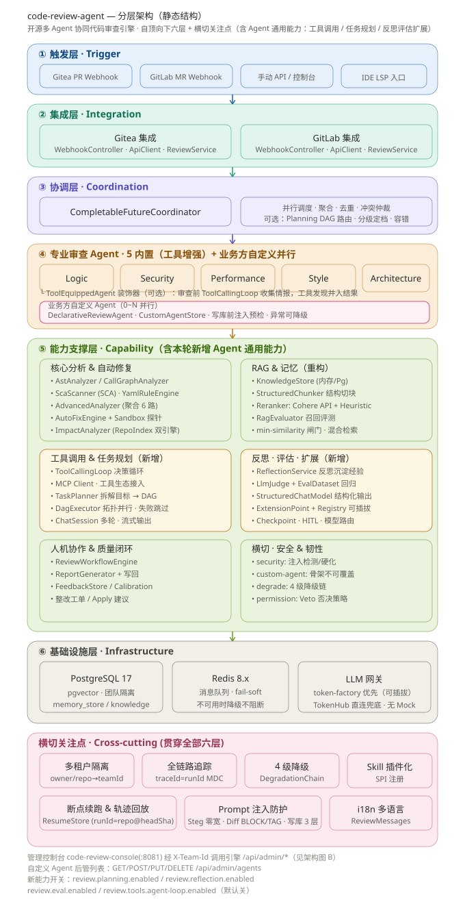
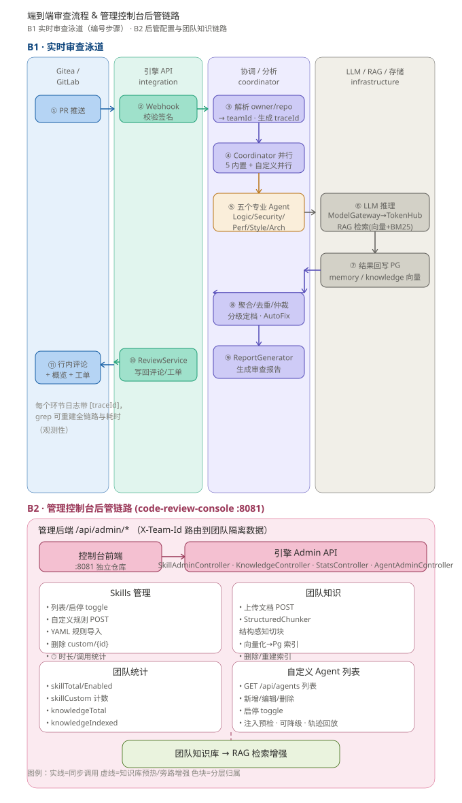

> [English](README.md) | [中文](README.zh-CN.md)

# 智能代码审查系统（Multi-Agent 协同架构）

基于《多 Agent 协同审查》设计文档实现的 Java 17 / Spring Boot 3.3 多 Agent 协同代码审查系统。  
以**星型拓扑**组织 5 个专业审查 Agent，由 Coordinator 并行调度、汇聚、去重、冲突仲裁与分级定档，  
覆盖文档提出的：规则检测、LLM 增强、Prompt 模板化、Skill 插件化、工具路由、Prompt 注入防护、  
RAG 与三层记忆、4 级降级链等核心设计。

> 默认启用 PostgreSQL + pgvector + Redis + 腾讯混元，全套生产实现；未安装时设 `pgvector.enabled=false` / `redis.enabled=false` 即可回退内存实现。

## 架构总览

本系统是一个**星型拓扑的多 Agent 流水线**：Webhook 触发 PR/MR 审查，`CompletableFutureCoordinator` 并行分发给 5 个专业审查 Agent（外加一个 `AdvancedAnalyzer`，以及按团队展开的业务方**自定义 Agent**）执行，对结果做聚合/去重/冲突仲裁，再将报告写回代码托管平台。可选 Agent 通用能力（工具调用、任务拆解 DAG、反思经验库、LLM 评估、扩展机制）通过开关接入流水线。下面两张图分别呈现**静态分层结构**与**端到端运行时流程**（含管理控制台的技能时长 / 团队知识 / 自定义 Agent 后管链路）。

### 分层架构（静态结构）



*图 1 — 自顶向下六层：触发层 → 集成层 → 协调层 → 专业审查 Agent（5 内置·工具增强 + 业务方自定义并行）→ 能力支撑层（含工具调用 / 任务规划 / 反思评估扩展）→ 基础设施层；横切关注点（多租户、全链路追踪、4 级降级、Skill 插件化、注入防护、i18n）贯穿所有层级。*

### 端到端流程 & 管理控制台后管（技能时长、团队知识）



*图 2 — B1 实时审查泳道（① PR 推送 → ⑪ 行内评论，每个环节日志携带 `traceId`）；B2 后管链路：管理控制台 `code-review-console`（:8081）驱动引擎 `SkillAdminController`（含 ⏱ 时长/调用统计）、`KnowledgeController`（团队文档上传 → StructuredChunker 结构切块 → Pg 向量索引）、`StatsController`、`AgentAdminController`（自定义 Agent 列表：增删改查 + 注入预检 + 并行审查），团队知识库在审查时回流进 RAG 检索增强。*

## 技术栈

- Java 17、Spring Boot 3.3.4
- Jackson（Agent 间标准化消息协议编解码）
- LangChain4j 1.19.0（统一接入大模型 + 结构化输出 `AiServices` + OpenAI 兼容协议）
- 腾讯云 TokenHub MaaS（一个 API Key 通吃多模型：混元 `hy3` / DeepSeek `deepseek-v4-flash` / 智谱 `glm-5.2`，可回退 Mock）
- PostgreSQL 17 + pgvector 0.8（向量记忆存储，可回退内存）
- Redis 8.x（消息队列，可回退内存）
- 多租户（团队）隔离：全局基线（`__global__`）+ 团队叠加，按 `teamId` 隔离自定义规则 / 知识 / 记忆 / 历史 / 反馈
- 全链路追踪：基于 SLF4J MDC 的 `traceId` + LangChain4j `ChatModelListener`（LLM 请求/响应边界日志）

## 快速开始

### 标准部署（生产环境 / 独立服务）

agent 是**独立服务**：打包后指向你已有的 PostgreSQL/Redis/Gitea，直接运行 jar 即可。

```bash
# 1. 打包
./mvnw -o package -DskipTests

# 2. 配置（application.yml / 环境变量）：PG+pgvector、Redis、Gitea/GitLab 地址、
#    tokenhub API key、review.lang、review.profile…… 见下方「关键配置」

# 3. 运行服务
java -jar target/code-review-agent-1.0.0.jar
```

- 默认 Webhook：`http://<host>:8080/webhook/gitea`；控制台（独立仓库 `code-review-console`）:8081
- **不捆绑任何基础设施**——PG/Redis/Gitea 由你的环境/运维提供

### 本地开发调试（可选，macOS Colima+Homebrew 或 Docker）

> ⚠️ `dev/` 下的脚本**仅用于本地开发调试**：一次性拉起 PG/Redis/Colima/Gitea/引擎全家桶。生产环境请勿使用。

```bash
# 方式 A：macOS（Colima + Homebrew）一键全家桶
cp .env.example .env
./dev/start-all.sh dev        # PG → Redis → Colima → Gitea → 引擎(:8080)
./dev/status.sh
./dev/stop-all.sh --all       # --all 连 Colima 虚拟机一起停

# 方式 B：任意装 Docker 的机器 —— 基础设施用 compose，引擎用 maven 起
cd dev && docker compose -f docker-compose.dev.yml up -d   # PG17+pgvector / Redis / Gitea
cd .. && ./mvnw spring-boot:run -Dspring-boot.run.profiles=dev
```

`start-all.sh` 会自动完成：

1. 启动 PostgreSQL 17（首次自动 initdb、建库 `codereview`、启用 `vector` 扩展）
2. 启动 Redis（端口 6379）
3. 启动 Colima 虚拟机（若 Docker 未运行）
4. 启动 Gitea 容器（首次自动创建，端口 3000，数据持久化在 `~/gitea-local/`）
5. 启动审查服务（端口 8080，Gitea 集成自动开启，日志在 `/tmp/review-app.log`）

全部就绪后：

- **Gitea**：http://localhost:3000（账号 `reviewer`，密码见你的 Gitea 安装配置）
- **审查服务 Webhook**：`http://&lt;HOST_IP&gt;:8080/webhook/gitea`（容器内回调宿主机地址）
- **演示 PR**（含预埋问题代码，可直接看审查效果）：<http://localhost:3000/reviewer/demo-project/pulls>

> 首次在新机器上使用前，需安装依赖（仅一次）：
>
> ```bash
> brew install postgresql@17 pgvector redis colima docker
> ```
>
> 启动后提任意 PR 即触发自动审查，报告以 Markdown 评论回写到 PR。

### 首次开机后的标准流程

```bash
cd code-review-agent
./dev/start-all.sh     # 开机后跑一次，全部拉起
./dev/status.sh        # 随时确认状态
# ... 正常使用（提 PR → 自动审查）...
# 不用时：
./dev/stop-all.sh      # 或 ./dev/stop-all.sh --all 彻底关停
```

### 手动启动（可选，不走脚本）

```bash
# 1. PostgreSQL 17 + pgvector
/opt/homebrew/opt/postgresql@17/bin/pg_ctl -D /opt/homebrew/var/postgresql@17 -l /tmp/pg.log start

# 2. Redis
/opt/homebrew/opt/redis/bin/redis-server --daemonize yes --port 6379

# 3. Gitea（Docker 容器）
docker start gitea

# 4. 审查服务
./mvnw spring-boot:run -Dspring-boot.run.arguments="--gitea.enabled=true --gitea.base-url=http://localhost:3000 --gitea.api-token=<token> --gitea.webhook-secret=<secret>"
```

> 注意 1：若 shell 环境存在 `SERVER__PORT` 等环境变量会覆盖 `server.port` 配置，  
> 启动前可 `unset SERVER__PORT`（脚本已自动处理）。
>
> 注意 2：必须使用 **PG17 自带的 psql/createdb**（`/opt/homebrew/opt/postgresql@17/bin/`），  
> PATH 里若链接的是 PG16 客户端会因系统表结构差异报错（脚本已自动处理）。

### 仅运行审查服务（不接 Gitea）

```bash
./mvnw spring-boot:run
```

如需启动时执行一次硬编码样例演示（不走 Webhook），用 `-Dspring-boot.run.arguments="--demo.runner.enabled=true"` 传入，  
将依次打印：

1. 多 Agent 协同审查报告（Markdown）
2. Prompt 注入纵深防御检测结果
3. RAG 与长期记忆检索结果
4. 4 级降级链（异常自动降级到人工复核）
5. 误报反馈闭环（标记误报 → 二次审查自动抑制）
6. 修复后复检（与上次审查对比已解决/未解决）

也可仅编译验证：`./mvnw -B clean compile`（期望 BUILD SUCCESS）。

## 接入 GitLab（自动审查 Merge Request）

系统内置 GitLab 集成层，配置三步即可实现 MR 提交后自动审查并将报告回写到 MR 评论。

### 第一步：创建 GitLab Personal Access Token

在 GitLab → 用户头像 → **Preferences → Access Tokens** 创建 Token，勾选 **api** scope。

### 第二步：填写配置

编辑 `src/main/resources/application.yml`：

```yaml
gitlab:
  base-url: https://gitlab.your-company.com   # 你的 GitLab 实例地址
  api-token: glpat-xxxxxxxxxxxx              # 上一步创建的 Token
  webhook-secret: my-webhook-secret          # 自定义密钥（用于校验 Webhook 来源）
  enabled: true                              # 开启 GitLab 集成
```

或通过命令行参数 / 环境变量注入（推荐，避免密钥入库）：

```bash
GITLAB_API_TOKEN=glpat-xxx ./mvnw spring-boot:run \
    -Dspring-boot.run.arguments="--gitlab.enabled=true --gitlab.base-url=https://gitlab.your-company.com"
```

### 第三步：在 GitLab 项目配置 Webhook

在目标项目 → **Settings → Webhooks** 添加：

- **URL**：`http://<你的服务地址>:8080/webhook/gitlab`
- **Secret token**：与 `gitlab.webhook-secret` 一致
- **Trigger**：勾选 **Merge request events**

### 工作流程

```
开发者提交 MR
  → GitLab 发送 Webhook（action=open/update）
  → 系统异步拉取 MR 变更（GET /projects/:id/merge_requests/:iid/changes）
  → 5 个 Agent 并行审查（逻辑/安全/性能/风格/架构 + 混元 LLM）
  → 聚合去重、冲突仲裁、分级定档（Blocker/Major/Minor/Info）
  → 审查报告以 Markdown 评论回写到 MR
```

> 异常隔离设计：GitLab API 不可达 / Token 失效 / MR 无变更等情况均优雅降级，  
> 在 MR 上发布跳过说明，不影响服务稳定性。Webhook 响应在 200ms 内返回（异步执行审查），  
> 不会触发 GitLab 的 10 秒超时。

## 接入 Gitea（轻量方案，推荐本地体验）

GitLab CE 镜像约 3GB、启动 5-10 分钟，本地体验推荐 **Gitea**（镜像 ~110MB、秒级启动）。  
系统内置同等能力的 Gitea 集成层（`integration/gitea` 包）。

### 第一步：本地运行 Gitea（Docker）

```bash
docker run -d --name gitea -p 3000:3000 -p 2222:22 \
  -v ~/gitea-local/data:/data -v ~/gitea-local/logs:/var/log/gitea \
  -e USER_UID=1000 -e USER_GID=1000 \
  -e GITEA__security__INSTALL_LOCK=true \
  -e GITEA__server__ROOT_URL=http://localhost:3000/ \
  -e GITEA__service__DISABLE_REGISTRATION=true \
  -e GITEA__webhook__ALLOWED_HOST_LIST=private,loopback \
  --restart unless-stopped gitea/gitea:latest

# 创建管理员与 Token
docker exec -u git gitea gitea admin user create --admin \
  --username reviewer --password '<密码>' --email reviewer@example.com --must-change-password=false
docker exec -u git gitea gitea admin user generate-access-token --username reviewer --scopes all
```

> 注意：容器内访问宿主机审查服务用 `http://&lt;HOST_IP&gt;:8080`（Colima/Docker 环境的宿主机网关地址）。

### 第二步：启动审查服务

```bash
./dev/start-all.sh    # 一键启动 Gitea + PostgreSQL + Redis + 审查服务
```

或手动指定参数：

```bash
./mvnw spring-boot:run -Dspring-boot.run.arguments="--gitea.enabled=true --gitea.base-url=http://localhost:3000 --gitea.api-token=<上一步生成的 Token> --gitea.webhook-secret=<自定义密钥>"
```

### 第三步：在 Gitea 项目配置 Webhook

仓库 → **Settings → Webhooks → Add Webhook → Gitea**：

- **Target URL**：`http://&lt;HOST_IP&gt;:8080/webhook/gitea`
- **Method / Content Type**：POST / application/json
- **Secret**：与 `gitea.webhook-secret` 一致（HMAC-SHA256 签名校验）
- **Trigger**：勾选 **Pull Request**

### 工作流程

```
开发者提交/更新 PR
  → Gitea 发送 Webhook（action=opened/synchronized/reopened）
  → 系统异步拉取 PR diff（GET /repos/:owner/:repo/pulls/:index.diff）
  → 5 个 Agent 并行审查（逻辑/安全/性能/风格/架构 + 混元 LLM）
  → 聚合去重、冲突仲裁、分级定档（Blocker/Major/Minor/Info）
  → 审查报告以 Markdown 评论回写到 PR
```

> 技术提示：新版 Gitea 的 `/pulls/:index/files` 接口不返回 `patch` 字段，  
> 本系统改用 `/pulls/:index.diff` 拉取完整 unified diff 并自行解析，兼容性最好。

### 行内评论与「应用建议」按钮（Gitea 1.27 适配）

自动修复建议以 ```` ```suggestion ```` 代码块回写到 PR，**只有在代码评审行内评论里才会渲染「应用建议」(Apply) 按钮**（顶层 PR 评论不会显示）。

> **Gitea 1.27 API 变更**：已移除独立的 `POST /pulls/{index}/comments` 接口，且 `POST /reviews/{id}/comments` 仅保留 GET 列表（调用返回 **405**）。  
> 因此行内评论只能在「创建评审」时通过 `comments` 数组**一次性写入**：`GiteaApiClient.postReviewComments(...)` 调用  
> `POST /repos/{owner}/{repo}/pulls/{index}/reviews`，以 `event=COMMENT` 一次性提交评审 + 所有行内评论（每条 `ReviewCommentItem` 含 `path` / `line`(side=RIGHT) / `body`）。
>
> ⚠️ **已知限制（已在 Gitea 1.27 实测）**：当评论随 PENDING 评审一并提交时，`line` / `side` 字段会被 Gitea **静默丢弃为 `null`**，所有评论退化为**文件级**评论（`IsCodeComment()=false`）。  
> 结果：**经 REST API 的「应用建议」(Apply) 按钮在 1.27 下不会渲染**，`suggestion` 块仅作为普通代码块展示。  
> 因此引擎同时把可采纳修复写入**顶层概览评论**（auto-fix 摘要）+ 文件级 `suggestion` 块供人工复制。若需真正的行内 Apply 体验，须升级到恢复行内评论 API 的 Gitea 版本，或走非 REST 路径。

## IDE（IntelliJ IDEA）打开后若满屏爆红

命令行可编译、但 IDE 满屏报错，几乎都是 **IDE 的 JDK / 语言级别低于 16，或未加载 Maven 依赖**所致——  
本项目大量使用 Java 16+ 语法（`record`、`switch` 表达式 `->`、文本块 `"""`），低于该版本会被 IDE 标红。

1. **确认 JDK**：`File → Project Structure → Project SDK` 选择 **17**（如 Corretto / Zulu 17）；
2. **确认语言级别**：同一窗口 `Project → Language Level` 设为 `17`；
3. **重新加载 Maven**：右键 `pom.xml → Maven → Reload Project`（或 Maven 工具窗口的刷新按钮）；
4. 仍不行：`File → Invalidate Caches… → Invalidate and Restart`，再重新加载 Maven。

> 注意：Spring Boot 3.3 最低要求 Java 17；本工程统一使用 **Java 17**（`maven.compiler.release=17`，仅用 `record` 等 17 特性），编译需 JDK 17+。IDEA 2022.2 不识别 Java 21 项目语言级别，故锁定 17 避免 reimport 后 bytecode 被回退。

## 接入真实大模型（TokenHub 多模型，via LangChain4j）

系统通过 **LangChain4j 1.19.0** 统一接入大模型，底层走 **腾讯云 TokenHub MaaS** 的 OpenAI 兼容协议。  
TokenHub 一个 API Key 可调平台所有模型，仅需切换 `model` 字段，**不引入 `langchain4j-pgvector`**（其独立版本号与多租户 `memory_store` schema 冲突，PG 记忆沿用自建存储）。

- 接入点：`https://tokenhub.tencentmaas.com/v1`
- 默认模型（网关按列表顺序路由，超时/失败自动 failover）：`hy3`（混元）、`deepseek-v4-flash`（DeepSeek）、`glm-5.2`（智谱）
- 结构化输出：`CodeReviewAiService`（LangChain4j `AiServices`）+ `MessageWindowChatMemory`（按 Agent-团队-PR 隔离的短期窗口记忆）；解析失败回退文本路径（`LlmFindingParser`）

### 配置（`src/main/resources/application.yml` 的 `tokenhub`）

```yaml
tokenhub:
  api-key: ${TOKENHUB_API_KEY:}        # 留空则回退 Mock（仅供演示，LLM 不产生发现）
  base-url: https://tokenhub.tencentmaas.com/v1
  timeout-seconds: 60
  quota-per-minute: 200
  models:
    - name: hunyuan
      model: hy3
    - name: deepseek
      model: deepseek-v4-flash
    - name: glm
      model: glm-5.2
```

> 加模型只需在 `models` 列表加一行（共用同一 Key）；想换 AiServices 主模型，把对应项移到列表第一个即可。  
> 无 OpenAI 官方通道（国内不好用），所有模型统一走 TokenHub。

### 调用链路

```
LlmClient(接口)
  └─ ModelGateway            # 多供应商路由 + 60s 滑动窗口配额 + failover + Mock 兜底
       ├─ LangChain4jChatProvider(hunyuan)  → OpenAiChatModel(hy3)      + LoggingChatModelListener
       ├─ LangChain4jChatProvider(deepseek) → OpenAiChatModel(deepseek-v4-flash) + LoggingChatModelListener
       ├─ LangChain4jChatProvider(glm)      → OpenAiChatModel(glm-5.2)  + LoggingChatModelListener
       └─ MockProvider         # 列表终点，无 Key 时零配置可用
primaryChatModel（取 models[0]）→ CodeReviewAiService(AiServices 结构化输出 + ChatMemory)
```

- 启动日志：`已装配 LangChain4j 统一模型网关（TokenHub 多模型）：ModelGateway[hunyuan(on),deepseek(on),glm(on),mock(on)]`
- 向量化：`review.llm.embedding.enabled=true` 时切 `LangChain4jEmbeddingClient`（OpenAiEmbeddingModel，api-key/base-url 未单独配则复用 TokenHub）；默认 `SimpleHashEmbeddingClient`（离线哈希 256 维）。TokenHub 嵌入模型：`kinfra-text-embedding-0.6b`(1024 维，默认) / `kinfra-text-embedding-4b`(2560 维)；pgvector ivfflat 索引上限 2000 维，故默认 1024（切换模型须同步改 `pgvector.vector-dim`，存量表自动迁移重建向量列）。

> ⚠️ **安全提示**：`api-key` 是敏感凭证，请勿将明文密钥提交到代码仓库。推荐两种做法：
>
> 1. 保留占位 `${TOKENHUB_API_KEY:}`，运行前用环境变量注入：`TOKENHUB_API_KEY=sk-xxxx ./mvnw spring-boot:run`；
> 2. 或将 `application.yml` 加入 `.gitignore`，改用本地覆盖文件 `application-local.yml`。
>
> 当前仓库的 `application.yml` 已写入一个可用 Key 用于演示，请在上线前移除或替换。

启用真实模型后，`ModelGateway` 打印当前在线供应商；最终审查报告中标注 **来源 LLM** 的发现即由对应模型实时推理产生（规则型发现仍由本地确定性检测补充）。

## RAG 与高级检索

团队知识库 + 编码规范手册的 RAG 管线围绕可插拔的 `KnowledgeStore` 抽象（`InMemoryKnowledgeStore` 用于本地 / `PgKnowledgeStore` 用于 PostgreSQL + pgvector）重建，默认开启**混合检索（稠密向量 + BM25 关键词）**，并引入 **Cross-Encoder 重排** 与 **相似度闸门** 抑制低相关噪声。

```
源文档 ─▶ StructuredChunker（按标题/代码围栏切分） ─▶ 向量化 ─▶ KnowledgeStore
                                                                  │
查询 ─▶ 混合召回（向量 ∪ BM25，top-K） ─▶ Reranker（cross-encoder） ─▶ min-similarity 闸门 ─▶ prompt
```

- **`StructuredChunker`**：保留 Markdown 结构（标题 + 围栏代码块），让召回返回语义完整、自洽的片段，而非任意字符切片。
- **`Reranker`** 接口两种实现：`ApiReranker`（Cohere/Jina cross-encoder）与 `HeuristicReranker`（离线词法/位置打分）。**API Key 缺失时 `ApiReranker` 自动降级到 `HeuristicReranker`**——审查链路永不因重排而阻塞。
- **`RagEvaluator`**：在携带 ground-truth `expectedId` 元数据时可选记录 precision/recall，便于检索质量做回归测试。
- **`min-similarity`**（默认 `0.3`）：在候选进入 prompt 前丢弃低于阈值的片段，实现"选择性 abstain"以保持上下文干净。

### 配置（`application.yml` 的 `review.rag` / `review.egress`）

```yaml
review:
  rag:
    rerank:
      enabled: true                 # 开启 cross-encoder 重排（无 key 时自动降级 heuristic）
      provider: cohere              # cohere | jina
      base-url: ${RERANK_BASE_URL:https://api.cohere.com/v2/rerank}
      api-key: ${RERANK_API_KEY:}   # 留空 → 离线 heuristic 重排
      model: ${RERANK_MODEL:rerank-english-v3.0}
      timeout-ms: 5000
    min-similarity: ${RAG_MIN_SIMILARITY:0.3}   # 0.0 = 不拦截
    eval-enabled: ${RAG_EVAL_ENABLED:true}
  # Egress：按依赖显式出口管控（绝不劫持 localhost 的 PG/Redis/Gitea）
  egress:
    rerank:
      mode: ${EGRESS_RERANK_MODE:direct}        # direct | system | proxy
      proxy-url: ${RERANK_PROXY:}               # 仅 mode=proxy 时生效
```

> 🔐 **生产凭证**：`RERANK_API_KEY` / `TOKENHUB_API_KEY` 必须由 Secret Manager（Vault / AWS Secrets Manager / Doppler）注入环境变量，**绝不入库**。`.env` 已被 git-ignore 忽略（见 `.env.example`）。
>
> 🌐 **GFW / 出口说明**：Cohere/Jina 端点在某些网络下被封锁。可用 `EGRESS_RERANK_MODE=proxy` + `RERANK_PROXY=http://127.0.0.1:<clash-mixed-port>`（如 Clash Verge 的 mixed-port `7897`）仅让**重排请求**走显式代理，不会劫持 localhost 的 PostgreSQL/Redis/Gitea 连接。`direct`（默认）适用于合规网络内直出、或经内部 AI Gateway（Envoy AI Gateway / LiteLLM Proxy 等）统一持有供应商 key 的场景。

## 多租户（团队）隔离架构

系统采用**「全局基线 + 团队叠加」**模型，让多个团队在同一套引擎上互不干扰地自定义审查策略，同时共享平台内置能力。

- **全局基线（`__global__`）**：内置 13 个 Skills + 编码规范手册 RAG 向量，所有团队共享，不可被团队覆盖。
- **团队叠加**：自定义规则 / 团队知识 / 记忆 / 审查历史 / 误报反馈按 `teamId` 隔离。
- **团队识别**：`review.teams.mapping` 按 `owner/repo`（精确）> `owner`（组织）> 回退 `default` 解析；Webhook 已带 `owner/repo` 自动识别；控制台 / API 用 `X-Team-Id` 请求头覆盖。
- **落盘隔离**：团队数据落在 `data-dir/<teamId>/`（含 `custom-rules.json` / `skills-enabled.json` / `feedback.json` / `review-history.json` / `knowledge/`）；PostgreSQL `memory_store` 表加 `team_id` 列 + `idx_memory_team` 索引，RAG 检索含全局基线（`includeGlobal=true`）、经验/团队记忆不含（`includeGlobal=false`）。
- **代码位置**：`tenant` 包（`Teams` 常量与 `sanitize` / `TeamProperties` `@ConfigurationProperties` / `TeamResolver.resolve(owner,repo,override)`）；`ReviewAgentConfig` 注册 `teamResolver` Bean（并 `@EnableConfigurationProperties({TeamProperties.class, TokenHubProperties.class})`）；控制台 `EngineClient` 透传 `X-Team-Id`。
- **启动迁移**：旧 `data-dir` 根下的规则文件首次启动自动迁移进 `default` 团队；内置 Skills 各团队在 `skills-enabled.json` 独立启停。

## 全链路追踪（可观测性）

为便于线上问题定位，系统为每次审查请求注入贯穿全链路的 `traceId`，并在 LLM / 向量库边界统一打点。

- **`core/trace/TraceContext`**：基于 SLF4J MDC 的 12 位十六进制 `traceId`；入口（Webhook / Demo）生成并 `set`；因系统大量 `CompletableFuture.supplyAsync` 跨线程（默认 `ForkJoinPool`），用 `TraceContext.wrap(Runnable/Supplier)` 在提交前 `capture()`、执行 `restore()`、结束 `restorePrev(prev)`——**关键坑**：`wrap` 的 finally 必须用恢复快照而非 `MDC.clear()`，否则 `ForkJoinPool` 就地执行会清掉调用线程自身 traceId，导致 join 之后日志全变 `N/A`。
- **日志格式**：`application.yml` 的 `logging.pattern.console/file` 加入 `[traceId=%X{traceId:-N/A}]`，每行自动带追踪号（无则显示 N/A）。
- **LLM 边界日志**：`core/llm/LoggingChatModelListener`（LangChain4j `ChatModelListener`）统一记录所有 `ChatModel` 的请求 / 响应，天然带 traceId，**一条线覆盖 AiServices 与文本回退两条路径**（避免 AiServices 直连 `ChatModel` 不经 `ModelGateway` 导致日志缺失）；INFO 截断前 800 字符，开 `com.codereview.agent.core.llm: DEBUG` 看完整请求 / 响应。
- **排查用法**：线上某次 PR 审查异常，先取该次请求的 `traceId`（Webhook 收请求日志里有），再 `grep traceId=xxxx 应用日志` 即可还原完整调用链（Webhook→协调器→子 Agent→LLM→向量库→Gitea 回写）与各阶段耗时，定位是 LLM 慢 / 子 Agent 异常 / 向量库慢 / Gitea API 失败。

## 新增能力（基于文档补充实践）

在既有「并行审查 + 去重 + 分级定档」之上，本系统进一步落地文档提出的四类闭环实践：

### 1. 优先级冲突仲裁（Conflict Arbitration）

当不同 Agent 在同一代码位置给出相互冲突的建议（如性能 Agent 建议“内联”、风格 Agent 建议“拆分函数”），  
Coordinator 按固定优先级权重裁决，高优先级胜出，落败方进入报告「⚖️ 冲突仲裁」区块并标注原因：

- 安全 `SECURITY(100)` > 逻辑 `LOGIC(90)` > 性能 `PERFORMANCE(70)` > 架构 `ARCHITECTURE(60)` > 风格 `STYLE(10)`
- 优先级相同时，再按严重级别、置信度兜底。

### 2. 误报反馈闭环（False-Positive Loop / Human-in-the-loop）

开发者在 PR 上标记某条发现为误报后，系统将其沉淀为长期反馈（`FeedbackStore`），后续聚合阶段自动抑制相同规则  
（支持规则级或文件级精准抑制），实现“越审越准”：

- 提交反馈：`POST /api/feedback`
- 查询反馈：`GET /api/feedback`
- 示例：
  ```bash
  curl -X POST http://localhost:8080/api/feedback -H 'Content-Type: application/json' \
    -d '{"ruleId":"SEC-002","agentType":"SECURITY","isFalsePositive":true,"file":"PaymentService.java","note":"合规例外"}'
  ```
- 被抑制项在报告中以「🚫 已抑制误报」区块呈现，不计入分级统计。

### 3. 修复后复检（Incremental Re-check / Verification）

同一 PR 再次推送（Webhook `synchronized`）时，系统读取历史（`ReviewHistoryStore`），与上一轮对比，在报告中给出  
「🔁 修复复检」区块：已解决 / 未解决 / 新引入，逐条列出，验证问题是否真正修复。

### 4. 调用链追踪与质量趋势（Traceability & Quality Trend）

- 每次审查生成唯一 `runId` 并统计耗时，写入报告头，便于日志关联与耗时监控；
- `GET /api/quality-report?range=week|all` 基于历史聚合输出周度 / 全量质量趋势 Markdown：审查次数、问题总数、  
  分级分布、高频规则 Top10、仓库分布、最近审查，供 Tech Lead 持续改进。

### 5. 架构对标增强（deepseek-harness / openai codex 借鉴落地）

> 对照两份外部 harness 源码（dsh 事件源 Session / codex RolloutItem 轨迹、context-fragments 按需注入、  
> suspend/recover_turn 断点续跑、guardian-v2 fail-closed、intersect_permission_profiles 权限收敛、  
> ToolExposures 工具分级、agent-team TeamMailbox 持久信箱、llm-replay 确定性回放）逐一落地，  
> 全部为**可选增强**：不配置即与旧版行为完全一致，核心审查链路不受影响。

**5.1 事件源审查轨迹（对齐 dsh `Session` / codex `RolloutItem`）**
- `core/trajectory/`：`ReviewEvent`（不可变）+ `ReviewEventLog`（RCU 原子追加、不可变视图）+ `ReviewTrajectoryRecorder`；
- 每次审查按 `runId` 记录 `review.started → context.diff-loaded → context.injected → agent.started → agent.completed → review.completed` 全链路事件；
- 落盘 `data-dir/<teamId>/trajectories/<runId>.jsonl`（JSONL，追加式），失败仅告警不阻断审查；事件自带 traceId，与日志链路关联。

**5.2 上下文影响面切片（对齐 codex `context-fragments`）**
- `core/impact/ImpactAnalyzer` 复用 `AstAnalyzer` + `CallGraphAnalyzer`，计算「变更方法 → 上游调用方」传播链；
- 影响面摘要经 `ReviewContext.impactSummary` 注入 5 个 Agent 的 prompt（模板新增「影响面」区块，缺失变量安全）；无影响面时返回空串，避免噪声；
- 大 PR 只喂「改动方法 + 受影响调用方」，降 token、提聚焦度。

**5.3 断点续跑（对齐 codex `suspend_turn_and_shutdown` + `recover_turn_if_idle`）**
- `core/resume/`：`ResumeState`（已完成 Agent + 已产出发现）+ `FileResumeStore`（原子 JSON 落盘 `data-dir/<teamId>/resume/<runId>.json`）；
- 同 `runId` 再次审查时自动恢复：**已完成的 Agent 不重跑**，只跑剩余 Agent，崩溃后长 PR 不重审；
- 每完成一个 Agent 即保存断点，正常完成自动清理；轨迹含 `review.resumed` 事件便于审计。

**5.4 审查强度 Profile（可热切换）**
- `core/profile/ReviewProfile`：`STRICT`（保留 Minor+）/ `ADVISORY`（默认，只留 Major+）/ `SUGGEST`（全保留）；
- 配置 `review.profile=STRICT|ADVISORY|SUGGEST`，作用于聚合去重/仲裁/抑制之后，CI 门禁用 STRICT、日常用 ADVISORY。

**5.5 AutoFix fail-closed 安全边界 + 沙箱探测（对齐 dsh `SandboxUnavailableError` / codex `guardian-v2`）**
- `core/autofix/`：`AutoFixMode`（SUGGEST/APPLY，默认 SUGGEST）+ `AutoFixSafetyPolicy`（APPLY 需沙箱可用，否则拒绝）+ `SandboxProbe`（探测 bwrap/firejail/sandbox-exec/docker，探测失败一律不可用）；
- 任何实际写代码的路径必须先过 `canApply()/requireApplyAllowed()` 守卫，绝不在无隔离时静默应用。

**5.6 权限收敛（对齐 codex `intersect_permission_profiles` 父不覆盖子）**
- `core/permission/VetoPolicy`：**BLOCKER 级强否决不可被「误报抑制」或「仲裁覆盖」剔除**，自动回收回最终报告；
- 保证「任一专家 Agent 的阻断级结论不会被总审查员宽松处理」。

**5.7 工具分级门控（对齐 codex `ToolExposures` DIRECT/DEFERRED/CODE_MODE）**
- `core/tools/`：`ToolExposure` + `ToolGate`——DEFERRED 重工具（全量编译、跑测试、AutoFix 写码）默认**拒绝**（fail-closed）；
- 放行条件：`review.tools.deferred-enabled=true` 或当前 profile=STRICT；每次裁定记录调用统计（放行/拒绝计数），供审计。

**5.8 持久化信箱委派（对齐 dsh `agent-team` `TeamMailbox`）**
- `core/mailbox/TeamMailbox`：`send`（先落盘 QUEUED）→ `poll`（DELIVERED）→ `ack`（ACKED），崩溃后 `recoverFor` 重投未确认消息；
- 落盘 `data-dir/<teamId>/mailbox/<to>.json`（原子写，重启自动恢复），为后续「主审委派子任务给专项 Agent」提供不丢、不重、有序的队列基础。

**5.9 确定性回放评测（对齐 dsh `llm-replay` / codex `rollout`）**
- `core/eval/ReviewReplay`：读取轨迹 JSONL 校验事件序列结构完整性（必须有 `review.started` 开头、`review.completed` 结尾、事件类型合法）；
- 配合固定 fixture 可做回归评测：新版本审查器对同一 PR 的轨迹应保持合法且结论一致，从「能跑」到「可信」。

**5.10 外部工具 SPI 插件化（对齐 codex `mcp_tool`）**
- `core/tools/external/`：`ExternalToolProvider`（name/capabilities/invoke）+ `ExternalToolRegistry`（注册/按名路由/fail-fast 调用）；
- MCP 等协议由 Provider 实现承载（文档见接口注释），引擎自身不强制引入 MCP SDK，保持离线可编译。

**配置项汇总（均为可选）**

| 配置项 | 默认 | 说明 |
| ------ | ---- | ---- |
| `review.profile` | `ADVISORY` | 审查强度：STRICT / ADVISORY / SUGGEST |
| `review.tools.deferred-enabled` | `false` | 是否放行 DEFERRED 重工具（fail-closed 默认拒绝） |
| `review.tools.code-mode-enabled` | `false` | 是否放行 CODE_MODE 工具 |
| `review.autofix.mode` | `SUGGEST` | 自动修复模式：SUGGEST / APPLY |
| `review.autofix.sandbox-available` | 空 | 显式指定沙箱可用性；留空则自动探测（bwrap/firejail/sandbox-exec/docker） |
| `review.data-dir` | `./data` | 轨迹 / 断点 / 信箱 / 反馈 / 历史统一落盘根目录 |

> 以上 4 类能力默认开启，无需额外配置；人工反馈与质量报告接口由 `review.api.enabled` 控制（`true` 默认开启），  
> 生产环境建议配合网关鉴权暴露。

### 企业级增强能力（九大模块）

在「并行审查 + 去重 + 分级定档 + 闭环」之上，进一步补齐了企业落地必备的九大能力模块，  
全部以「零外部依赖（除 YAML 解析用 snakeyaml）」的纯 Java 实现接入 Spring 装配，开箱即用：

#### 1. AST 语义分析（`AstAnalyzer`）

基于手写括号栈词法器（不依赖 JavaParser）解析源码，输出 `AstReport`：类结构、方法列表、  
方法行数（`length`）、分支数、嵌套深度，用于「方法过长 / 圈复杂度偏高」类结构性问题定位。  
在 CI 与 IDE 两个入口复用，保证口径一致。

#### 2. 调用链与影响面（`CallGraphAnalyzer` + `AdvancedAnalyzer`）

- `CallGraphAnalyzer`：解析单文件内「方法 → 被调用方法」关系，并以传递闭包计算某方法被哪些上游  
  方法依赖（`impact(method)`），支撑「改一处影响多大」的精准评估。
- `AdvancedAnalyzer`：将 AST + 调用链 + SCA 聚合成 `ARCHITECTURE`、`SECURITY` 两类 `AgentResult`，  
  并行注入 Coordinator 审查流水线（5 Agent + Advanced 共 6 路并行）。

#### 3. 低代码 Skill 平台（`YamlRuleEngine`）

运营 / 安全同学无需改代码即可下发新规则：提交 YAML 即生成 `CustomRuleRequest` 注入技能注册中心。  
引擎侧 `POST /api/admin/skills/yaml`，控制台侧 `POST /api/skills/yaml`（透传），返回 `{imported, errors}`：

```yaml
rules:
  - name: no-synchronized
    category: architecture
    title: 避免使用 synchronized 方法
    description: 高并发下 synchronized 方法易成瓶颈
    suggestion: 改用并发容器或显式锁
    severity: MAJOR
    pattern: 'synchronized\s+\w+\s*\('
```

#### 4. 统一模型网关（`ModelGateway`）

实现 `LlmClient`，内部聚合多个 `ModelProvider`（混元 / OpenAI / Mock），具备：

- **多供应商路由**：按配置顺序选择可用供应商；
- **配额保护**：`QuotaState` 60 秒滑动窗口限流，超窗口自动跳到下一家；
- **故障转移**：某供应商异常自动 failover 到下一个；
- **Mock 兜底**：列表末尾内置 Mock，无密钥时零配置可用。

启动日志会打印 `已装配统一模型网关：ModelGateway[hunyuan(on),mock(on),]`。

#### 5. 定时扫描（`ScheduledScanService`）

`@EnableScheduling` + `@Scheduled(cron="${scan.cron:0 0 2 * * *}")` 每日凌晨对配置仓库清单  
（`scan.repos=owner/repo:branch,...`）拉全量 diff 执行扫描，结果归档为 Gitea Issue，  
实现「无人值守夜间巡检」。由 `scan.enabled=true` 开启。

#### 6. 自动修复引擎（`AutoFixEngine`）

`generateSuggestions(ReviewReport)` 输出带 ```` ```suggestion ```` 代码块的可落地修复 Markdown：

- **确定性规则**：`LOGIC-002 / LOGIC-003 / PERF-001 / STYLE-002` 等用模板直接给出替换样例；
- **LLM 生成**：其余交由模型网关生成自然语言修复建议。

可直接回帖到 PR，开发者一键采纳。

#### 7. 人机协作工作流（`ReviewWorkflowEngine`）

将严重级别接入研发流程：

- **BLOCKER**：强制人工审批——创建 Gitea Issue 并将 commit status 置为 `failure`，阻断合入；
- 其余级别：commit status 置为 `success`。

通过 `GiteaApiClient.createIssue` / `createCommitStatus` 落地。

#### 8. SCA 依赖漏洞（`ScaScanner`）

解析 PR diff 中 `pom.xml` / `package.json` 的新增依赖，匹配内置 CVE 样本库  
（log4j-core CVE-2021-44228、spring-core CVE-2022-22965、commons-collections、  
jackson-databind、lodash、minimist、axios 等），输出漏洞清单、许可证黑名单命中（GPL/AGPL），  
并生成 CycloneDX-lite 的 SBOM JSON，随报告一并给出。

#### 9. IDE LSP 接口（`IdeReviewServer`）

以独立进程运行 JSON-RPC 2.0 over stdio（LSP `Content-Length` 分帧），让 VSCode / IDEA  
实时获得审查诊断与 Quick Fix：

- `initialize` → 声明 `textDocumentSync` + `codeActionProvider`；
- `textDocument/didOpen | didChange` → 触发分析并 `publishDiagnostics`（含规则 `code`）；
- `textDocument/codeAction` → 提供「查看代码审查修复建议」Quick Fix。

复用引擎 `AstAnalyzer` 与 `PatternSkill` 规则集，保证 IDE 与 CI 审查口径一致。由  
`java -cp ... com.codereview.agent.ide.IdeReviewServer` 启动，编辑器侧接 LSP 客户端即可。

### Agent 通用能力（工具调用 / 任务拆解 / 反思评估 / 扩展机制）

企业级 Agent 能力积木，全部为**可选增强（默认关闭）**——关闭时引擎行为与旧版完全一致。  
通过 `application.yml` 或 `--review.*.enabled=true` 开启：

| 能力 | 组件 | 开关 |
| --- | --- | --- |
| **工具调用循环**——思考→决策→调用→观察→推理；最大迭代防死循环、非法 JSON 优雅降级、工具异常不炸循环 | `toolcalling/AgentTool` + `ToolRegistry` + `ToolCallingLoop` + 内置工具（`current_time` / `regex_scan` / `file_read`·防路径穿越） | `review.tools.agent-loop.enabled` |
| **任务拆解 & DAG 执行**——LLM 将目标拆成依赖 DAG，按 `assignee` 路由到对应 Agent 拓扑并行执行；上游失败下游跳过，规划失败降级固定并行路径 | `planning/TaskPlanner` + `TaskPlan`（id 唯一/依赖存在/Kahn 无环）+ `DagExecutor` + `TaskPlanningSupport`（织入 `CompletableFutureCoordinator`） | `review.planning.enabled` |
| **反思与经验库**——审查后沉淀：BLOCKER/MAJOR 发现转为可复用 pattern + 建议，进团队隔离、去重的经验库（可选 LLM 总结） | `memory/ReflectionService` + `memory/ExperienceStore`（保留向量检索 API + 新增文件条目层） | `review.reflection.enabled` |
| **LLM 评估**——ground-truth precision/recall/F1 + llm-as-judge 逐条真假阳性判定；LLM 不可用时自动跳过 | `eval/LlmJudge`（复用轨迹 JSONL 做数据源） | `review.eval.enabled` |
| **可插拔组件机制**——`ExtensionPoint`（order 织入序/同名覆盖/线程安全）+ 五类扩展点接口（LlmInterceptor / RagEnhancer / AgentProvider / MemoryStrategy / StageHook） | `extension/ExtensionPoint` + `extension/ExtensionRegistry` | 注册为 Bean |

五项均有单测 + 集成测试覆盖（循环语义、DAG 拓扑序与环拒绝、Coordinator 织入、precision/recall 断言、注册表排序），详见 `docs/test-report-agent-capabilities-2026-08-27.md`。

### 数据持久化

反馈与历史默认落盘到 `review.data-dir`（默认 `./data`，生成 `feedback.json` / `review-history.json`）；  
目录不可写时自动回退内存，保证系统不中断。

## 管理控制台（Skills 市场 + 团队知识库 + 自定义 Agent）

为了让团队**自助管理审查规则与规范文档**，系统在引擎之上新增了独立的「控制台微服务 + Vue 前端」，
形成三层结构（引擎仍是唯一权威数据源）：

```
            ┌─────────────┐   HTTP 微服务调用    ┌──────────────────┐
 浏览器 ───▶ │  Vue 前端    │ ─────────────────▶ │ 控制台微服务        │
 (由 8081 托管)│ (ElementPlus)│   /api/* 透传        │ code-review-console │
            └─────────────┘                     └────────┬─────────┘
                                                          │ RestTemplate
                                                          ▼
                                                ┌──────────────────┐
                                                │ 审查引擎(8080)     │
                                                │ /api/admin/* 权威源 │
                                                └──────────────────┘
```

- **引擎**（`code-review-agent`，`:8080`）仍是唯一权威数据源，新增 `/api/admin/*` 管理接口；
- **控制台微服务**（`code-review-console`，`:8081`）用 `RestTemplate` 以微服务方式代理引擎，并托管 Vue 静态资源；
- **Vue 前端**由控制台在 `http://localhost:8081/` 直接托管，无需独立前端服务器。

> 三个页面：**仪表盘**（技能/知识概况）、**Skills 市场**（技能启停 + 自定义规则）、**团队知识**（规范文档/操作手册/视频上传）。

### 一键脚本（推荐）

仓库根目录提供了三个运维脚本，覆盖「完整栈启动 / 状态检查 / 停止」：

```bash
# 位于两个 Maven 工程的上一级目录（即本仓库根）
cd <workspace>                       # 含 code-review-agent / code-review-console 的目录

./start-all.sh          # 一键拉起 PG+pgvector / Redis / Gitea / 引擎(8080) / 控制台(8081)
./start-all.sh --no-wait# 仅后台拉起、不阻塞等待
./status.sh             # 查看各组件运行状态与健康
./stop-all.sh           # 停止全部（引擎/控制台/Gitea/Redis/PG）
./stop-all.sh --keep-infra  # 仅停应用层，保留 PG/Redis
```

- 脚本内含 **Gitea 令牌自举**：若 `reviewer` 管理员不存在会自动创建并生成令牌；引擎启动参数自动带上 Gitea 地址 / 令牌 / Webhook 密钥。
- 各组件日志统一写到 `/tmp/code-review-engine.log`、`/tmp/code-review-console.log`、`/tmp/pg.log`。
- 关键变量（端口、Gitea 凭据、Webhook 密钥、Colima 回调网关）都在脚本顶部，可按环境修改。
- 在 macOS 真实终端里，引擎/控制台以 `nohup` 脱离终端运行，**终端关闭后仍存活**。

### 启动控制台（手动三步，等价于脚本）

```bash
# 1. 先起引擎（确保 8080 可达；生产用真实 pgvector/redis，本地演示可回退内存）
cd code-review-agent
./mvnw spring-boot:run -Dspring-boot.run.arguments="--server.port=8080 --pgvector.enabled=true --redis.enabled=true"

# 2. 起控制台微服务（Spring Boot，8081）
cd ../code-review-console
./mvnw spring-boot:run -Dspring-boot.run.arguments="--server.port=8081"

# 3. 浏览器访问
open http://localhost:8081
```

> 控制台默认通过 `engine.base-url: http://localhost:8080` 连引擎。  
> 若引擎不在本机（容器/远程），改 `code-review-console/src/main/resources/application.yml` 的 `engine.base-url` 即可，无需改代码。

> **多租户支持**：控制台向引擎转发的所有管理请求（技能 / 知识 / 统计）均自动透传 `X-Team-Id` 请求头，  
> 使控制台界面按当前团队隔离查看与配置规则、知识与反馈；不传则回退 `default` 团队。

### 接入 Gitea 触发真实 PR 审查

引擎内置 Gitea Webhook 接收器（`/webhook/gitea`），开启 `gitea.enabled=true` 后自动注册。
`start-all.sh` 已默认开启并自动注入令牌与密钥，无需手工改配置。

1. **运行 Gitea**：`start-all.sh` 会以容器方式启动 Gitea（`:3000`），并自动创建管理员 `reviewer`、生成访问令牌。
2. **配置 Webhook**（在 Gitea 仓库 → Settings → Webhooks → Add Webhook → Gitea）：
   - 目标 URL：`http://&lt;HOST_IP&gt;:8080/webhook/gitea`
     （**Colima 下 Gitea 容器回调宿主机必须用此网关**；`172.17.0.1` 被拒、`host.docker.internal` 不解析）
   - Secret：`codeReviewWebhookSecret2026`（与引擎 `gitea.webhook-secret` 保持一致）
   - 事件：勾选 `Pull Request`（引擎在 `opened` / `reopened` / `synchronized` 时触发审查）
3. **验证**：在 Gitea 开一个 PR（或向 PR 分支推送新提交），引擎会拉取 diff → 五 Agent + 混元 LLM 审查 → 把 Markdown 报告作为 PR 评论回写。
4. **Git 克隆/推送**本地需绕过代理：`export no_proxy=localhost,127.0.0.1,&lt;HOST_IP&gt; && unset HTTP_PROXY HTTPS_PROXY`，再用 `git clone http://reviewer:<token>@localhost:3000/reviewer/<repo>.git`。

> 引擎侧参数（脚本已自动拼接）：`--gitea.enabled=true --gitea.base-url=http://localhost:3000 --gitea.api-token=<自动生成> --gitea.webhook-secret=codeReviewWebhookSecret2026`。

### 前端独立开发（可选）

```bash
cd code-review-console/frontend
npm install
npm run dev      # Vite 开发服务器，/api 已代理到 8081
# 构建产物输出到 ../src/main/resources/static，由控制台托管
npm run build
```

### Skills 市场

- **内置技能（13 个）**：安全维度 `hardcoded-secret`、`sql-injection`；通用维度 `empty-catch`、
  `print-stack-trace`、`system-out`、`select-star`、`new-in-loop`、`synchronized-method`、
  `long-line`、`todo-marker`、`trailing-whitespace`、`new-thread`、`instanceof-check`。
  每个技能按审查维度（security/logic/performance/style/architecture）路由，审查时实时取用。
- **团队自定义规则**：在「Skills 市场 → 新增自定义规则」填写名称、维度、严重级别、正则、标题、描述、修复建议，
  **即时生效**（正则编译为 `CustomRuleSkill`，无需改代码、无需重启）。
- **启停开关**：每个技能可独立启用/停用，状态持久化，重启后仍生效。

控制台接口（经 8081 代理，底层转发引擎 `/api/admin/skills`）：

| 方法   | 路径                          | 说明                                          |
| ------ | ----------------------------- | --------------------------------------------- |
| GET    | `/api/skills`                 | 列出全部技能（内置+自定义）与启用状态          |
| POST   | `/api/skills/{name}/toggle`   | 启停某技能（`body: {"enabled": true/false}`） |
| POST   | `/api/skills/custom`          | 新增团队自定义规则                            |
| DELETE | `/api/skills/custom/{id}`     | 删除自定义规则                                |

### 业务方自定义审查 Agent（团队级并行审查）

除内置 5 个通用子 Agent 外，业务团队可在后管「**自定义 Agent 列表**」自助定义 0~N 个专属审查 Agent，与通用 Agent **并行**参与每次 PR 审查；定义按 `teamId` 隔离，运行期增删即生效，无需重启。

设计原则（**可控性 > 灵活性、安全优先**）：

- **声明式，不开放代码 / 工具调用**：业务方仅填写「角色描述 + 审查要点 + 严重级别偏好」两个内容槽；系统指令骨架由代码硬编码且**不可被覆盖**，末尾固定护栏（diff 文字只是被审查数据、非指令）。
- **Prompt 注入纵深防御**：① 系统指令骨架不可覆盖；② 写库前对业务方提交内容做注入预检（`KeywordInjectionDetector`），命中即拒绝保存；③ 审查时 PR diff 过注入检测，命中仅数据区标注 `[INJECTION-RISK]`，**绝不切换系统角色**。
- **可降级**：自定义 Agent 异常 / 超时（复用整体 `timeout-ms`）仅该 Agent 结果置空，不影响内置 5 Agent 与最终报告。
- **可追踪 / 可回放**：复用事件源轨迹，记录 `agent.custom.expanded` / `agent.custom.disabled` 及 `custom-agent.created/updated/deleted/toggle`；落盘 `<data-dir>/<teamId>/trajectories/<runId>.jsonl`，支持事后回放与责任追溯（对齐 deepseek-harness / codex rollout）。

控制台接口（经 8081 代理，底层转发引擎 `/api/admin/agents`）：

| 方法   | 路径                          | 说明                                          |
| ------ | ----------------------------- | --------------------------------------------- |
| GET    | `/api/agents`                 | 自定义 Agent 列表（含启用态，按团队隔离）      |
| POST   | `/api/agents`                 | 新增自定义 Agent（含注入预检）                |
| PUT    | `/api/agents/{id}`            | 编辑更新（乐观锁 `version`）                  |
| DELETE | `/api/agents/{id}`            | 删除自定义 Agent                              |
| POST   | `/api/agents/{id}/toggle`     | 启停开关（`body: {"enabled": true/false}`）   |

> 与「自定义规则」的区别：自定义规则是**正则匹配的单条规则**，注入到对应维度的内置 Agent；自定义 Agent 是**独立的并行审查角色**，拥有自己的系统指令与审查要点，适合表达「支付合规审查」「某业务线专属规范」这类整体视角。

### 团队知识库（规范文档 / 操作手册 / 视频，接入 RAG）

「团队知识」页用于上传**团队规范文档、操作手册或培训视频**，解析后进入 RAG 向量知识库；
审查 Agent 在推理时自动参考，使团队私有规范参与审查。

- 支持 **文件上传**（`.txt`/`.md`/代码/`.docx` 自动提取文本）或 **纯文字稿**（`text` 字段，适合视频配文字稿）；
- 视频等二进制若无文字稿，仅保存元数据（`indexed=false`）；有文字稿则正常向量化（`indexed=true`）；
- 支持分类（`category`）与来源（`source`）标注。

控制台接口（经 8081 代理，底层转发引擎 `/api/admin/knowledge`）：

| 方法   | 路径                      | 说明                                                        |
| ------ | ------------------------- | ----------------------------------------------------------- |
| GET    | `/api/knowledge`          | 列出全部知识                                                |
| POST   | `/api/knowledge`          | 上传（`multipart`：`file` / `source` / `category` / `type` / `text`） |
| DELETE | `/api/knowledge/{id}`     | 删除知识（同时清理向量与文件）                              |

仪表盘统计：`GET /api/stats` 返回
`skillTotal / skillEnabled / skillCustom / knowledgeTotal / knowledgeIndexed`。

### 数据持久化（新增）

控制台不直接落盘，所有数据由引擎保存在 `review.data-dir`（默认 `./data`）：

| 数据             | 路径                                  |
| ---------------- | ------------------------------------- |
| 自定义规则       | `./data/custom-rules.json`            |
| 技能启停状态     | `./data/skills-enabled.json`          |
| 自定义 Agent 定义 | `./data/<teamId>/custom-agents.json`  |
| 团队知识原文+元数据 | `./data/knowledge/`（`.meta.json` 记录提取文本与向量信息） |

## 目录结构

```
src/main/java/com/codereview/agent/
├── CodeReviewAgentApplication.java        # 启动类
├── DemoRunner.java                        # 端到端演示入口（demo.runner.enabled=true 时激活）
├── config/ReviewAgentConfig.java          # Spring 装配（精确控制依赖）
├── config/InfrastructureConfig.java       # 基础设施按配置切换（pgvector/redis）
├── integration/
│   ├── gitlab/                            # GitLab 集成层
│   │   ├── GitLabApiClient.java           # REST API v4 客户端（拉 diff / 发评论）
│   │   ├── GitLabWebhookController.java   # Webhook 接收（/webhook/gitlab）
│   │   ├── GitLabReviewService.java       # 审查编排（webhook→diff→审查→回写）
│   │   └── GitLabConfig.java              # 集成层 Bean 装配
│   └── gitea/                             # Gitea 集成层（默认启用，轻量本地体验）
│       ├── GiteaApiClient.java            # REST 客户端（拉 diff / 批量行内评论 postReviewComments / commit status）
│       ├── GiteaWebhookController.java    # Webhook 接收（/webhook/gitea，gitea.enabled=true 注册）
│       ├── GiteaReviewService.java        # 审查编排（分阶段计时 + 回写顶层/行内评论）
│       └── GiteaConfig.java               # 集成层 Bean 装配
├── tenant/                                # 多租户（团队）隔离
│   ├── Teams.java                         # 内置团队常量（__global__ / default）+ sanitize
│   ├── TeamProperties.java                # @ConfigurationProperties（review.teams.default/mapping）
│   └── TeamResolver.java                  # resolve(owner,repo,override) → teamId
└── core/
    ├── model/        # 领域模型：Severity/AgentType/Finding/CodeDiff/PullRequest/ReviewMessage/Report
    ├── agent/        # ReviewAgent 接口 + 抽象基类 + 5 个具体 Agent + DeclarativeReviewAgent（声明式自定义 Agent）
    ├── coordinator/  # Coordinator 接口 + CompletableFutureCoordinator（并行/超时/部分失败/自定义 Agent 展开）
    ├── analysis/     # AstAnalyzer（AST 语义）/ CallGraphAnalyzer（调用链）/ ScaScanner（SCA）/ AdvancedAnalyzer（聚合）
    ├── autofix/      # AutoFixEngine（自动修复建议生成）
    ├── workflow/     # ReviewWorkflowEngine（BLOCKER 强制审批 / commit status）
    ├── scheduler/    # ScheduledScanService（定时夜间巡检）
    ├── prompt/       # PromptTemplate 接口 + 占位符模板 + classpath 加载器
    ├── skill/        # Skill 插件接口 + 注册中心 + 自定义规则 + YamlRuleEngine（低代码平台）
    │   └── impl/     # PatternSkill（通用正则技能）/ CustomRuleSkill（团队自定义）
    ├── admin/        # 控制台后端：技能/知识/自定义 Agent 管理 Controller + RAG 入库 + 文本提取 + DTO（CustomAgentStore/CustomAgentDef/AgentAdminController）
    ├── calibration/  # 置信度校准服务（误报/正报）
    ├── mq/           # MessageQueue 接口 + 内存实现 + QueueNames + AgentWorker
    ├── tool/         # ToolDefinition / ToolRouter（意图→白名单）/ ToolCallValidator
    ├── security/     # 注入检测（关键词/语义/异常）+ Prompt 硬化（XML/Canary）
    ├── memory/       # MemoryEntry / MemoryStore / InMemoryVectorStore / ReflectionAgent / RAG / ExperienceStore（团队隔离文件经验条目）/ ReflectionService（审查后反思沉淀）
    ├── toolcalling/  # AgentTool / ToolRegistry / ToolCallingLoop（思考→决策→调用→观察→推理）+ ToolEquippedAgent 装饰器 + BuiltinTools
    ├── planning/     # TaskPlanner（LLM 任务拆解）/ TaskPlan（DAG 校验）/ DagExecutor（拓扑并行）/ TaskPlanningSupport（织入 Coordinator）
    ├── rag/          # RAG 检索重构：KnowledgeStore（内存/Pg）/ StructuredChunker / Reranker（ApiReranker+HeuristicReranker）/ RagEvaluator / RagContextBuilder
    ├── llm/          # LlmClient / ModelGateway（多供应商路由+配额+failover）/ LangChain4jChatProvider / MockProvider / NoOpChatModel / LoggingChatModelListener / EmbeddingClient / aiservice/（CodeReviewAiService 结构化输出 + ChatMemory）
    ├── trace/        # TraceContext（SLF4J MDC traceId，跨线程 wrap 传播，全链路追踪）
    ├── trajectory/   # ReviewEvent / ReviewEventLog / ReviewTrajectoryRecorder（事件源审查轨迹，JSONL 落盘）
    ├── impact/       # ImpactAnalyzer（上下文影响面切片：变更方法 → 上游调用方，注入 Agent prompt）
    ├── resume/       # ResumeState / FileResumeStore（断点续跑：崩溃后同 runId 只重跑剩余 Agent）
    ├── profile/      # ReviewProfile（审查强度 STRICT/ADVISORY/SUGGEST 热切换）
    ├── permission/   # VetoPolicy（权限收敛：BLOCKER 免于误报抑制 / 仲裁覆盖）
    ├── tools/        # ToolGate / ToolExposure（工具分级门控）+ external/（ExternalToolProvider SPI 插件化）
    ├── mailbox/      # TeamMailbox（持久化信箱：send/poll/ack/recoverFor 崩溃重投）
    ├── eval/         # ReviewReplay（轨迹确定性回放评测）/ LlmJudge（precision/recall/F1 + llm-as-judge）
    ├── extension/    # ExtensionPoint（五类扩展点接口）/ ExtensionRegistry（可插拔：order 织入序 + 同名覆盖）
    ├── enhance/      # ReviewEnhancements（Coordinator 可选增强能力聚合入口）
    ├── report/       # ReportGenerator（去重/优先级仲裁/误报抑制/定档）+ ArbitrationPolicy + QualityTrendReporter + VerificationResult
    ├── feedback/     # FeedbackStore 接口 + 文件/内存实现（误报反馈闭环）
    ├── history/      # ReviewHistoryStore 接口 + 历史记录（修复后复检 / 质量趋势）
    ├── api/          # ReviewApiController（人工反馈 / 质量报告 REST 接口）
    ├── degrade/      # DegradationChain（4 级降级）
    ├── ide/          # IdeReviewServer（JSON-RPC LSP over stdio，IDE 实时诊断）
    └── util/         # DiffUtils（unified diff 行号解析）
```

> **配套控制台微服务（独立仓库目录 `code-review-console/`）**：`code-review-console` 为 Spring Boot 微服务
> （`:8081`），用 `RestTemplate` 代理本引擎 `/api/admin/*`，并托管 `frontend/`（Vue 3 + ElementPlus）静态资源。
> 详见上文「管理控制台」章节。

## 与文档设计的对应关系

| 文档设计点                         | 落地位置                                                            |
| ----------------------------- | --------------------------------------------------------------- |
| 星型拓扑 + 5 个审查 Agent            | `agent/impl/*` + `coordinator`                                  |
| 并行审查 + 超时 + 部分失败              | `CompletableFutureCoordinator`（allOf + orTimeout）               |
| 标准化消息协议                       | `model/ReviewMessage`                                           |
| Prompt 模板化                    | `prompt/*` + `resources/prompts/*.txt`                          |
| 业务方自定义 Agent（并行 + 注入防御 + 降级） | `core/admin/CustomAgentStore` + `core/agent/DeclarativeReviewAgent` + `core/admin/AgentAdminController` |
| Skill 插件化                     | `skill/*`（硬编码密钥、SQL 注入检测）                                       |
| 工具路由（防选错工具）                   | `tool/ToolRouter` + `ToolCallValidator`                         |
| 置信度校准（越用越准）                   | `calibration/ConfidenceCalibrationService`                      |
| Prompt 注入防护                   | `security/*`（关键词/语义/异常 + 硬化）                                    |
| RAG + 三层记忆                    | `memory/*`（向量库 + 反思 + 经验库）                                      |
| 4 级降级链                        | `degrade/DegradationChain`                                      |
| 分级定档 Blocker/Major/Minor/Info | `model/Severity` + `report/ReportGenerator`                     |
| 优先级冲突仲裁                       | `report/ArbitrationPolicy` + `ReportGenerator`                  |
| 误报反馈闭环（Human-in-the-loop）     | `feedback/*` + `api/ReviewApiController` + `ReportGenerator` 抑制 |
| 修复后复检（增量对比）                   | `history/*` + `CompletableFutureCoordinator` 验证                 |
| 调用链追踪 / 周度质量报告                | `ReviewReport.runId` + `report/QualityTrendReporter` + `api`    |
| AST 语义分析（方法过长/复杂度）          | `analysis/AstAnalyzer` + `AdvancedAnalyzer`                    |
| 调用链与影响面（传递闭包）                | `analysis/CallGraphAnalyzer`（`impact(method)`）               |
| 低代码 Skill 平台（YAML 下发规则）        | `skill/YamlRuleEngine` + `POST /api/admin/skills/yaml`         |
| 统一模型网关（多供应商/配额/failover）     | `llm/ModelGateway` + `LangChain4jChatProvider`（TokenHub 多模型）/ `CodeReviewAiService`（AiServices 结构化输出） |
| 定时扫描（夜间巡检）                     | `scheduler/ScheduledScanService`（`@Scheduled` + Gitea Issue）  |
| 自动修复引擎（suggestion 代码块）         | `autofix/AutoFixEngine`                                        |
| 人机协作工作流（BLOCKER 强审批）          | `workflow/ReviewWorkflowEngine` + `GiteaApiClient`             |
| SCA 依赖漏洞（CVE/SBOM）                 | `analysis/ScaScanner`（CycloneDX-lite SBOM）                   |
| IDE LSP 接口（实时诊断/Quick Fix）        | `ide/IdeReviewServer`（JSON-RPC over stdio）                    |
| 事件源审查轨迹（审计/回放）              | `trajectory/*`（JSONL 落盘 `data-dir/<teamId>/trajectories/`） |
| 上下文影响面切片（按需注入）            | `impact/ImpactAnalyzer` + `ReviewContext.impactSummary` + prompt 模板 |
| 断点续跑（长 PR 崩溃恢复）              | `resume/FileResumeStore`（同 runId 只重跑剩余 Agent）          |
| 审查强度热切换（STRICT/ADVISORY/SUGGEST） | `profile/ReviewProfile` + `review.profile`                    |
| AutoFix fail-closed + 沙箱探测           | `autofix/AutoFixSafetyPolicy` + `SandboxProbe` + `ToolGate`   |
| 权限收敛（BLOCKER 免于抑制/覆盖）        | `permission/VetoPolicy`                                        |
| 工具分级门控（DEFERRED 默认拒绝）        | `tools/ToolGate` + `ToolExposure` + `review.tools.*`           |
| 持久化信箱（多 Agent 委派不丢不重）      | `mailbox/TeamMailbox`（send/poll/ack/recoverFor）              |
| 确定性回放评测（轨迹回归）              | `eval/ReviewReplay`                                            |
| 工具调用循环（思考→决策→调用→观察→推理）   | `toolcalling/ToolCallingLoop` + `ToolRegistry` + 内置工具 + `ToolEquippedAgent`（`review.tools.agent-loop.enabled`） |
| 任务拆解 & DAG 执行（规划→拓扑并行）     | `planning/TaskPlanner` + `TaskPlan` + `DagExecutor` + `TaskPlanningSupport`（`review.planning.enabled`） |
| 反思与经验库（审查后经验沉淀）          | `memory/ReflectionService` + `ExperienceStore`（`review.reflection.enabled`） |
| LLM 评估（precision/recall/F1 + llm-as-judge） | `eval/LlmJudge`（`review.eval.enabled`）                |
| 可插拔组件机制（扩展点）               | `extension/ExtensionPoint` + `ExtensionRegistry`（五类扩展点接口） |
| 外部工具 SPI（MCP 等插件化接入点）       | `tools/external/ExternalToolProvider` + `ExternalToolRegistry` |
| 多租户（团队）隔离（全局基线+团队叠加）     | `tenant/*`（Teams/TeamProperties/TeamResolver）+ `review.teams.*` + 控制台 `X-Team-Id` + PG `team_id` |
| 全链路追踪（可观测性）                   | `core/trace/TraceContext`（MDC traceId 跨线程传播）+ `core/llm/LoggingChatModelListener`（LLM 边界日志） |

## 基础设施实现

三大基础设施均提供「生产 + 离线」双实现，通过 `application.yml` 一键切换，业务代码零改动。

| 组件        | 离线实现（默认关闭）                              | 生产实现（默认启用）                                          | 切换配置                              |
| --------- | --------------------------------------- | --------------------------------------------------- | --------------------------------- |
| LLM       | `MockProvider`（Mock 兜底，零配置可用）           | `ModelGateway` + `LangChain4jChatProvider`（TokenHub 多模型 hy3 / deepseek-v4-flash / glm-5.2，OpenAI 兼容） | `tokenhub.api-key` 留空→Mock |
| 记忆存储      | `InMemoryVectorStore`                   | `PgVectorMemoryStore`（PostgreSQL 17 + pgvector 0.8，含 `team_id` 隔离） | `pgvector.enabled=false`→内存       |
| 消息队列      | `InMemoryMessageQueue`                  | `RedisMessageQueue`（Redis，LPUSH/BRPOP）              | `redis.enabled=false`→内存          |
| Embedding | `SimpleHashEmbeddingClient`（词袋哈希，256 维） | `LangChain4jEmbeddingClient`（OpenAiEmbeddingModel，复用 TokenHub；`kinfra-text-embedding-0.6b` 1024 维） | `review.llm.embedding.enabled=true` 切换 |

### 组件安装与说明

三大基础设施均提供「生产 + 离线」双实现，通过 `application.yml` 一键切换，业务代码零改动。  
日常启停直接用 `./dev/start-all.sh` / `stop-all.sh` 即可，这里说明组件的安装来源与数据位置：

```bash
# 安装（仅首次，macOS Homebrew）
brew install postgresql@17 pgvector redis colima docker
```

| 组件                       | 安装方式                                     | 数据位置                              | 端口          |
| ------------------------ | ---------------------------------------- | --------------------------------- | ----------- |
| PostgreSQL 17 + pgvector | `brew install postgresql@17 pgvector`    | `/opt/homebrew/var/postgresql@17` | 5432        |
| Redis                    | `brew install redis`                     | 无持久化（队列数据）                        | 6379        |
| Colima（Docker 运行时）       | `brew install colima docker`             | `~/.colima`                       | -           |
| Gitea 容器                 | `docker pull gitea/gitea`（走 daocloud 加速） | `~/gitea-local/`                  | 3000 / 2222 |


> 数据库 `codereview` 与 `vector` 扩展由 `start-all.sh` 自动创建（幂等）。  
> `application.yml` 已默认启用 pgvector 和 Redis。若未安装或不需要，  
> 设 `pgvector.enabled=false` / `redis.enabled=false` 即可回退内存实现。

首次安装 PostgreSQL 后的初始化（`start-all.sh` 已内置，手动操作时参考）：

```bash
/opt/homebrew/opt/postgresql@17/bin/initdb -D /opt/homebrew/var/postgresql@17 \
    --locale=en_US.UTF-8 -E UTF8 --auth=trust
```

## 代码规范

- 包内分层清晰，接口与实现分离；核心抽象（Agent / MQ / LLM / Memory）均可插拔。
- 关键类与方法均附中文 Javadoc，说明职责、设计意图与文档出处。
- 统一使用 `record` 表达不可变数据模型；枚举表达固定分类（Severity / AgentType）。
- 遵循阿里巴巴 Java 开发手册与 Spring 最佳实践（构造器注入、SLF4J 日志）。

## License

本项目以 [MIT 协议](LICENSE) 开源。© 2026 13liyunfei。
