# code-review-agent · 完整业务流程图集

从「PR 被推送」到「评论回写平台」的全链路，逐层拆解到单 Agent 内部与聚合仲裁细节。

- 入口：`GiteaWebhookController` · `GitLabWebhookController` · `ScheduledScanService` · `ReviewApiController` · `IdeReviewServer`
- 编排：`GiteaReviewService` → `CompletableFutureCoordinator` → `ReportGenerator`
- 状态层：`PgDb` → PostgreSQL 8 张表（`pgvector.enabled` 开关，未启用则回退内存并告警）

> 本文由 `docs/diagrams/_build/export-md.mjs` 从 `manifest.json` + `*.mmd` 生成，**不要手改**。
> 改图改 `*.mmd`，改文案改 `manifest.json`，然后 `node export-md.mjs` 重跑。
> 带内联 SVG 的可视化版本见 [`business-flow.html`](business-flow.html)。

## 目录

- [L0 · 系统全景](#l0)
- [L1a · 接入与同步校验](#l1a)
- [L1b · 异步审查与回写](#l1b)
- [L2a · 协调器 · 准备与并行调度](#l2a)
- [L2b · 协调器 · 限时收口与聚合](#l2b)
- [L2c · 影响面分析 · 双引擎分层与真实仓库索引](#l2c)
- [L3 · 单 Agent 三段式与三级降级](#l3)
- [L4a · 聚合 · 降级收集 / 去重 / 仲裁](#l4a)
- [L4b · 聚合 · 误报抑制与强度定级](#l4b)
- [L5 · 人机协作 · 分级路由决策树](#l5)
- [L6 · 数据流 · PostgreSQL 集群存储与租户隔离](#l6)
- [L6b · 记忆生命周期 · 证据驱动升级与 TTL 遗忘](#l6b)
- [L7 · 能力矩阵 · Agent / Skill / 分析引擎 / 安全检测器](#l7)

---

## L0 · 系统全景

五个入口 → 引擎内部六段流水线 → 平台四类回写动作。多租户以 `teamId` 贯穿全链路。

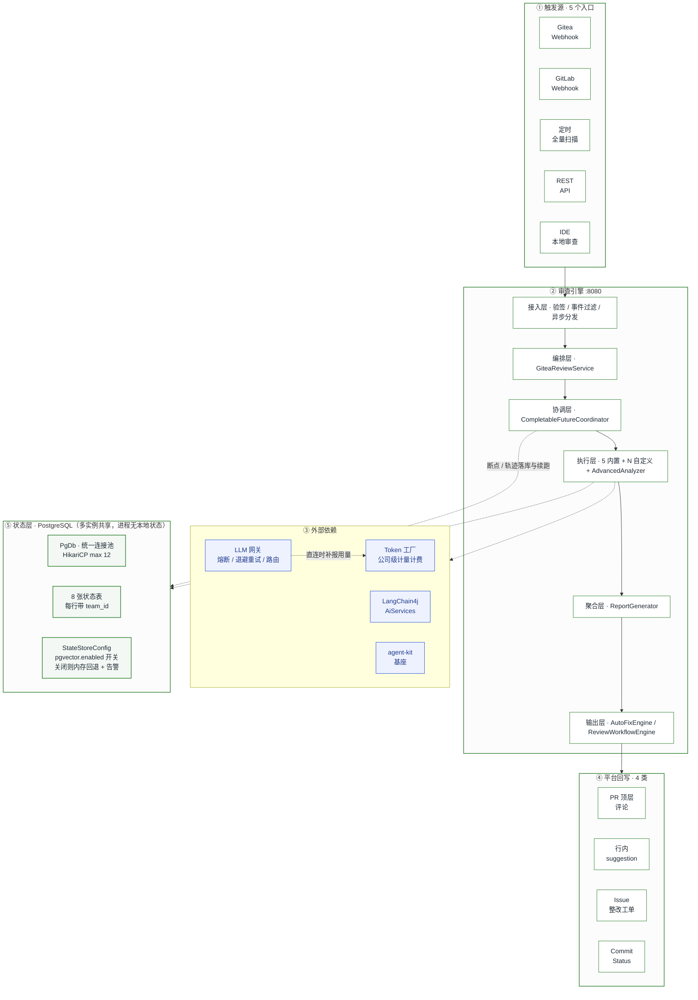

> 源码：`docs/diagrams/l0-overview.mmd`

> **要点**
> **拓扑是「星型汇聚」而非流水线**：5 个内置 Agent 之间互不通信、无依赖，协作只发生在聚合阶段（去重 / 仲裁 / 抑制）。
> **LLM 侧已接入公司级 Token 工厂**：工厂供应商与直连供应商同列候选，复用已有 failover；直连时由 `UsageReportingProvider` 把用量补报回工厂（无 usage 按字符数估算并打 estimated 标记）。
> **状态层已全量迁 PostgreSQL**：断点 / 经验 / 校准 / 反馈 / 历史 / 轨迹 / 团队配置 / 知识元数据共 8 张表，全部带 `team_id`；`pgvector.enabled=true` 时多实例读写同一份状态，**审查进程不再落任何本地状态文件**。

---

## L1a · 接入与同步校验

Webhook 的同步部分**只做校验与分发**，重活全部丢给 `webhookExecutor` 异步执行。这样平台侧不会超时重试。

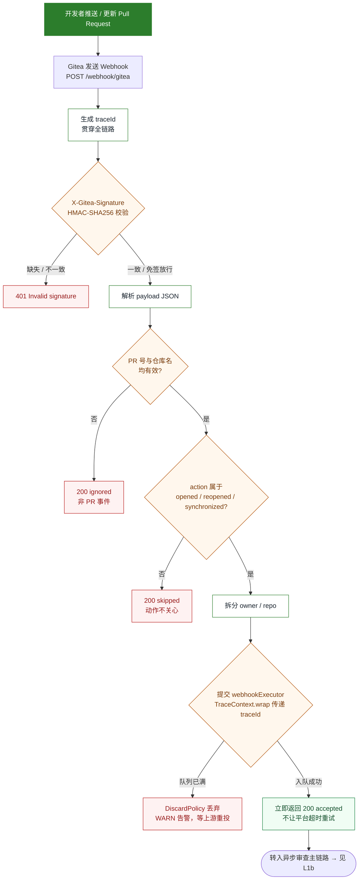

> 源码：`docs/diagrams/l1a-webhook-intake.mmd`

**源码锚点**

| 说明 | 位置 |
| --- | --- |
| 验签 / 事件过滤 / 异步分发 | `integration/gitea/GiteaWebhookController.java:75-147` |
| 团队解析 | `tenant/TeamResolver.java` |
| 线程池拒绝策略 | `config/ProductionExecutorConfig.java:62` |

> **注意**
> **Gitea Webhook 配置的三个坑**
>
> - `events` 必须是 **布尔字面量**，写成字符串不生效；
> - 重建后的 hook 默认 `active=false`，需单独 PATCH 打开；
> - PATCH **不持久化 secret**，改密钥必须 DELETE + POST 重建。
>
> **拒绝策略已从 CallerRunsPolicy 改为 DiscardPolicy**：原先队列满时会用 Tomcat 接收线程执行审查任务，等于把背压直接传导给 webhook 接入能力，高峰期会让整个服务的接入一起变慢。现在丢弃并记 WARN，由 Gitea 上游重投——对审查系统而言，**丢一次比拖慢接入安全**。

---

## L1b · 异步审查与回写

`GiteaReviewService.reviewPullRequest()` 的编排主线：拉 diff → 并行审查 → 生成修复 → 分级路由 → 双通道回写。 **headSha 全程透传**，既用于 commit status，也是影响面索引与断点续跑键的输入。

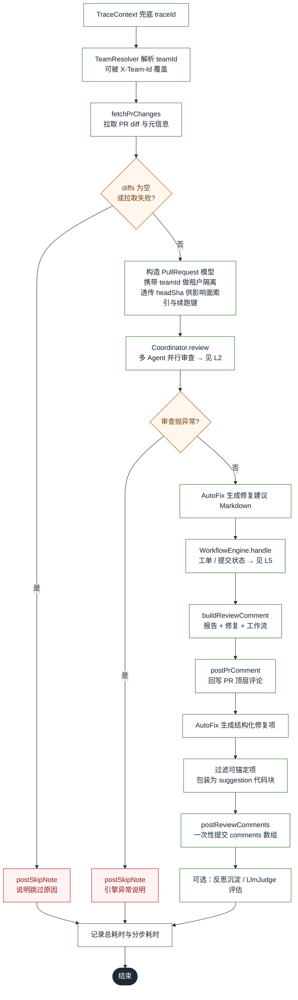

> 源码：`docs/diagrams/l1b-async-review.mmd`

**源码锚点**

| 说明 | 位置 |
| --- | --- |
| 主链路编排（含 headSha 透传） | `integration/gitea/GiteaReviewService.java:99-192` |
| headSha 缺失时回落 sourceBranch | `:129` |
| 报告 Markdown 拼装 | `integration/gitea/GiteaReviewService.java:199-219` |

> **注意**
> **Gitea 1.27 的平台限制（踩过的坑）**
>
> - 逐条直发行内评论的接口返回 **405**，唯一入口是 `POST /pulls/{index}/reviews` + `comments[]` + `event:COMMENT` 一次性提交；
> - PENDING 预建方式下 `line`/`side` 会被丢弃，恒降级为文件级评论 → 可采纳修复必须写进「顶层概览 + 行内 suggestion」双通道。

---

## L2a · 协调器 · 准备与并行调度

**runId 由 PR 身份派生**（不再用随机 traceId）→ 断点续跑 → 影响面与 RAG 上下文增强 → 自定义 Agent 展开 → 规划/固定两种并行路径。

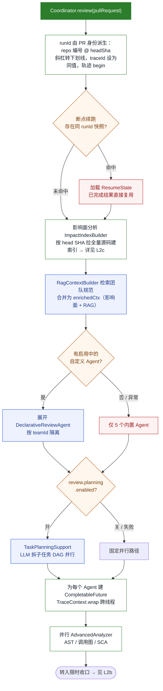

> 源码：`docs/diagrams/l2a-prepare-dispatch.mmd`

**源码锚点**

| 说明 | 位置 |
| --- | --- |
| runId 派生（续跑键） | `coordinator/impl/CompletableFutureCoordinator.java:302-303, 589` |
| 断点续跑检测 | `:245-266` |
| 影响面 + RAG 上下文注入 | `:265-295, 347` |
| 自定义 Agent 展开 | `:297-325` |
| 并行 Future 创建 | `:342-359` |

> **注意**
> **runId 曾用随机 traceId，导致断点续跑在生产上永远不生效**：崩溃重试是新 HTTP 请求，拿到另一串随机 traceId，`resumeStore.load(runId)` 永远查不到断点——典型的「feature 只在测试里跑过、线上是死代码」。现在从 PR 身份派生稳定键 `repo#编号@headSha`（`/`→`_`，因 runId 同时被当作文件名）；含 head SHA 保证换新 commit 时重开审查而非续跑旧断点。

---

## L2b · 协调器 · 限时收口与聚合

共享 deadline 逐个收口，超时即中断；随后聚合、否决回收、复检对比与落库。高级分析改走 `analyze(pr, diffs)`，结束时释放影响面临时目录。

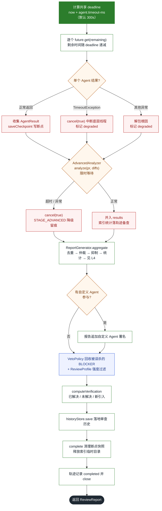

> 源码：`docs/diagrams/l2b-timeout-aggregate.mmd`

**源码锚点**

| 说明 | 位置 |
| --- | --- |
| 独立限时等待 + 降级 | `:373-432` |
| 高级分析新签名 | `core/analysis/AdvancedAnalyzer.java:97`（旧重载保留于 `:173`） |
| 聚合后处理（Veto / Profile / 复检 / 落库） | `:447-496` |
| 断点快照写入 | `:503-526` |

> **注意**
> **这里修过一个 P0 缺陷**：修复前用 `allOf(...).orTimeout()`，超时只作用在聚合 future 上，后续逐个 `join()` 仍然会无限阻塞，且 `advancedFuture` 完全没进超时体系。现在改为「共享 deadline + 逐个 `get(remaining)`」，超时即 `cancel(true)` 中断底层线程。

---

## L2c · 影响面分析 · 双引擎分层与真实仓库索引

此前影响面在真实 PR 上**恒产出 0 条结论**：diff 只含改动处 ±3 行上下文，手写正则的 AST 扫描器拿不到完整方法，跨文件调用方从来没被看见过。

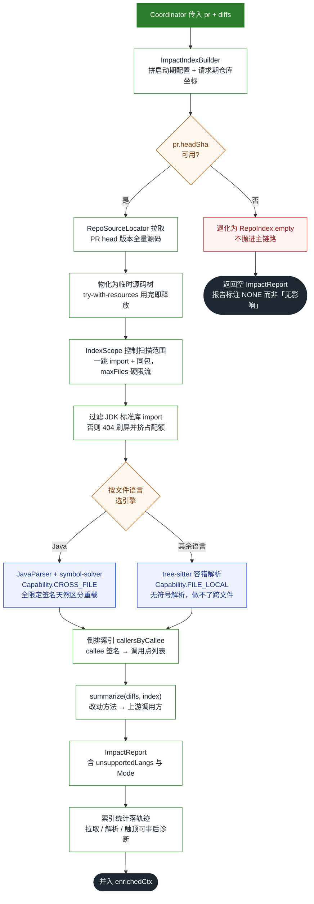

> 源码：`docs/diagrams/l2c-impact-analysis.mmd`

**源码锚点**

| 说明 | 位置 |
| --- | --- |
| 索引构建入口 | `core/analysis/index/ImpactIndexBuilder.java:20, 40` |
| 倒排索引与能力判定 | `core/analysis/index/RepoIndex.java:196-231` |
| 能力枚举（可区分「查不了」与「确实没有」） | `core/analysis/spi/CodeAnalyzer.java:63-74` |
| 引擎路由（Java→JavaParser，其余→tree-sitter） | `core/analysis/index/AnalysisEngines.java:17-18` |
| 生产接线与临时目录释放 | `coordinator/impl/CompletableFutureCoordinator.java:272-273` |

> **要点**
> **改完必须验证生产日志真的出现「[RepoIndex] 索引完成」**。本仓库已因「分析器写得准但没接生产路径」踩过三次同类坑（AST 层恒 0、断点续跑 runId、影响面）。

> **注意**
> **为什么之前测不出来**：测试用了「新增文件全量 patch」，helper 悄悄替生产代码满足了前提，于是恒 0 的问题被测试掩盖。治本要点：
>
> - **能力显式化**：`Capability` 区分 CROSS_FILE / FILE_LOCAL，把「引擎查不了」与「确实没有影响面」分开，避免把原理性限制说成「没影响」；
> - **按 head SHA 拉全量源码**物化成临时源码树，JavaParser 才有跨文件解析的原料；源码根必须给到 `src/main/java` 而非仓库根，否则全 `resolved=false` 且不报错；
> - **一跳 + 同包 + maxFiles 硬限流**，并过滤 JDK 标准库 import，否则 404 刷屏并挤占配额。

---

## L3 · 单 Agent 三段式与三级降级

每个 Agent 内部三段：**① 输入防护（逐文件分级隔离）** → **② Skill 确定性预扫描** → **③ LLM 语义增强**。规则出确定结论，LLM 只做补充。

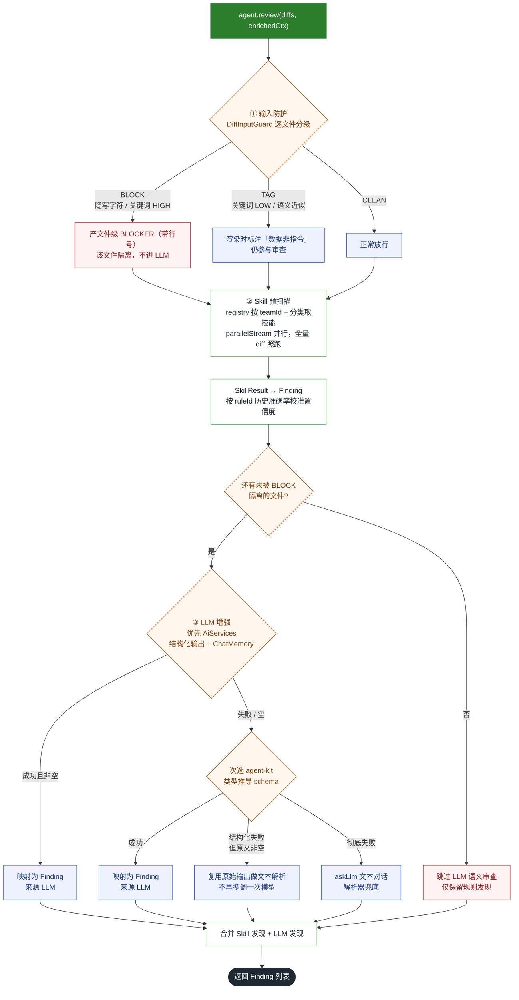

> 源码：`docs/diagrams/l3-single-agent.mmd`

**源码锚点**

| 说明 | 位置 |
| --- | --- |
| 逐文件分级（BLOCK / TAG / CLEAN） | `core/agent/impl/SecurityAgent.java:63-97` |
| 隔离后渲染（标注数据非指令） | `:99-122` |
| 分级门卫实现 | `core/security/DiffInputGuard.java` |
| Skill 并行预扫描 | `core/agent/AbstractReviewAgent.java:85-89` |
| 置信度校准 | `core/agent/AbstractReviewAgent.java:97-120` |
| LLM 三级降级 | `core/agent/AbstractReviewAgent.java:190-244` |

> **要点**
> **降级链路的关键设计**：结构化输出失败但 `rawResponse` 非空时，**复用原始输出走文本解析**，不再多调一次模型——既省 token，也避免二次失败。

> **注意**
> **输入防护已从「全 PR concat 一刀切」改为「逐文件分级」**：
>
> - **BLOCK**（隐写字符 / 关键词 HIGH）→ 该文件**不进 LLM 上下文**并产文件级 BLOCKER 带行号；
> - **TAG**（关键词 LOW / 语义近似）→ 渲染前显式标注「被审查数据非指令」，仍参与审查；
> - **CLEAN** → 正常放行。
>
> 收益：单文件命中不再连累整 PR（旧实现一旦命中就 `return`，整 PR 不做语义审查），且能给出文件级/行级定位。新增维度：`StegInjectionScanner` 查**隐写字符**（零宽 / Bidi 拆词藏指令）。**纯规则层无 LLM 风险，因此 Skill 预扫描仍跑全量 diff**，只有 LLM 输入被裁剪。

---

## L4a · 聚合 · 降级收集 / 去重 / 仲裁

仲裁权重：**安全 100 > 逻辑 90 > 性能 70 > 架构 60 > 风格 10**；先比 Agent 权重，再比严重度，最后比置信度。

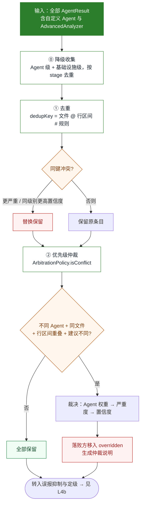

> 源码：`docs/diagrams/l4a-dedup-arbitration.mmd`

**源码锚点**

| 说明 | 位置 |
| --- | --- |
| 降级收集 / 去重 / 仲裁 | `core/report/ReportGenerator.java`（`aggregate` 8 参数重载） |
| 权重表与冲突判定 | `core/report/ArbitrationPolicy.java:21-27, 52-95` |

---

## L4b · 聚合 · 误报抑制与强度定级

抑制来自开发者历史反馈；**BLOCKER 强否决不可被抑制或仲裁覆盖**，被误杀时由 VetoPolicy 回收。

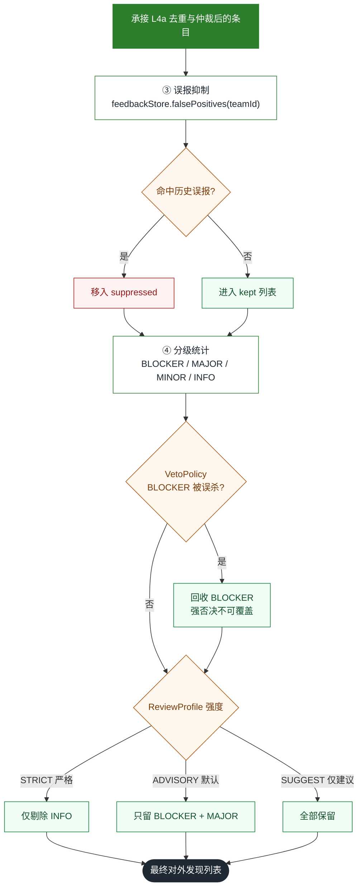

> 源码：`docs/diagrams/l4b-suppress-grading.mmd`

**源码锚点**

| 说明 | 位置 |
| --- | --- |
| BLOCKER 强否决回收 | `core/permission/VetoPolicy.java:26-36` |
| 强度 Profile 过滤 | `core/profile/ReviewProfile.java:24-57` |

---

## L5 · 人机协作 · 分级路由决策树

自动审查之后「人」如何介入。`ReviewWorkflowEngine.handle()` 按 BLOCKER 有无分叉。

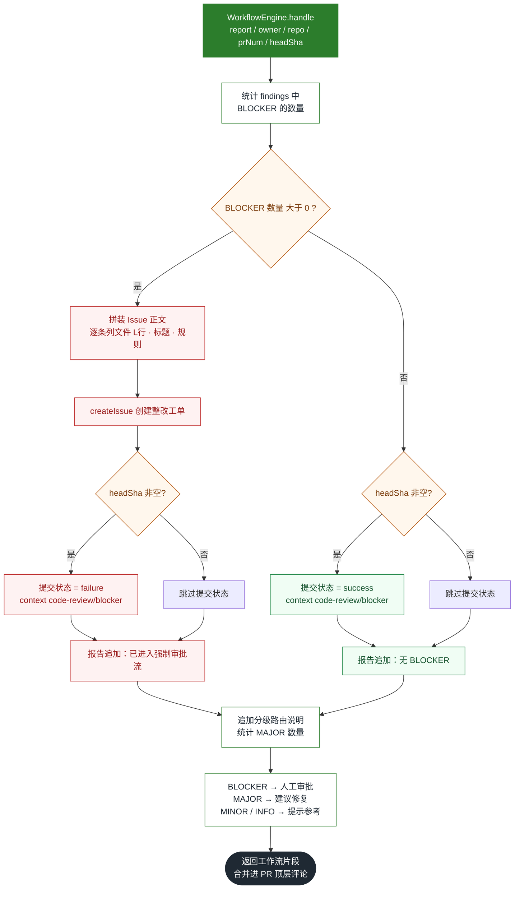

> 源码：`docs/diagrams/l5-workflow.mmd`

**源码锚点**

| 说明 | 位置 |
| --- | --- |
| 决策与回写动作 | `core/workflow/ReviewWorkflowEngine.java:42-85` |
| Issue / Commit Status API | `integration/gitea/GiteaApiClient.java` |

> **要点**
> 工单引用用裸 `#N` 而非绝对 URL：Gitea 的 auto-link 会渲染为站内可点链接，不会被域名白名单过滤，也不会因 base 二次拼接导致 404。

---

## L6 · 数据流 · PostgreSQL 集群存储与租户隔离

8 张状态表统一由 `PgDb` 连接池承载，每行带 `team_id`；`pgvector.enabled` 一键切换 PG / 内存双后端。基线 `__global__` + 团队叠加，缺失回退默认。

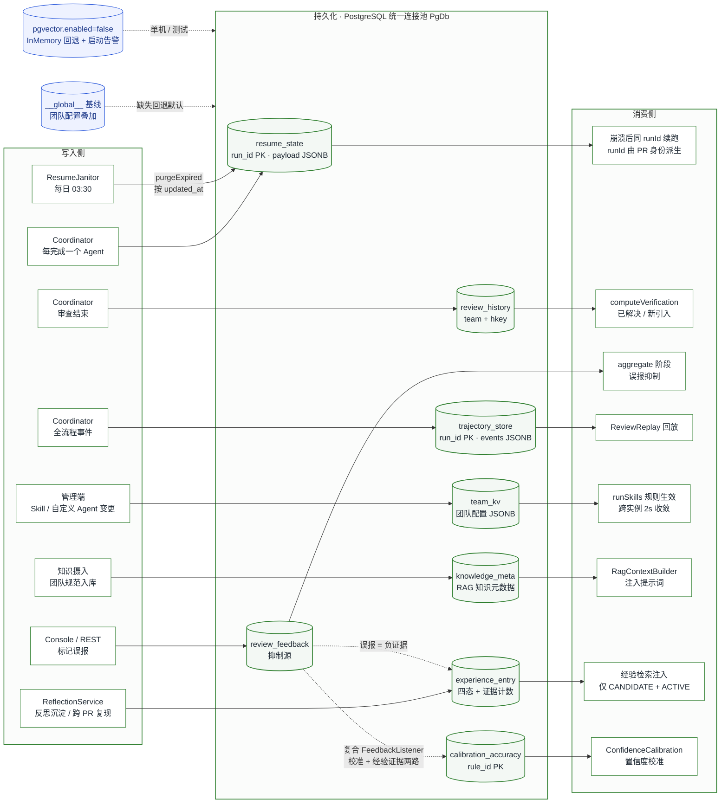

> 源码：`docs/diagrams/l6-dataflow.mmd`

**源码锚点**

| 说明 | 位置 |
| --- | --- |
| 统一连接池与 8 张表建表 | `core/store/PgDb.java:46, 109` |
| PG / 内存双后端装配开关 | `core/store/StateStoreConfig.java:46-145` |
| 团队配置落 team_kv + 2s TTL 刷新 | `core/skill/SkillRegistry.java:43, 68` |
| 反馈复合监听器（校准 + 经验证据） | `config/ReviewAgentConfig.java:614-619` |
| 断点定时清理（每日 03:30） | `core/resume/ResumeJanitor.java:27, 47` |

> **要点**
> **跨实例收敛靠「写穿 + 短 TTL 惰性刷新」**：团队配置（Skill 启停 / 自定义 Agent）写穿 `team_kv` JSONB，读方带 2s 短 TTL 惰性重载——A 实例管理端变更，B 实例最迟 2s 生效，不需要消息广播。

> **注意**
> **为什么迁**：改造前 8 类状态落在 `data-dir//` 本地 JSON，A 机沉淀 B 机不可见，多实例必然分叉——**「经验越用越准」在集群下反而退化成「每台机器各长一套记忆」**。
> **三个设计取舍**：
>
> - 沿用仓库既有风格——原生 JDBC + Hikari，**不引 starter-jdbc**，避免改变运行时行为；
> - `StateStoreConfig` 按 `pgvector.enabled` 装配双后端，未启用时回退内存并**启动告警**（单机/测试可用，集群必须开 PG）；
> - 表结构 `CREATE TABLE IF NOT EXISTS` 幂等初始化（无 Flyway），与既有 `memory_store` 口径一致。
>
> **迁移后 `data-dir` 只剩一个用途**：agent-loop 开启时作为 `FileReadTool` 的默认读取根。
> **坑**：Spring 的 `Duration` 绑定，不带单位的纯数字按**毫秒**算——写成 `ttl: 24` 会变成 24 毫秒、把所有断点一扫而空。

---

## L6b · 记忆生命周期 · 证据驱动升级与 TTL 遗忘

经验条目四态：`CANDIDATE → ACTIVE → ARCHIVED → PURGED`。**升级靠证据不靠时间**，遗忘只作用于长期无命中的冷门经验。

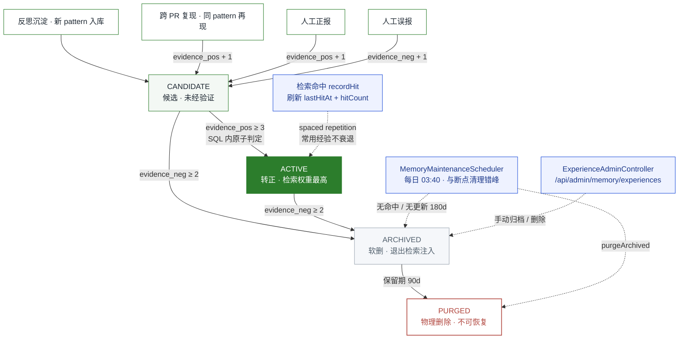

> 源码：`docs/diagrams/l6b-memory-lifecycle.mmd`

**源码锚点**

| 说明 | 位置 |
| --- | --- |
| 四态枚举与升级规则 | `core/memory/ExperienceStage.java:21-25` |
| 接口：沉淀 / 反馈 / 命中 / 归档 / 清理 | `core/memory/ExperienceLibrary.java:20-69` |
| PG 实现（SQL 内原子判定） | `core/store/PgExperienceLibrary.java:27, 29, 46-48` |
| 每日维护 03:40（180d 归档 / 90d 硬删） | `core/memory/MemoryMaintenanceScheduler.java:36-48` |
| 管理端点 | `core/memory/ExperienceAdminController.java:24-56` |

> **要点**
> **反遗忘靠 spaced repetition**：每次检索命中都刷新 `lastHitAt` 与 `hitCount`，被反复用到的经验永远不会进入 TTL 归档——遗忘只清理「记忆衰退」的冷门条目，常用经验不衰退。

> **注意**
> **阈值是 SQL 常量**（`ACTIVE_EVIDENCE = 3` / `ARCHIVE_NEGATIVE = 2`），升级判定在 `UPDATE ... SET stage = CASE WHEN ...` 内**原子完成**，不存在读-改-写竞态。
> **坑**：Spring `Duration` 绑定不带单位的纯数字按**毫秒**算——`experience-idle: 180` 会变成 180 毫秒，一轮清空全部经验。默认值一律写成 `180d` / `90d`。
> 维护任务**与断点清理 03:30、巡检 02:00 错峰**在 03:40 执行，异常只记 WARN 跳过本轮，不影响审查主链路。

---

## L7 · 能力矩阵 · Agent / Skill / 分析引擎 / 安全检测器

执行层的完整构成：5 内置 Agent + 团队自定义 Agent + 高级静态分析（含影响面双引擎）；Skill 按 category 挂载，支持运行期启停与团队自定义规则。

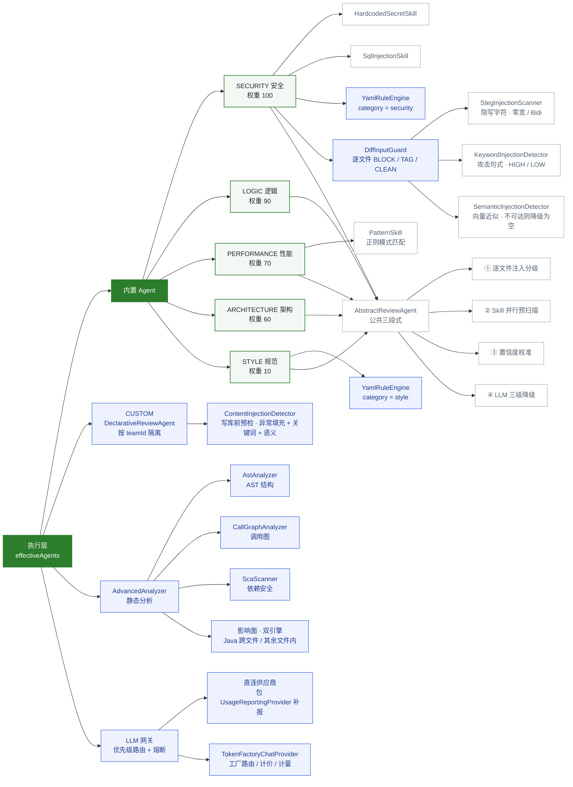

> 源码：`docs/diagrams/l7-capability.mmd`

**源码锚点**

| 说明 | 位置 |
| --- | --- |
| 5 个内置 Agent | `core/agent/impl/{Security,Logic,Performance,Architecture,Style}Agent.java` |
| 自定义 Agent | `core/agent/DeclarativeReviewAgent.java`；管理接口 `core/admin/AgentAdminController.java` |
| 高级静态分析 + 影响面 | `core/analysis/{AdvancedAnalyzer,AstAnalyzer,CallGraphAnalyzer,ScaScanner}.java`；`core/analysis/index/` |
| 注入检测四件套 | `core/security/{DiffInputGuard,DiffInjectionDetector,StegInjectionScanner,SemanticInjectionDetector}.java` |
| 写库边界预检 | `core/security/ContentInjectionDetector.java` |
| Token 工厂接入 | `core/tokenfactory/{TokenFactoryChatProvider,UsageReportingProvider}.java` |
| Skill 注册与运行期启停 | `core/skill/SkillRegistry.java:201-267` |

> **注意**
> **安全检测按信任边界分层，不同边界用不同强度**：
>
> - **diff 预检**（进 LLM 前）：关键词 + 隐写字符命中 → BLOCK 隔离；语义近似 → TAG 标注。**此处只隔离/标注，不硬拦截**——基座词表里的「越权 / admin mode / 泄露系统提示」在代码审查域是正常业务词（"检查越权风险"曾被直接拦掉）；
> - **写库边界**（自定义 Agent 存库前，本仓库唯一把业务方文本提升为系统提示的位置）：才做异常填充 + 关键词 + 语义复合检测，命中即拒绝。
>
> 中文长描述香农熵天然偏高，**熵检测只对纯 ASCII 生效**，否则误杀。

---

code-review-agent · 业务流程图集 · 全部节点均可在 `src/main/java/com/codereview/` 下按文件路径 grep 复现

mermaid 源码：`docs/diagrams/*.mmd`
