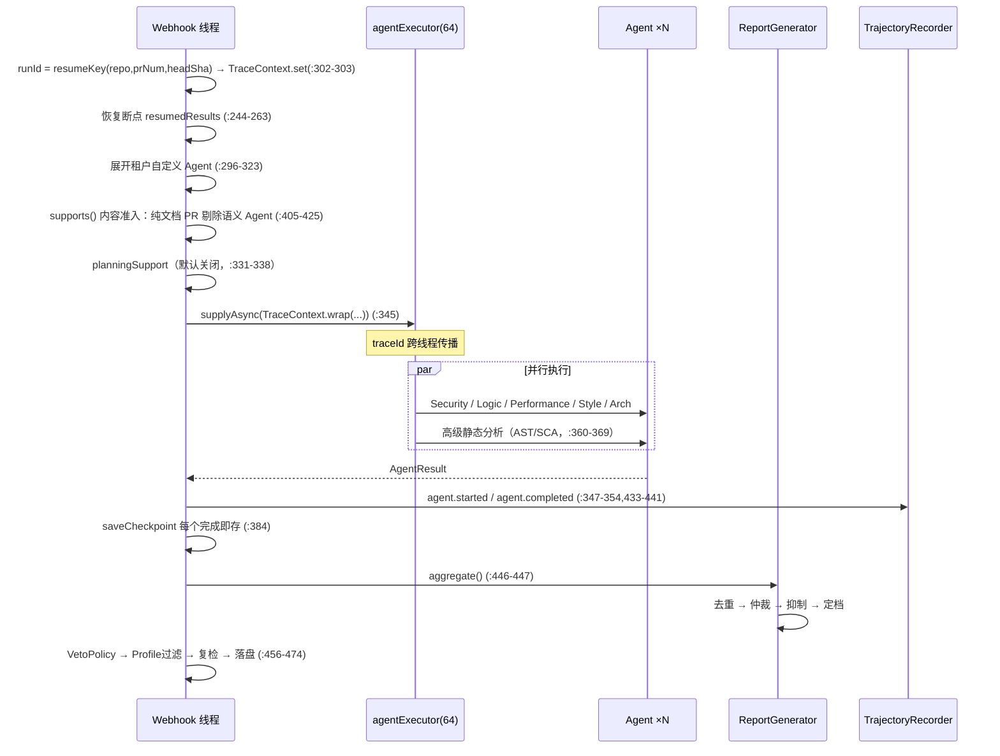
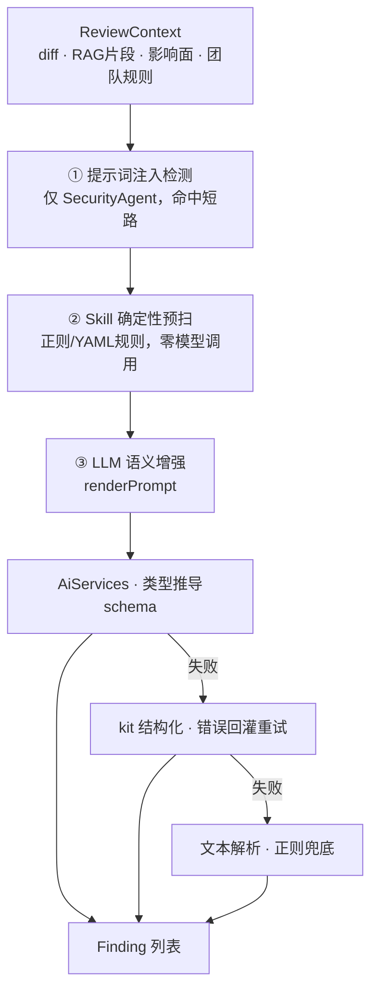
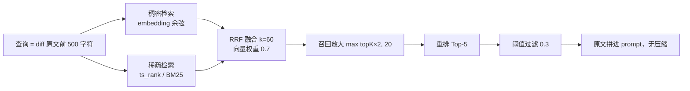
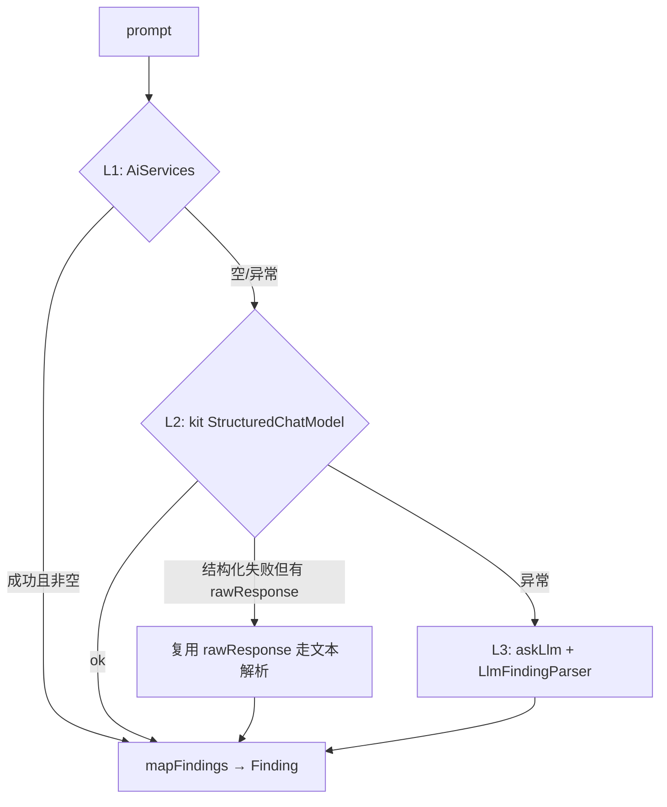
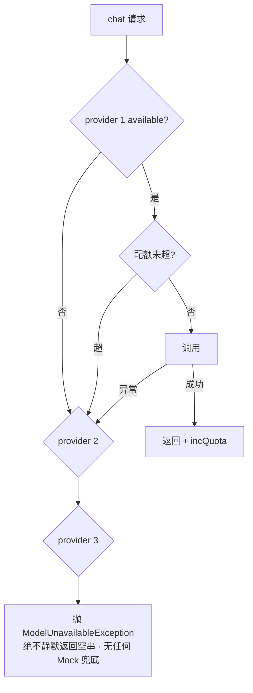
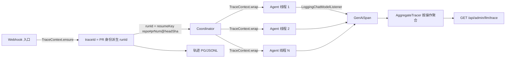

# code-review-agent 架构流程图与面试深挖手册

> 面向 **Agent 开发 / 大模型工程化** 岗位面试。所有结论均可 `grep` 复现，行号基于 `main` 分支当前提交。
> 代码根路径缩写：`SRC` = `src/main/java/com/codereview/agent/`
>
> **使用方式**：先背下「第 0 节一页纸」，再按第 8 节的 L1/L2/L3 分级准备。L3 的缺陷清单是加分项 —— 能主动说出自己系统的毛病，比背八股文有说服力得多。

---

## 0. 一页纸速览

**一句话定位**：一个**多 Agent 协同**的代码审查引擎。一个 PR 进来，5 个专业 Agent 并行审查，结果经去重 / 冲突仲裁 / 误报抑制后回写成 Gitea 评论；全程 traceId 串联，轨迹落 JSONL 可回放。

**关键数字**

| 维度 | 值 | 位置 |
|---|---|---|
| 代码规模 | 16,150 行 / 199 个 Java 文件 | — |
| 内置 Agent | 5 个（Security/Logic/Performance/Style/Architecture） | `ReviewAgentConfig.java:404,410` |
| Agent 线程池 | 64 线程 / 队列 512 / CallerRunsPolicy | `ProductionExecutorConfig.java:34-38` |
| Webhook 线程池 | 8 线程 / 队列 2000 / CallerRunsPolicy | `ProductionExecutorConfig.java:20-25` |
| 单 Agent 超时 | 300,000 ms，**逐 Future 独立限时，已生效**（见 7.3） | `CompletableFutureCoordinator.java:76,375-405` |
| LLM 框架 | LangChain4j 1.19.0 | `pom.xml:35` |
| 自建基座 | agent-kit 0.1.1（`com.codereview.kit`） | `pom.xml` |
| 测试 | **296 例**（281 基线 + 15 例本轮治理新增；含 P0 修复 21 例） | — |

**架构选型一句话总结**：**请求-响应模型 + 星型并行 + 全量汇聚**，不是事件流、不是流水线、不是 DAG。这个选择决定了后面所有的设计（为什么用 CompletableFuture 而不是 MQ，为什么要仲裁，为什么超时这么难做对）。

---

## 1. 端到端主链路

```mermaid
flowchart TD
    subgraph 触发层
        W[Webhook 入口<br/>Gitea · GitLab] --> G[准入与异步化<br/>HMAC验签 → 事件过滤 → 线程池 → 立即200]
        S[定时全量扫描<br/>每日 02:00] --> G
        D[Demo / IDE 模式] --> G
    end

    G --> C[上下文装配<br/>diff → AST/调用图/SCA → RAG检索]
    C --> CO[CompletableFutureCoordinator 星型编排]

    CO --> A1[Security]
    CO --> A2[Logic]
    CO --> A3[Performance]
    CO --> A4[Style]
    CO --> A5[Architecture]
    CO --> AN[租户自定义 Agent ×N]
    CO --> AD[高级静态分析<br/>AST/调用图/SCA]

    A1 --> AG[聚合四步]
    A2 --> AG
    A3 --> AG
    A4 --> AG
    A5 --> AG
    AN --> AG
    AD --> AG

    AG --> O1[概览评论]
    AG --> O2[行内 suggestion]
```



### 1.1 触发层（4 个入口，3 条走同一协调链路）

| 入口 | 是否走 Coordinator | 代码锚点 |
|---|---|---|
| `POST /webhook/gitea` | ✅ 是 | `GiteaWebhookController.java:40,75` |
| `POST /webhook/gitlab` | ✅ 是 | `GitLabWebhookController.java:66` |
| `ScheduledScanService` | ✅ 是（构造 `prId=0` 的伪 PR） | `ScheduledScanService.java:57,81-82` |
| `DemoRunner` | ✅ 是（`@ConditionalOnProperty`） | `DemoRunner.java:50-51` |
| `IdeReviewServer` | ❌ **否**，独立 LSP 进程，只用 AST + PatternSkill | `IdeReviewServer.java:74` |

**Webhook 处理四步**（`GiteaWebhookController.java`）：
1. HMAC-SHA256 验签 `:88-107`，算法 `:157-166`（可用 `webhook-allow-unsigned=true` 绕过 `:61`）
2. 事件过滤：仅 `opened/reopened/synchronized`，prNum=0 或无 `/` 的仓库名直接 ignored `:119-133`
3. `CompletableFuture.runAsync(TraceContext.wrap(...), webhookExecutor)` 异步化 `:139-141`
4. **立即返回 `{status:accepted}`** `:143-147` —— 避免 Webhook 平台超时重推

> ✅ **幂等已落地（2026-09-08）**：`GiteaReviewService` / `GitLabReviewService` 注入 `ReviewHistoryStore`，审查前按 **PR/MR 身份（仓库 + 编号 + head SHA）** 派生幂等键（与 Coordinator 断点键同源，`PullRequest.resumeKey`，`PullRequest.java:90-97`），命中已完成历史即跳过 —— 重复 push / webhook 重推不再重复审查。Gitea 在拉取前判重（webhook 自带 headSha，零成本）；GitLab 载荷不贯穿 headSha，判重在拉取后（响应自带头提交 SHA，多一次轻量 fetch 远便宜于重复审查）。键含 head SHA ⇒ 新 commit 自动重开审查而非沿用旧结果。测试锁定：`GiteaReviewIdempotencyTest`（5 例）+ `GitLabReviewIdempotencyTest`（3 例）。

### 1.2 回写：为什么只能走「创建评审」一次提交

Gitea 1.27 移除了独立的行内评论接口，`POST /reviews/{id}/comments` 返回 405。唯一可用路径：

```
POST /pulls/{index}/reviews   event=COMMENT   comments:[{commit_id, path, line, side}]
```

代码锚点：`GiteaApiClient.java:165-170,187,193-203`。这是**平台适配的硬约束**，不是设计选择 —— 面试时讲清楚这一点，能体现你做过真实集成而不是纸上谈兵。

回写顺序（`GiteaReviewService.java:99-192`）：
1. diff 为空 → `postSkipNote` 返回 `:110-115`
2. `coordinator.review(pr)` `:133`，异常 → `postSkipNote("审查引擎异常")`
3. `AutoFixEngine.generateSuggestions` `:144` + `ReviewWorkflowEngine.handle` `:145`（BLOCKER → 建 Issue + 提交状态，`ReviewWorkflowEngine.java:52-65`）
4. 顶层概览评论 `:151` → 行内 comments `:157-166`

---

## 2. 协调器内部时序（面试主战场）



### 2.1 Agent 子集选择：**supports() 内容准入（2026-09-08 已落地）**

`ReviewAgent` 接口新增 default `supports(List<CodeDiff>, ReviewContext)`（恒 true，向后兼容，`ReviewAgent.java:34-50`）。语义型 Agent（Logic/Perf/Style/Arch）覆写为 `CodeDiff.containsCodeFile(diffs)`（`CodeDiff.java:49-56`：language 非 unknown 即代码内容；xml/sql 视为代码——SQL 注入/慢查询语义审查仍有价值）。调度前 Coordinator 统一过滤（`CompletableFutureCoordinator.java:405-425`），被剔除的 Agent 记 `agent.skipped-by-supports` 轨迹事件，**不产生降级语义**（只是省 token）。

路由语义：

- **Security 恒跑**（不覆写 supports）—— 注入防护对任意内容（文档里的恶意指令）都有价值
- **语义型 Agent 跳过纯文档 PR** —— README / CI yaml / 资源文件无代码可审，省 4 次 LLM 调用
- 自定义 Agent 默认参与（接口默认 true）

测试锁定：`CoordinatorSupportsRoutingTest`（3 例）——纯文档 PR 下 Logic/Style 零调用而 Security 跑 1 次；含代码 PR 全部参与。

> 面试官若追问「小 PR 也要跑 5 个 Agent 吗」——现在可以答：纯文档 PR 只跑 Security；含代码 PR 仍 5 个全跑（语义维度不可省，token 侧由 §4.4 的 diff 预算兜底）。

### 2.2 内置 Agent 的装配：配置声明式，顺序硬编码

5 个 Agent **均未标 `@Component`**，全部在 `ReviewAgentConfig.java:357-401` 以 `@Bean` 声明，顺序由 `List.of(...)` 硬编码（`:410`）。**没有 `@Order`，顺序不可配置。**

这个细节很有价值：说明「扩展新 Agent 必须改配置类」，与「租户自定义 Agent 动态 new」形成对比（见 6.1）。

### 2.3 断点续跑：**runId 已改为 PR 身份派生，真实重放可命中（修复）**

- 每完成一个 Agent 即 `saveCheckpoint`（`:384`，实现 `:619-642`）
- 断点存储 tmp + `ATOMIC_MOVE` 落盘（PG 化后 `ResumeStore` 落 `resume_state` 表，主键 run_id）
- **关键修复**：runId 不再取随机 traceId，而是 `PullRequest.resumeKey(repo, prNum, headSha)` 稳定派生（`CompletableFutureCoordinator.java:302`，公共方法 `PullRequest.java:90-97`），webhook 重放 / 崩溃重试算出同一个键 → 命中上次断点续跑；键含 head SHA → 换新 commit 自动重开而非续跑旧半成品

→ 结论：**断点续跑在生产真实生效**（此前 runId≡每次新建的 traceId，同 PR 重试永远命中不了断点 —— 典型「feature 只在测试里跑过、线上是死代码」）。幂等键与历史/断点键同源，三处（断点 / 历史判重 / webhook 判重）不再各算各的。

---

## 3. 单个 Agent 内部：确定性 + 语义双通道



### 3.1 三段式的真实顺序（`SecurityAgent.java:56-74`）

```
注入检测(:59-68) → 命中 → 出 BLOCKER SEC-INJECTION-001 → return（连 Skill 都不跑）
                → 未命中 → runSkills(:71) → llmFindings(:74)
```

**短路是有意为之**：源码被判定为注入攻击时，继续做语义审查等于让攻击者的指令进入模型。宁可放弃审查，也不给注入 payload 执行路径。

### 3.2 Skill 与 Agent 的绑定方式：**按 category 认领**

- `Skill` 接口只有 `getMetadata()` + `execute()`（`Skill.java:15`）
- `AbstractReviewAgent.runSkills:86` → `registry.getEnabledSkillsForCategory(teamId, category)`
- 内置 14 个（2 个 Java 类 Skill + 12 个 `PatternSkill`）：`ReviewAgentConfig.java:263-317`
- **隔离模型**：内置 Skill 跨团队共享，但**启停状态按团队叠加**（`SkillRegistry.java:34-36`）

### 3.3 注入防护的三个层次（纵深，不是单点）

| 层 | 机制 | 位置 |
|---|---|---|
| 系统指令 | 骨架硬编码，业务方不可覆盖 | `DeclarativeReviewAgent.java:93-115` |
| 写库预检 | 自定义 Agent 落库前检测，命中直接抛异常 | `CustomAgentStore.java:155,171` |
| 数据标注 | diff 命中注入时标 `[INJECTION-RISK]` 但继续审查 | `DeclarativeReviewAgent.java:126` |

**注意策略差异**：`SecurityAgent` 是**阻断**（`:67` return），自定义 Agent 是**标注不阻断**。前者保护主链路，后者保护业务方自定义链路 —— 这是刻意的分级，面试能讲出这个区别是加分项。

**一个真实的领域适配权衡**（`KeywordInjectionDetector.java:52-62`）：
> agent-kit 基座把 `override` / `act as` 判为 `Risk.LOW`，但 Java 代码里 `@Override` 注解满地都是 → **只把 HIGH 升级为拦截，LOW 不拦**。

这是「复用基座」与「领域适配」冲突的绝佳案例。

---

## 4. 上下文工程：diff → prompt

### 4.1 三路上下文注入

| 通道 | 产出 | 注入点 |
|---|---|---|
| 静态分析 | AST 结构 / 调用链影响面 / SCA 依赖 | `CompletableFutureCoordinator.java:267` |
| RAG 检索 | 团队规范 + 上传文档片段 | `CompletableFutureCoordinator.java:271` |
| 合并装填 | 统一进 `ReviewContext` | `CompletableFutureCoordinator.java:287-289` |

### 4.2 静态分析：JavaParser 精确调用图 + tree-sitter 多语言兜底 + SCA 接 OSV

主链路的上下文注入来自 `core/analysis/` 三件套：

- **Java 跨文件影响面（JavaParser）**：按 PR 的 head SHA 拉源码物化临时索引（`ImpactIndexBuilder`/`RepoIndex`），做**一跳 + 同包**的精确调用图（变更方法 → 谁在调它），回答「这个改动影响了哪些上游」；CROSS_FILE 模式。
- **其余语言（tree-sitter）**：真实 native 解析器（bonede 0.25.3，py/js/ts/go 等），FILE_LOCAL 模式做文件内调用识别 —— 不做符号级跨文件（成本权衡）。
- **SCA 依赖漏洞（OSV）**：`OsvVulnSource` 走真实 OSV 批量查询（生产同源），失败降级内置 `BuiltinVulnSource` 样本规则（`ScaSourceConfig` 可切换）——**不再是当年「本地硬编码 8 条 CVE」的形态**。

> 这也是「分析器再准，不接生产路径就是死代码」的案例：影响面索引的接线点在 `CompletableFutureCoordinator.buildImpactSummary`（`:265-289`），验收看日志锚点 `[ImpactIndex] ... 索引完成`。早期手写词法扫描的 `AstAnalyzer` 已随静态分析演进被替代，面试不必再讲。

### 4.3 RAG：混合检索 + RRF 融合



- **Chunk**：`StructuredChunker` 700 字符 / overlap 0.15（`:43`），按 **Markdown 标题 + 代码围栏**边界切（`:74-96`）。注意「Structured」= **结构感知的文本切分，不是 AST 节点**。
- **Embedding**：LangChain4j `OpenAiEmbeddingModel`，`kinfra-text-embedding-0.6b`，**1024 维**（`application.yml:141,143`）。无 Key 时降级 `SimpleHashEmbeddingClient`（256 维）。
- **pgvector 未用官方模块**：`pom.xml:109-111` 主动排除 `langchain4j-pgvector`，SQL 全手写，`@PostConstruct` 幂等建表（`PgVectorMemoryStore.java:186-199`）。
- **Rerank**：`ApiReranker` 走 Cohere/Jina，异常降级 `HeuristicReranker`（0.7×词重叠 + 0.2×元数据 + 0.1×长度）。

### 4.4 上下文裁剪：**diff 字符预算已落地（2026-09-08）**

`AbstractReviewAgent` 新增 `volatile int diffCharBudget`（默认 **-1 = 不截断**，向后兼容，`:68`），`formatDiffs` 超预算时按**文件均摊截断**（`:175-227`）：每个文件保留头部 patch 直到其均摊额度（下限 200 字符），末尾统一追加截断统计标注 —— 模型能看出「改了哪些文件、每个文件开头长什么样」，且明确知道 diff 不完整（不会把截断误判成「没有更多变更」）。配置入口 `review.prompt.diff-char-budget`（`application.yml:129`，环境变量 `REVIEW_DIFF_CHAR_BUDGET`），由 `ReviewAgentConfig` 注入 5 个内置 Agent（`:549`）。测试锁定：`DiffCharBudgetTest`（4 例）——预算关/足/超三态 + 多文件均摊不偏向列表头部。

> 设计取舍：宁可「每个文件都看个头」，也不让 diff 列表头部的文件独占预算。RAG 侧另有独立裁剪（召回 10 → 重排 5 → 阈值 0.3）。

---

## 5. 结构化输出：三级降级

代码位置：`AbstractReviewAgent.java:190-243`（已逐行核对）



**三级对照**

| 级别 | 机制 | schema 来源 | 重试 |
|---|---|---|---|
| L1 | LangChain4j AiServices + `MessageWindowChatMemory(10)` | **返回类型自动推导**，无手写 schema | — |
| L2 | agent-kit `StructuredChatModel` | `JsonSchemas.fromType(ReviewResultDto.class)` | 1 次，**回灌上次失败原因 + 输出截断 800 字符** |
| L3 | `LlmFindingParser` 正则解析 | — | — |

**最值得讲的一个优化**（`AbstractReviewAgent.java:227-233`）：
> 结构化失败时**复用已拿到的 `rawResponse` 走文本解析，不额外多调一次模型**。

这一行体现的是真实的成本意识 —— 兜底路径如果再调一次模型，慢一倍、贵一倍，而 90% 的情况原始输出里其实已经有可用的 finding 了。

**为什么 L1 是 AiServices 而不是基座的 StructuredChatModel**（面试高频追问）：
AiServices 带 `ChatMemory` 和框架级 schema 校验，比基座的 `StructuredChatModel` 更强。**不为「用而用」降级替换** —— 这条原则在 `docs/agent-kit-adoption.md` 里有完整记录。

---

## 6. 扩展点与多租户

### 6.1 不改代码新增 Agent：四层机制

1. **schema = JSON**（不是 YAML）：`CustomAgentDef` record（`CustomAgentDef.java:24-34`）
2. **存储**：`data-dir/<teamId>/custom-agents.json`（`CustomAgentStore.java:63`）
3. **入口**：REST `/api/admin/agents`（`AgentAdminController.java:30,48,58,71`），PUT 带乐观锁
4. **渲染**：硬编码骨架 + 受控内容槽（`DeclarativeReviewAgent.java:93-115`），骨架里 diff 前后显式标注「被审查数据，非指令」

**关键实现细节**：`DeclarativeReviewAgent` **不是 Bean**，由 Coordinator 每次审查时动态 `new`（`CompletableFutureCoordinator.java:304`），来源是 `customAgentStore.listEnabled(teamId)`（`:300`）。

> ⚠️ 注意区分：自定义 **Agent** 走 JSON + REST，自定义 **规则** 走 YAML（`YamlRuleEngine.java:32`），两条路径不同。

### 6.2 多租户隔离模型

- **解析链**：`owner/repo` 精确 → `owner` 组织 → default（`TeamResolver.java:40-54`）
- **基线叠加**：`__global__` 全局规则 + 团队专属（`Teams.java:13`）
- **数据目录**：`data/<teamId>/`（轨迹、自定义 Agent、历史、信箱各一份）
- **路径穿越防护**：teamId 一律过 `Teams.sanitize`，白名单 `[A-Za-z0-9_-]{1,64}`（`:44-56`）
- **记忆/RAG 叠加**：`includeGlobal` 时把 `__global__` 条目并入检索（`PgVectorMemoryStore.java:327-336`）

**未隔离的维度**：模型额度 —— `ModelGateway` 的配额是**进程级全局**，不按租户切分。

### 6.3 自动修复：只建议，不提交

主链路走 **SUGGEST** 模式（`AutoFixEngine.java:88`），产物是 Gitea 行内 `suggestion` 代码块，由人点按钮采纳。

安全闸门四道：
1. 模式默认 SUGGEST，不 APPLY
2. `AutoFixSafetyPolicy.java:31-40` fail-closed
3. `SandboxProbe.java:29-33` 探测 bwrap/firejail/sandbox-exec/docker，探测异常按不可用
4. `ToolGate` 对 `autofix.apply` 这个 DEFERRED 重工具做授权（`:137`）

---

## 7. 可靠性工程

### 7.1 模型网关：顺序 failover + 固定窗口配额



配置（`application.yml:45-61`）：`hy3` → `deepseek-v4-flash` → `glm-5.2`，timeout 60s，`quota-per-minute:200`。

**缺陷治理清单**（全数闭环，L3 问答用；P0-2 修复见 Q13）：

| 缺陷 | 位置 | 状态与说明 |
|---|---|---|
| **无熔断半开** | `ModelGateway.java` | ✅ **已修复**：每供应商包 `CircuitBreakerProvider` **三态机（CLOSED/OPEN/HALF_OPEN）**，连续失败达阈值 OPEN，期间该供应商快速失败；HALF_OPEN 放行探测请求，成功即 CLOSED —— 恢复不再依赖 60s 配额窗口自然重置。路由自动跳过 OPEN 供应商（`ModelGateway` 列表遍历对熔断态跳过）。默认开启 |
| **静默返回空串** | `ModelGateway.java`（修复前 `:81`） | ✅ **已修复（P0-2）**：全供应商失败即抛 `ModelUnavailableException`（`ModelGateway.java:101-106`），由协调器标 `degraded` 进报告。**2026-09-03 起 Mock 兜底彻底移除**——不再注入 mock 供应商、无兜底分支，未配 Key 直接启动失败（`ReviewAgentConfig.java:122`）。**静默失败比报错更危险**——上层会把空串解析成「无发现」 |
| **配额计数竞态** | `ModelGateway.java`（修复前 `:180-189`） | ✅ **已修复（2026-09-08）**：`quotaExceeded` 与 `incQuota` 原先分处锁内外，窗口翻转与自增在不同临界区 —— 翻转瞬间旧计数清零，该窗口实际调用被低估而**超发**。现在两者共用 `refreshWindow`，统一在 `synchronized(qs)` 锁内做「窗口翻转 + 自增」（`ModelGateway.java:258-283`） |

**重试的真实来源（网关自身已内置）**：网关带 **退避重试** —— `RetryClassifier` 判临时错误（429/503/超时等），按 `BackoffPolicy`（200ms / ×2 / 2s 上限）在同一供应商上重试至 `maxAttempts`，超过才换下一家；永久错误立即切。LangChain4j 层 builder 未设 `maxRetries` 取默认 2 只是**最后一道**，不是重试主来源（`ReviewAgentConfig.java:239-247`）。

### 7.2 Agent 级容错：部分失败可用（P0-1 修复后）

```java
// CompletableFutureCoordinator.java:375-405 —— 每个 future 独立限时等待
long deadline = System.currentTimeMillis() + Math.max(1L, timeoutMillis);
for (int i = 0; i < futures.size(); i++) {
    CompletableFuture<AgentResult> future = futures.get(i);
    long remaining = Math.max(deadline - System.currentTimeMillis(), 1L);
    try {
        AgentResult result = future.get(remaining, TimeUnit.MILLISECONDS);  // ← 带超时取，绝不用 join()
        mainResults.add(result);
        saveCheckpoint(runId, pr, teamId, resumedResults, mainResults);
    } catch (TimeoutException te) {
        future.cancel(true);
        mainResults.add(AgentResult.degraded(pr.id(), agent.getType(), "执行超时（" + timeoutMillis + "ms）"));
        degradations.add(new AgentDegradation(agent.getType().name(), "执行超时（" + timeoutMillis + "ms）"));
    } catch (Exception e) {
        mainResults.add(AgentResult.degraded(pr.id(), agent.getType(), rootMessage(e)));
        degradations.add(new AgentDegradation(agent.getType().name(), rootMessage(e)));
    }
}
```

**修复前**（P0-1）：`join()` 无超时 → 慢 Agent 会卡死主线程；异常 Agent 只打 warn 被**静默跳过**（Agent 直接消失，报告看不出来）。
**修复后**：挂一个 Agent 照样出报告，且**降级如实可见**——超时/异常的环节以 `AgentResult.degraded` + `AgentDegradation(stage, reason)` 进入报告，顶部渲染「⚠️ 审查降级提示」告警块。这是**全量汇聚模型的核心容错**。

### 7.3 编排级超时：**已修复 —— 逐 Future 独立限时**

**曾踩的坑**（面试讲「发现问题→定位→修复」的完整故事）：

```java
CompletableFuture<Void> allDone = CompletableFuture.allOf(futures.toArray(...));
allDone.orTimeout(timeoutMillis, TimeUnit.MILLISECONDS)     // ← 只作用在聚合节点
       .whenComplete((v, ex) -> { if (ex != null) log.warn(...); });

for (CompletableFuture<AgentResult> future : futures) {
    mainResults.add(future.join());                          // ← 无超时，仍会无限阻塞
}
```

**问题本质**：`orTimeout` 只让 `allDone` 这个聚合 future 超时，**不会完成也不会取消任何单个 future**。所以超时实际只产生一条 warn 日志，主线程依然卡在 `join()` 上。
**第二个漏洞**：`advancedFuture`（高级静态分析）**既没进 `allOf`，也没有任何超时**——`join()` 无限阻塞同样适用。

**修复方案**（`CompletableFutureCoordinator.java:375-430`）：方案 B 落地——收集时对**每个 future 逐个带超时取**（`get(remaining, MILLISECONDS)`），以同一 `deadline` 递减剩余时间；`advancedFuture` 与主 Agent 进**同一个超时体系**（`:409-430`），超时用固定阶段名 `AgentDegradation.STAGE_ADVANCED_ANALYSIS` 记录。
另补两个隐性修复：① `timeoutMillis` 声明时显式初值 `300_000L`（`:76`），堵死「非 Spring 装配（单测）时为 0 → orTimeout(0) 立即误触发」的回归；② `saveCheckpoint` 跳过降级结果——超时 Agent 不写断点，续跑时重试而不是当作完成（`:515-517`）。

> 为什么不用方案 A（每个 future 单独 `orTimeout().exceptionally(...)`）？两者都能让超时变成 `AgentResult` 的正常取值而非控制流异常；实际选了 B 是因为 `allOf` 语义下的**共享 deadline**（一次审查一个总预算）比 per-future 各算各的超时更贴近真实意图，且不必为每个 future 包一层 `exceptionally` 转换。

**测试锁定**（`CoordinatorTimeoutDegradationTest`，4 例）：超时 Agent → 报告在 ~timeout 内返回（不卡 5s 慢任务）、degraded 含 PERFORMANCE+「超时」、健康 Agent 发现保留；异常 Agent → LOGIC 降级且原因透出；`advancedFuture` 超时 → 固定阶段名降级；全健康 → 无降级、默认 300000 不误触发。
**诚实的边界**：`CompletableFuture.cancel(true)` **不中断已开始执行的 `supplyAsync` 线程**（Java 限制，与 `ExecutorService.submit` 的 FutureTask 不同），真实 Agent 的阻塞 LLM 调用同样无法被打断——所以测试只验收行为契约（超时按时返回、降级可见、健康不受影响），不断言「线程被中断」。

---

## 8. 可观测性：traceId 全链路



**三个关键设计**

1. **runId 由 PR 身份派生，traceId 与它同值**（`CompletableFutureCoordinator.java:302-303`）—— 一次审查一个 id，轨迹、日志、span 三者对齐；且同 PR 崩溃重试算同一 id（断点可命中，见 2.3）。**注意语义变化**：traceId 不再是每次请求随机的 UUID，而是稳定派生值 —— 可复现、可续跑、可判重，代价是并发同 PR 重放共享同一 id（由 webhook 幂等判重兜底，见 1.1）。
2. **`TraceContext.wrap` 用「恢复快照」而不是 `MDC.clear()`**（`TraceContext.java:101-130`，注释 `:95-99` 解释了原因）：ForkJoinPool 可能就地执行任务，直接 clear 会把调用线程的 traceId 一起清掉。
3. **观测是旁路，绝不能断主链路**（`LoggingChatModelListener.java` 全文 try-catch 包住 span 记录）。

**span 字段**（`LoggingChatModelListener.java:140-148`）：`llm.chat` + traceId + model + durationMs（纳秒单调时钟）+ input/output token + error + `messages`/`outputChars`。

**指标端点已暴露（2026-09-08）**：`LlmHealthController` 增加 `GET /api/admin/llm/trace`（`:103-113`）——注入 agent-kit `AggregateTracer`，返回 `snapshot()`（总次数/错误/输入输出 token/耗时/估算成本）+ `byOperation()` 按操作细分。此前这些指标只被监听器写入、无任何端点消费（注释自承「死数据」），现在喂数方（`LoggingChatModelListener`）与读数方（`/trace`）闭环。

**轨迹落盘**：`<data-dir>/<teamId>/trajectories/<runId>.jsonl`（事件源不可变，`ReviewEventLog.java:43-50` RCU + `AtomicReference`）；PG 化后轨迹入 `trajectory_store` 表。

---

## 9. 面试深挖 Q&A

### L1 · 必答（概念与选型）

**Q1：为什么用 CompletableFuture 并行，而不是 MQ？**
> 三个理由：① 调用模型是**请求-响应**，不是事件流；② 结果必须**全量到齐**才有意义（仲裁要比较不同 Agent 对同一位置的冲突意见），`allOf` 是现成屏障，MQ 星型拓扑得自己写「N 个到齐了吗」的状态机；③ traceId 跨线程传播只要 `TraceContext.wrap()` 一行，跨进程得序列化进消息体再重建。真正该换 MQ 的时机是：要横向扩容、要跨语言 Agent、要削峰排队、要改成异步通知 —— 现在一条都不成立。

**Q2：5 个 Agent 之间怎么协作？**
> **不协作，是星型汇聚。** 各 Agent 只共享 `ReviewContext`，输出互不作为输入（`Coordinator.java:7` 注释明确写了「星型拓扑」）。协作发生在**聚合阶段**而不是执行阶段：去重 → 冲突仲裁 → 误报抑制。

**Q3：多个 Agent 对同一行给出矛盾建议怎么办？**
> `ArbitrationPolicy` 按 AgentType 权重裁决：SECURITY(100) > LOGIC(90) > PERFORMANCE(70) > ARCHITECTURE(60) > STYLE(10)，同级再比 severity → confidence（`ArbitrationPolicy.java:21-27,85-96`）。落败方不丢弃，进 `overriddenFindings` 并生成人类可读的仲裁说明。

**Q4：怎么保证 LLM 输出的 JSON 一定能解析？**
> 三级降级，且**兜底不再调模型**：AiServices（类型推导 schema）→ kit 结构化（失败回灌重试 1 次）→ 正则文本解析。关键优化是结构化失败时复用已有的 `rawResponse` 走文本解析。

### L2 · 深挖（权衡与细节）

**Q5：Agent 数量会随 PR 大小变化吗？**
> 会做**内容相关性准入**（2026-09-08 落地）：`ReviewAgent.supports()` 默认恒 true，语义型 Agent（Logic/Perf/Style/Arch）覆写为 `CodeDiff.containsCodeFile` —— 纯文档/配置 PR（README、CI yaml、资源文件）直接剔除 4 个语义 Agent，只留 Security（注入防护对任意内容都有价值）。含代码 PR 仍 5 个全跑：语义维度不可省，token 侧由 diff 预算（Q6）兜底。调度前过滤不产生降级语义（`CompletableFutureCoordinator.java:405-425`）。

**Q6：prompt 里塞多少上下文？超长怎么办？**
> diff 原文有**字符预算**（2026-09-08 落地）：`AbstractReviewAgent.diffCharBudget` 默认 -1 不截断，配置 `review.prompt.diff-char-budget` 开启后，`formatDiffs` 按文件均摊截断（每文件保留头部到均摊额度，下限 200 字符），末尾标注「X 个文件完整 / Y 个文件截断，请基于片段审查」—— 模型知道 diff 不完整，不会把截断误判成没有变更。RAG 侧另有裁剪（召回 10 → 重排 5 → 阈值 0.3）。**可继续讲的演进**：按 diff 行数分档，超阈值时优先保留「被改方法的完整实现 + 调用链一跳」而不是堆砌文件（Q6 的 diff 预算解决总量问题，行号/结构优先级是下一层优化）。

**Q7：断点续跑在什么情况下真正生效？**
> 现在**每次真实重放都生效**：runId 已从随机 traceId 改为 `(repo, prNum, headSha)` 稳定派生（`PullRequest.resumeKey`，`PullRequest.java:90-97`），崩溃后同 PR 重试、webhook 重复投递都算同一个键 → 命中上次落盘的 checkpoint（已完成 Agent 不重跑，只补未完成的）。键含 head SHA：换了新 commit 会重开审查而不是续跑旧半成品。这也让 webhook 幂等判重与断点键同源——三处（断点 / 历史判重 / webhook 判重）一套键，不会各算各的漂移。

**Q8：ChatMemory 用在哪？会不会串 PR？**
> `AiServices` + `MessageWindowChatMemory(10)`，memoryId = `Agent类型-PR号`（`AbstractReviewAgent.java:247-249`），**按 Agent + PR 隔离**。且是纯进程内、不落库 —— 重启即失，单个 PR 内多轮才有意义。

**Q9：提示词注入怎么防？**
> 三层次：系统指令硬编码不可覆盖（自定义 Agent 只能填内容槽）、写库前预检、数据区标注。主链路只有 `SecurityAgent` 一处**阻断**（命中直接 return），自定义 Agent 路径是**标注不拦截**。领域适配上有个具体权衡：基座把 `override` 判为 LOW，但 Java `@Override` 满地都是，所以只拦 HIGH。

**Q10：embedding 维度不匹配会怎样？**
> 已根治（2026-09）：yml 默认即 **1024 维**（真实模型 `kinfra-text-embedding-0.6b`），dev/test/生产同源，注释显式禁止各自覆盖；pgvector 向量列维度与配置统一为 1024。不匹配的历史教训：`PgVectorMemoryStore.migrate` 曾会**备份旧表并重建向量列**——启动即毁数据级别，所以这类「默认值必须与真实模型一致」的配置用 fail-fast 注释 + profile 统一锁死，而不是靠 profile 碰巧对齐。无 Key 降级 `SimpleHashEmbeddingClient`（256 维）仅离线兜底，不与 PG 混用。

### L3 · 压力（缺陷与改进）

**Q11：这个系统最大的技术债是什么？**
> 三块 P0 硬伤（超时挂错位置 / 空串静默降级 / 校准空转）已全部修掉，见 Q12/Q13/Q14——每个都留下可复现的测试。**历史债 2026-09-08 已全仓清理**：① `core/mq/` 664 行完整 MQ 子系统（含 ack/nack/死信/重投）从未接线、`AgentWorker` 全仓库没被 `new` 过；② `core/tool/` 的 `ToolDefinition` 9 个「纸面工具」只有声明没有实现（实际工具执行走新一代 `core/tools/ToolGate`）；③ `TeamMailbox`、`ReviewReplay`、`ReflectionAgent` 是 `@Component` 孤儿。以上整包删除 + 新增 `DeadCodeGuardTest` 死代码门禁（main 中生产零引用且非框架回调的类型直接让 CI 失败），防止再犯——面试可讲：**清理本身是一次"顺着引用面找病根"的审计，病根是 DemoRunner/测试给死代码提供了合法引用，编译不告警、IDE 不标灰**。
>
> **同一轮还有「自查文档 → 逐条核实现状 → 全量落地」的审计**：拿面试手册里标注「仍在」的缺陷清单逐条对代码，区分「文档滞后」（其实早修了）与「真缺陷」（当场修）——真缺陷修掉 6 项：配额计数竞态（锁外自增 → 统一锁内翻转+自增）、`supports()` 内容准入、diff 字符预算、`AggregateTracer` 指标端点、Gitea+GitLab webhook 幂等判重。修完全部用测试锁定（本轮新增 15 例）。面试可以讲：**文档里「缺陷已修」的标注会滞后于代码，反向审计（拿声明找证据）才能发现哪些是真缺口、哪些只是没同步**——修文档滞后项本身也是价值。

**Q12：`orTimeout` 真的生效吗？—— 已修复，这是我最想讲的一个故事**
> **发现**：它原来挂在 `allOf` 返回的聚合 future 上，只产生一条 warn，不会完成或取消任何单个 future，后面 `join()` 仍然无限阻塞；`advancedFuture` 完全没进超时体系。
> **修复**：改为收集阶段对每个 future 逐个 `get(remaining, MILLISECONDS)` 带超时取（共享 deadline 递减），`advancedFuture` 纳入同一体系；超时/异常转成 `AgentResult.degraded` + `AgentDegradation` 进报告，而不是静默丢弃（`CompletableFutureCoordinator.java:375-430`）。
> **验证**：`CoordinatorTimeoutDegradationTest` 4 例——慢 Agent 5s 阻塞任务在 ~300ms 超时即返回报告、降级进报告、健康 Agent 不受影响。**诚实的边界**：Java 的 `CompletableFuture.cancel(true)` 不会中断已开始的线程，所以验收点是「不卡主线程 + 降级可见」，不是「线程被中断」。

**Q13：模型全挂了会怎样？—— 已修复（P0-2），且不再有任何 Mock**
> **发现**：原来返回空串 `""` 且不抛异常（修复前 `ModelGateway.java:81`）。上层会把它解析成「0 条发现」，最终产生一份「看起来通过」的报告。**这是最危险的一个降级** —— 静默失败比报错更糟。
> **修复（两步）**：① 全供应商失败即抛 `ModelUnavailableException`（`ModelGateway.java:101-106`，消息带 providerCount/attempts/累计失败，无任何 Mock 措辞）；② **2026-09-03 彻底移除 Mock**：`MockProvider`/`MockLlmClient`/`NoOpChatModel` 三个假模型类删除，装配不再追加 mock 供应商（`ReviewAgentConfig.java:107`），未配 Key 时 `primaryChatModel` 直接抛 `IllegalStateException` 拒绝启动（`ReviewAgentConfig.java:122`，fail-fast）。异常向上传导 → 协调器标 `degraded` → 报告顶部告警块「该维度 0 条发现不代表代码没问题」。
> **验证**：`ModelGatewayDegradationTest` 4 例——全失败抛异常且消息不含 mock、happy path 零降级计数、不可用供应商不计尝试次数、失败消息携带真实 provider/attempt 计数。
> **面试表述**：宁可在报告里看见「安全维度本次不可信」，也不用假模型产出「看起来通过」的结果——Mock 从演示期的权宜变成了正确性事故源，所以整类删掉而不是留开关。

**Q14：反馈闭环真的闭上了吗？—— 校准这条已闭上（P0-3）**
> **发现**：真闭环原本只有一条：`POST /api/feedback` → `FileFeedbackStore` → 下次审查 `ReportGenerator:142` 起按 ruleId 抑制。而置信度校准时**空转**——`calibrate()` 确实被调用（`AbstractReviewAgent.java:98,117`），但它依赖的 `ruleAccuracy` 只能由 `markFalsePositive`/`markTruePositive` 写入，这两个方法**原全仓零调用方** → `ruleAccuracy` 恒为空 → `getOrDefault(ruleId, 1.0)` 恒返回 1.0 → `calibrate` 退化成「乘 1.0」的恒等函数。
> **修复**：新增 `FeedbackListener` SPI，`FileFeedbackStore`/`InMemoryFeedbackStore` 在 `save` 末尾广播，`ConfidenceCalibrationService implements FeedbackListener` 按 `isFalsePositive` 分派 mark 方法——**接线点收敛在落库咽喉，入口扩展零改动**。同时加防「一票否决」：误报指数衰减有下限 `MIN_ACCURACY=0.5`，正报回升封顶 1.0。
> **验证**：`CalibrationFeedbackLoopTest` 8 例——一次误报 accuracy→0.8 且 `calibrate("SEC-001",0.9)==0.72`、50 次误报后仍 ≥0.5、正报封顶、**准确率快照重启恢复**（2026-09-03：派生状态落 `<data-dir>/calibration/accuracy.json`，新实例构造即回放）、listener 异常不阻断反馈保存（观测旁路）。
>
> 面试时讲这个例子很好用：**代码跑通了、测试绿了、功能看起来有了，但数据链路断在一半，实际效果为零。** 这类问题只有顺着数据流追到写入端才能发现。

**Q15：如何从「单机并行」演进到「分布式」？**
> 不能简单加 MQ —— review 是**全量汇聚模型**，加消费者前得先解决「同一个 PR 的结果怎么汇聚」。三条路：① 按 Agent 分片，每个实例跑固定 Agent 类型，结果写共享存储由协调器汇聚；② 引入 `review.planning.enabled` 已有的 DAG 路径（目前默认关闭，用的是 agent-kit 的 TaskPlanner + DagExecutor）；③ 保持星型但把 Agent 换成跨语言 Worker（gRPC + traceId 透传）。

### 9.1 改进优先级（如果面试官问「你会先改什么」）

> 原表里 P0~P2 的每一项都已在 2026-09 前/中闭环。面试时可先给结论「这张表已经清空」，再展示**清空过程**——它本身就是一轮「文档声明 vs 代码现状」的对账审计。

| 优先级 | 改动 | 理由 |
|---|---|---|
| ~~P0~~ | ~~修 `orTimeout` 与空串静默降级~~ | ✅ **已完成（2026-09）**：逐 Future 限时 + `ModelUnavailableException` + 降级进报告，21 例测试锁定（见 7.2/7.3/Q12/Q13/Q14） |
| ~~P0~~ | ~~对齐 embedding 维度默认值~~ | ✅ **已完成**：yml 默认统一 1024 + 注释禁止覆盖（启动即毁数据的坑已关） |
| ~~P1~~ | ~~Agent 加 `supports()` 谓词~~ | ✅ **已完成（2026-09-08）**：纯文档 PR 剔除语义 Agent，Security 恒跑（见 2.1/Q5） |
| ~~P1~~ | ~~diff token 预算裁剪~~ | ✅ **已完成（2026-09-08）**：文件均摊截断 + 截断标注（见 4.4/Q6） |
| ~~P2~~ | ~~runId 改为 `(repo, prNum, headSha)` 派生~~ | ✅ **已完成**：断点续跑 / 历史判重 / webhook 判重三处同源（见 2.3/Q7） |
| ~~P2~~ | ~~暴露 `AggregateTracer` 指标端点~~ | ✅ **已完成（2026-09-08）**：`GET /api/admin/llm/trace`（见 8） |
| ~~P2~~ | ~~webhook 幂等判重~~ | ✅ **已完成（2026-09-08）**：Gitea 拉取前 / GitLab 拉取后，键同源（见 1.1） |
| ~~P2~~ | ~~配额计数竞态~~ | ✅ **已完成（2026-09-08）**：窗口翻转与自增统一进锁（见 7.1） |
| ~~P3~~ | ~~清理死代码（`core/mq/`、`core/tool/ToolDefinition`、`TeamMailbox`）~~ | ✅ **已完成（2026-09-08）**：整包删除 + `DeadCodeGuardTest` 门禁防复发 |

**仍开放（诚实的边界，面试可主动讲）**：

| 待办 | 说明 |
|---|---|
| 模型配额按租户隔离 | `ModelGateway` 配额是**进程级全局**，多租户共享 200 次/分——压测下租户 A 可能挤掉租户 B（见 6.2） |
| `CompletableFuture.cancel(true)` 不中断已开始的 Agent 线程 | Java 限制：真实阻塞 LLM 调用无法被打断，超时只是「不再等它」（见 7.3 诚实边界） |
| 幂等判重的失效窗口 | 判重基于「已完成历史」：审查中崩溃且未落历史 → 重投会重跑；但断点续跑同键兜底，只会续跑不会整轮重来 |
| diff 预算的下一层优化 | 现为字符级文件均摊；可演进为按「被改方法的完整实现 + 调用链一跳」的结构优先级裁剪 |

---

## 10. 三种时长的讲法

**30 秒版**
> 多 Agent 代码审查引擎。PR 触发 Webhook 后，5 个专业 Agent 并行审查同一份 diff，各自先跑确定性规则再调 LLM 做语义补充，结果经去重、冲突仲裁、误报抑制后回写成 Gitea 评论。核心设计是星型并行 + 全量汇聚，用 CompletableFuture 而不是 MQ，因为结果必须到齐才能仲裁。

**3 分钟版**
> 加四块：① 单 Agent 内部是「确定性 Skill 预扫 + LLM 语义增强」双通道，LLM 结构化输出有三级降级且兜底不重复调模型；② 聚合阶段的冲突仲裁有明确权重（安全 > 逻辑 > 性能 > 架构 > 风格）；③ 可靠性三层：模型网关 failover、Agent 级部分失败可用、轨迹全落盘可回放；④ 多租户按 `__global__` 基线 + 团队叠加，业务方可以不改代码新增 Agent。

**10 分钟版**
> 在上面基础上展开三件事：① 为什么用 CompletableFuture 而不是 MQ（请求-响应 vs 事件流、全量汇聚屏障、traceId 传播成本）；② 三层降级里那个「复用 rawResponse 不重调模型」的优化，以及为什么 L1 坚持用 AiServices 而不是为了复用基座去降级替换；③ 讲一段「从自查文档到真实修复」的故事：手册指认的 `orTimeout` 挂错位置、空串静默降级、置信度校准空转三个 P0，全部真实修复并用 21 例测试锁定（`CoordinatorTimeoutDegradationTest` / `ModelGatewayDegradationTest` / `CalibrationFeedbackLoopTest` / `ReportDegradationTest`）——展示的不只是发现问题的眼光，还有把问题闭环的能力。

---

## 附：grep 验证清单

面试前跑一遍，确保每个说法都还在：

```bash
SRC=src/main/java/com/codereview/agent

# 接口级锚点：证明「基于 agent-kit 基座」
grep -rn "extends com.codereview.kit" $SRC          # LlmClient
grep -rn "implements .*com.codereview.kit" $SRC     # Finding implements FindingLike

# 星型拓扑：Agent 之间无通信
grep -n "星型" $SRC/core/coordinator/Coordinator.java

# P0-1 修复验证：逐 Future 限时 + 降级进报告（不再是 orTimeout+join 的缺陷形态）
sed -n '371,430p' $SRC/core/coordinator/impl/CompletableFutureCoordinator.java

# 三级降级
sed -n '190,243p' $SRC/core/agent/AbstractReviewAgent.java

# 死代码审计已清理（2026-09-08）：mq/tool/external/孤儿 @Component 整包删除
ls $SRC/core/mq $SRC/core/tool 2>/dev/null                 # (无此目录 = 已删)
grep -rn "class DeadCodeGuardTest" $SRC/../test/java/com/codereview/agent/  # 门禁在
grep -rn "kit.graph" $SRC                            # 无输出

# P0-3 修复验证：校准闭环已接线（mark 方法现在有真实调用方了）
grep -n "implements FeedbackListener" $SRC/core/calibration/ConfidenceCalibrationService.java
grep -n "listener.onFeedback" $SRC/core/feedback/FileFeedbackStore.java     # 落库即广播
grep -n "onFeedback" $SRC/core/calibration/ConfidenceCalibrationService.java  # 按误报/正报分派 mark
grep -n "MIN_ACCURACY" $SRC/core/calibration/ConfidenceCalibrationService.java # 防一票否决下限

# P0-2 修复验证：全失败抛异常而非空串（且无任何 Mock）
grep -rn "ModelUnavailableException" $SRC/core/llm/ModelGateway.java        # 抛出点
grep -rn "无 Mock 兜底" $SRC/core/llm/ModelGateway.java                     # 异常消息明确无兜底

# 去 Mock 验证（应无输出——假模型类与兜底开关已删除）
grep -rn "MockProvider\|MockLlmClient\|NoOpChatModel\|allowMockFallback" $SRC   # 无输出
grep -n "已移除 Mock 兜底" $SRC/config/ReviewAgentConfig.java                   # 无 Key 启动失败（fail-fast）

# 降级可见性三件套
grep -n "degraded" $SRC/core/model/AgentResult.java | head -3
grep -n "degradations" $SRC/core/model/ReviewReport.java | head -3

# 新增 21 例测试类
ls $SRC/../test/java/com/codereview/agent/core/coordinator/impl/CoordinatorTimeoutDegradationTest.java
ls $SRC/../test/java/com/codereview/agent/core/llm/ModelGatewayDegradationTest.java
ls $SRC/../test/java/com/codereview/agent/core/calibration/CalibrationFeedbackLoopTest.java
ls $SRC/../test/java/com/codereview/agent/core/report/ReportDegradationTest.java

# 2026-09-08 第二轮治理（自查手册 → 逐条核实 → 全量落地）
# ① supports() 内容准入：语义型 Agent 覆写 + Coordinator 调度前过滤
grep -n "default boolean supports" $SRC/core/agent/ReviewAgent.java
grep -n "containsCodeFile" $SRC/core/agent/impl/LogicAgent.java $SRC/core/agent/impl/StyleAgent.java
grep -n "skipped-by-supports" $SRC/core/coordinator/impl/CompletableFutureCoordinator.java

# ② diff 字符预算：默认 -1 不截断，超限按文件均摊截断 + 标注
grep -n "diffCharBudget" $SRC/core/agent/AbstractReviewAgent.java | head -3
grep -n "diff-char-budget" src/main/resources/application.yml
grep -n "diffCharBudget" $SRC/config/ReviewAgentConfig.java

# ③ AggregateTracer 指标端点：数据不再是死数据
grep -n "@GetMapping(\"/trace\")" $SRC/core/admin/LlmHealthController.java

# ④ webhook 幂等判重：Gitea 拉取前 / GitLab 拉取后，键 = PullRequest.resumeKey
grep -n "幂等命中" $SRC/integration/gitea/GiteaReviewService.java $SRC/integration/gitlab/GitLabReviewService.java
grep -n "resumeKey" $SRC/core/model/PullRequest.java | head -3

# ⑤ 配额竞态修复：窗口翻转 + 自增同一把锁
grep -n "refreshWindow" $SRC/core/llm/ModelGateway.java

# 本轮新增测试类
ls $SRC/../test/java/com/codereview/agent/core/coordinator/impl/CoordinatorSupportsRoutingTest.java
ls $SRC/../test/java/com/codereview/agent/core/agent/DiffCharBudgetTest.java
ls $SRC/../test/java/com/codereview/agent/integration/gitea/GiteaReviewIdempotencyTest.java
ls $SRC/../test/java/com/codereview/agent/integration/gitlab/GitLabReviewIdempotencyTest.java
```
